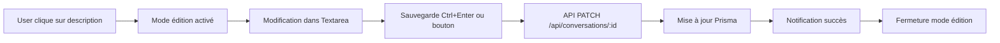

# 📝 Résumé des changements - Modification de description de conversation

## 🎯 Objectif
Permettre la modification de la description des conversations de groupe depuis la sidebar de détails.

## 📊 Statistiques des changements

| Composant | Fichiers modifiés | Lignes ajoutées | Status |
|-----------|-------------------|-----------------|---------|
| Frontend | 1 | ~100 | ✅ |
| Backend | 0 | 0 | ✅ (déjà supporté) |
| Documentation | 2 | ~150 | ✅ |

## 📁 Fichiers modifiés

### Frontend
```
frontend/components/conversations/conversation-details-sidebar.tsx
```
**Changements** :
- Import du composant `Textarea`
- Ajout des états `isEditingDescription` et `conversationDescription`
- Fonction `handleSaveDescription()` pour sauvegarder la description
- Interface UI pour afficher/éditer la description

### Backend
```
gateway/src/routes/conversations.ts (ligne 2658)
```
**Status** : ✅ Aucune modification nécessaire
- La route PATCH `/api/conversations/:id` supporte déjà le champ `description`

## 🔄 Flux de données



## 🎨 Interface utilisateur

### Mode lecture
```
┌─────────────────────────────────────────┐
│ 📝 Description                          │
│ ┌─────────────────────────────────────┐ │
│ │ Ceci est la description de la       │ │
│ │ conversation de groupe...           │ │
│ │                                  ✏️ │ │
│ └─────────────────────────────────────┘ │
└─────────────────────────────────────────┘
```

### Mode édition
```
┌─────────────────────────────────────────┐
│ 📝 Description                          │
│ ┌─────────────────────────────────────┐ │
│ │ [Textarea éditable]                 │ │
│ │                                     │ │
│ │                                     │ │
│ └─────────────────────────────────────┘ │
│            [💾 Enregistrer] [❌ Annuler] │
└─────────────────────────────────────────┘
```

## 🔐 Contrôle d'accès

| Rôle | Voir description | Modifier description |
|------|------------------|---------------------|
| Admin/BigBoss | ✅ | ✅ |
| Moderator | ✅ | ✅ |
| Member | ✅ | ❌ |
| Anonymous | ✅ | ❌ |

## ⌨️ Raccourcis clavier

- `Click` sur la zone : Activer le mode édition (admins uniquement)
- `Escape` : Annuler l'édition et restaurer la valeur originale
- `Ctrl/Cmd + Enter` : Sauvegarder la description

## ✅ Tests de validation

| Test | Status | Notes |
|------|--------|-------|
| Compilation TypeScript | ✅ | Aucune erreur |
| Build Next.js | ✅ | Build réussi |
| Route backend | ✅ | PATCH accepte `description` |
| Service frontend | ✅ | `updateConversation()` fonctionne |
| Permissions | ⚠️ | À tester en conditions réelles |
| UX/UI | ⚠️ | À tester manuellement |

## 🚀 Commandes de déploiement

```bash
# Build frontend
cd frontend && pnpm run build

# Rebuild Docker image (si nécessaire)
docker build -t isopen/meeshy-frontend:latest ./frontend

# Redémarrer le service
docker-compose restart frontend
```

## 📋 Checklist avant merge

- [x] Code compilé sans erreurs
- [x] Build Next.js réussi
- [x] Documentation créée
- [ ] Tests manuels effectués
- [ ] Traductions ajoutées (FR/EN)
- [ ] Review de code effectuée
- [ ] Tests en production

## 🎉 Résultat attendu

Les utilisateurs administrateurs peuvent maintenant :
1. Voir une description pour les conversations de groupe
2. Modifier cette description en cliquant dessus
3. Sauvegarder avec des raccourcis clavier pratiques
4. Recevoir un feedback visuel clair (toasts)

---

**Implémenté par** : GitHub Copilot
**Date** : 22 octobre 2025
**Branche** : `feature/selective-improvements`
**Status** : ✅ **PRÊT POUR TESTS**
