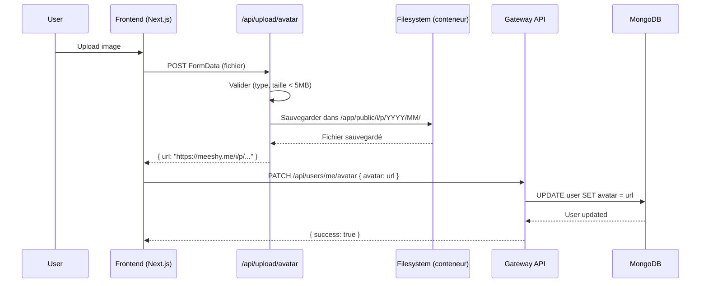

# Correction du problème de persistance des avatars en production

## Problème identifié

En production, les images de profil (avatars) ne se chargeaient pas après un redémarrage ou une mise à jour du conteneur frontend.

```
GET https://meeshy.me/i/p/2025/10/avatar_1760877849690_827t7v.jpg 404 (Not Found)
```

## Cause

Les avatars sont uploadés via l'API Next.js `/api/upload/avatar` et sauvegardés dans le dossier `public/i/p/YYYY/MM/` du conteneur frontend. Sans volume persistant Docker, ces fichiers sont perdus à chaque redémarrage ou mise à jour du conteneur.

### Flux actuel de l'upload d'avatar



### Problème

Sans volume Docker persistant :
- ✅ L'upload fonctionne
- ✅ L'URL est sauvegardée en base de données
- ❌ Le fichier physique est dans le conteneur (non persistant)
- ❌ Après redémarrage : 404 Not Found

## Solution mise en place

### 1. Ajout d'un volume persistant Docker

**Fichier modifié** : `docker-compose.traefik.yml`

#### a) Volume monté sur le service frontend

```yaml
frontend:
  image: ${FRONTEND_IMAGE:-isopen/meeshy-frontend:latest}
  container_name: meeshy-frontend
  restart: unless-stopped
  # ... autres configurations ...
  volumes:
    - frontend_uploads:/app/public/i  # ✅ NOUVEAU
```

#### b) Déclaration du volume

```yaml
volumes:
  database_data:
  database_config:
  redis_data:
  redis-ui-data:
  traefik_certs:
  models_data:
  gateway_uploads:
  frontend_uploads:  # ✅ NOUVEAU
```

### 2. Architecture des volumes

```
Docker Host
│
├── Volume: gateway_uploads
│   └── /app/uploads (attachments de messages)
│
└── Volume: frontend_uploads
    └── /app/public/i (avatars et images publiques)
        └── p/
            └── YYYY/
                └── MM/
                    └── avatar_*.{jpg,png,webp}
```

## Instructions de déploiement

### 1. Mettre à jour docker-compose.traefik.yml sur le serveur

```bash
ssh root@157.230.15.51
cd /opt/meeshy

# Sauvegarder la version actuelle
cp docker-compose.traefik.yml docker-compose.traefik.yml.backup

# Déployer la nouvelle version (via git pull ou copie manuelle)
# Le fichier docker-compose.traefik.yml doit inclure les modifications
```

### 2. Recréer le service frontend avec le nouveau volume

```bash
# Arrêter le frontend
docker compose -f docker-compose.traefik.yml stop frontend

# Recréer le service avec le nouveau volume
docker compose -f docker-compose.traefik.yml up -d frontend

# Vérifier que le volume est bien monté
docker inspect meeshy-frontend | grep -A 5 Mounts
```

Résultat attendu :
```json
"Mounts": [
    {
        "Type": "volume",
        "Name": "meeshy_frontend_uploads",
        "Source": "/var/lib/docker/volumes/meeshy_frontend_uploads/_data",
        "Destination": "/app/public/i",
        "Mode": "rw"
    }
]
```

### 3. Migration des avatars existants (optionnel)

Si des avatars existent déjà dans le conteneur frontend avant la mise en place du volume :

```bash
# Copier les avatars existants vers le volume
docker exec meeshy-frontend sh -c "cp -r /app/public/i/* /tmp/"
docker cp meeshy-frontend:/tmp/. /var/lib/docker/volumes/meeshy_frontend_uploads/_data/

# Ou depuis un backup local
docker cp frontend/public/i/. root@157.230.15.51:/var/lib/docker/volumes/meeshy_frontend_uploads/_data/
```

### 4. Test de persistance

```bash
# 1. Vérifier qu'un avatar existe
docker exec meeshy-frontend ls -lh /app/public/i/p/2025/10/

# 2. Redémarrer le conteneur
docker compose -f docker-compose.traefik.yml restart frontend

# 3. Vérifier que l'avatar est toujours présent
docker exec meeshy-frontend ls -lh /app/public/i/p/2025/10/

# 4. Tester l'accès via l'URL
curl -I https://meeshy.me/i/p/2025/10/avatar_XXXXXX.jpg
```

Résultat attendu : **200 OK** (au lieu de 404)

## Vérifications post-déploiement

### 1. Vérifier que le volume est créé

```bash
docker volume ls | grep frontend_uploads
```

### 2. Vérifier les permissions

```bash
docker exec meeshy-frontend ls -ld /app/public/i
# Devrait afficher: drwxr-xr-x avec owner node ou root
```

### 3. Tester l'upload d'un nouvel avatar

1. Se connecter sur https://meeshy.me
2. Aller dans `/settings`
3. Uploader une nouvelle photo de profil
4. Vérifier que l'image s'affiche
5. Redémarrer le frontend : `docker compose -f docker-compose.traefik.yml restart frontend`
6. Vérifier que l'image s'affiche toujours

### 4. Vérifier l'espace disque du volume

```bash
docker system df -v | grep frontend_uploads
```

## Spécifications de l'API d'upload

**Route** : `/api/upload/avatar`  
**Méthode** : `POST`  
**Format** : `multipart/form-data`

### Limitations

- **Formats acceptés** : `image/jpeg`, `image/jpg`, `image/png`, `image/webp`
- **Taille maximale** : 5 MB
- **Structure de stockage** : `/app/public/i/p/YYYY/MM/avatar_{timestamp}_{random}.{ext}`

### Exemple de chemin généré

```
/app/public/i/p/2025/10/avatar_1729347849690_827t7v.jpg
                 │    │  └─────────────────┬─────────────────┘
                 │    │                Nom unique
                 │    └── Mois (01-12)
                 └────── Année
```

## Sauvegardes

Les avatars sont maintenant persistés dans le volume Docker `frontend_uploads`. Pour les sauvegarder :

```bash
# Backup manuel
docker run --rm -v meeshy_frontend_uploads:/source -v /backup:/dest \
  alpine tar czf /dest/frontend_uploads_$(date +%Y%m%d).tar.gz -C /source .

# Restore
docker run --rm -v meeshy_frontend_uploads:/dest -v /backup:/source \
  alpine tar xzf /source/frontend_uploads_YYYYMMDD.tar.gz -C /dest
```

## Notes importantes

### Différence avec les attachments

- **Avatars** : Gérés par le **frontend** Next.js, stockés dans `/app/public/i/`
- **Attachments** : Gérés par le **gateway** Fastify, stockés dans `/app/uploads/`

Les deux ont maintenant des volumes persistants distincts.

### Évolution future possible

Une amélioration future pourrait centraliser tous les uploads (avatars et attachments) via le gateway, ce qui permettrait :
- Une gestion unifiée des fichiers
- Un meilleur contrôle des permissions
- Une API cohérente
- Un seul volume à gérer

## Checklist de déploiement

- [ ] Modifier `docker-compose.traefik.yml` (ajout du volume frontend_uploads)
- [ ] Déployer sur le serveur de production
- [ ] Recréer le service frontend avec `docker compose up -d frontend`
- [ ] Vérifier que le volume est monté : `docker inspect meeshy-frontend`
- [ ] Migrer les avatars existants si nécessaire
- [ ] Tester l'upload d'un nouvel avatar
- [ ] Tester la persistance après redémarrage
- [ ] Vérifier l'accès aux avatars existants (pas de 404)
- [ ] Configurer les backups du volume

## Résultat attendu

✅ Les avatars persistent après redémarrage du conteneur  
✅ Les avatars persistent après mise à jour de l'image Docker  
✅ Pas de 404 sur les URLs d'avatars existants  
✅ Les nouveaux uploads fonctionnent normalement  

---

**Date de mise en place** : 19 octobre 2025  
**Version docker-compose.traefik.yml** : Voir git log  

