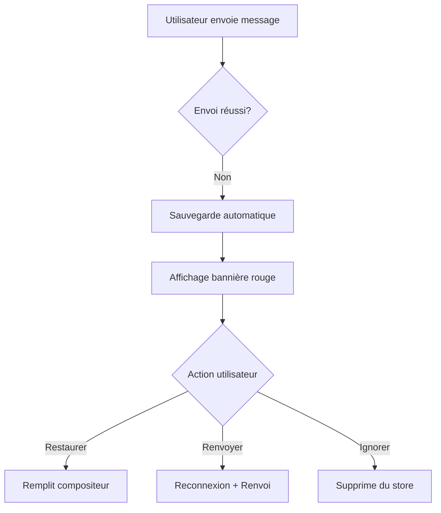
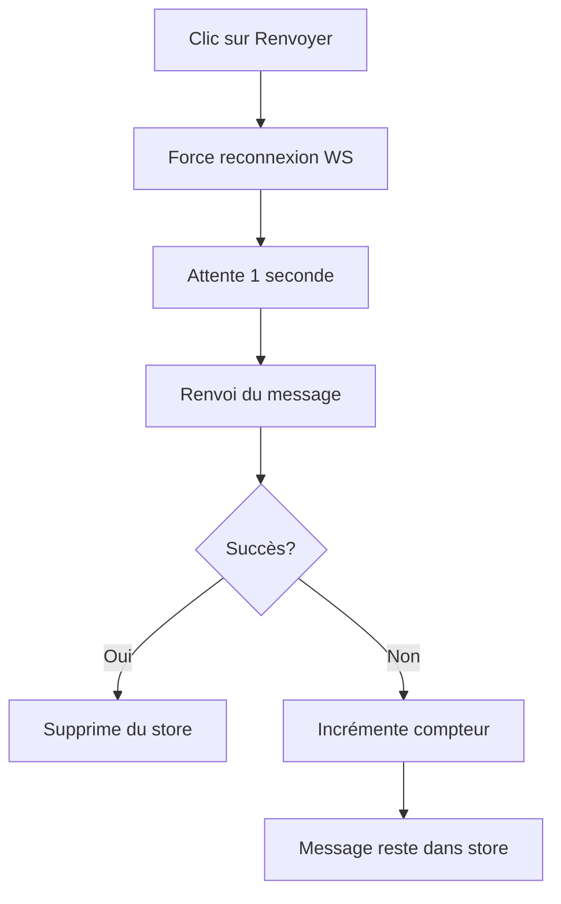

# Fix: Système de Récupération des Messages en Échec

**Date**: 18 octobre 2025
**Type**: Feature + Bug Fix
**Priorité**: Haute
**Status**: ✅ Implémenté

## 🎯 Problème

Lorsqu'un message échouait lors de l'envoi (déconnexion WebSocket, erreur réseau, etc.), l'utilisateur perdait complètement son message, incluant:
- Le contenu texte
- Les pièces jointes uploadées
- La réponse à un message (replyTo)
- La langue sélectionnée

Cela causait une **très mauvaise expérience utilisateur** et une **perte de données**.

## ✅ Solution Implémentée

### 1. Store de Persistance (`failed-messages-store.ts`)

Nouveau store Zustand avec persistance LocalStorage pour sauvegarder automatiquement les messages en échec:

```typescript
interface FailedMessage {
  id: string;                    // Identifiant unique
  conversationId: string;        // Conversation cible
  content: string;               // Contenu du message
  originalLanguage: string;      // Langue sélectionnée
  attachmentIds: string[];       // Pièces jointes
  replyToId?: string;           // Message de réponse
  timestamp: number;            // Horodatage
  error: string;                // Message d'erreur
  retryCount: number;           // Nombre de tentatives
}
```

**Fonctionnalités**:
- ✅ Sauvegarde automatique dans LocalStorage
- ✅ Limitation à 10 messages pour éviter de remplir le storage
- ✅ Indexation par conversation
- ✅ Compteur de tentatives de renvoi

### 2. Composant d'Affichage (`failed-message-banner.tsx`)

Bannière contextuelle affichée au-dessus du MessageComposer:

**Fonctionnalités**:
- ✅ Affichage des messages en échec pour la conversation active
- ✅ **Bouton "Restaurer"**: Restaure le message dans le compositeur pour modification
- ✅ **Bouton "Renvoyer"**: Tente un renvoi automatique avec reconnexion forcée
- ✅ **Bouton "Ignorer"**: Supprime le message du store
- ✅ Indicateur du nombre de tentatives
- ✅ Preview du contenu du message
- ✅ Gestion des attachments
- ✅ Traductions FR/EN

### 3. Intégration dans `use-messaging.ts`

**Sauvegarde automatique** lors d'un échec:

```typescript
// Lors d'une erreur d'envoi
catch (error) {
  // Sauvegarder automatiquement
  addFailedMessage({
    conversationId,
    content,
    originalLanguage,
    attachmentIds: [],
    replyToId,
    error: errorMessage,
  });
  
  // Toast avec bouton d'action
  toast.error(errorMessage, {
    action: {
      label: 'Restaurer',
      onClick: () => { /* Restauration */ }
    }
  });
}
```

### 4. Intégration dans `ConversationLayout.tsx`

**Deux nouveaux handlers**:

#### `handleRestoreFailedMessage`
- Restaure le contenu dans le textarea
- Restaure la langue sélectionnée
- Restaure les attachments
- Restaure le replyTo
- Focus automatique sur le compositeur

#### `handleRetryFailedMessage`
- **Force une reconnexion WebSocket** avant de renvoyer
- Renvoi automatique avec toutes les données
- Suppression du store si succès
- Toast de notification

**Affichage du composant**:
```tsx
{/* Bannière des messages en échec */}
{selectedConversation?.id && (
  <FailedMessageBanner
    conversationId={selectedConversation.id}
    onRetry={handleRetryFailedMessage}
    onRestore={handleRestoreFailedMessage}
  />
)}
```

### 5. Traductions (FR/EN)

Ajout de 14 nouvelles clés de traduction dans `conversations.json`:
- `messageSendFailed`: "Échec d'envoi du message"
- `restoreMessage`: "Restaurer"
- `retryNow`: "Renvoyer"
- `retrying`: "Renvoi..."
- `dismiss`: "Ignorer"
- `dismissAll`: "Ignorer tout"
- `messageSentSuccessfully`: "Message envoyé avec succès"
- `retryFailed`: "Échec du renvoi"
- `messageRestored`: "Message restauré"
- etc.

## 🔄 Flux de Récupération

### Scénario 1: Échec d'envoi


### Scénario 2: Reconnexion forcée


## 📋 Fichiers Modifiés

### Nouveaux Fichiers
- ✅ `frontend/stores/failed-messages-store.ts` - Store de persistance
- ✅ `frontend/components/messages/failed-message-banner.tsx` - Composant UI
- ✅ `docs/FIX_FAILED_MESSAGE_RECOVERY.md` - Cette documentation

### Fichiers Modifiés
- ✅ `frontend/hooks/use-messaging.ts` - Sauvegarde automatique
- ✅ `frontend/components/conversations/ConversationLayout.tsx` - Intégration UI
- ✅ `frontend/locales/fr/conversations.json` - Traductions FR
- ✅ `frontend/locales/en/conversations.json` - Traductions EN

## 🎨 Interface Utilisateur

### Bannière de Message en Échec
```
┌────────────────────────────────────────────────┐
│ ⚠️ Échec d'envoi du message (2 tentative(s)) │
│                                                │
│ "There is a problem with user profile..."     │
│                                                │
│ [Restaurer] [Renvoyer] [Ignorer]              │
└────────────────────────────────────────────────┘
```

### Toast de Notification
```
❌ Connexion WebSocket perdue. Reconnexion en cours...
   [Restaurer]
```

## 🔧 Configuration

### Paramètres du Store
- **Persistance**: LocalStorage (`meeshy-failed-messages`)
- **Limite**: 10 messages max (slice(-10))
- **Clé**: `id = failed-${timestamp}-${random}`

### Délais de Reconnexion
- **Attente avant renvoi**: 1000ms (1 seconde)
- **Timeout Socket.IO**: 10000ms (10 secondes)

## ✅ Tests Manuels Requis

### Test 1: Échec d'Envoi
1. ✅ Écrire un message avec attachments
2. ✅ Couper la connexion réseau
3. ✅ Cliquer sur Envoyer
4. ✅ Vérifier l'affichage de la bannière
5. ✅ Vérifier la sauvegarde dans LocalStorage

### Test 2: Restauration
1. ✅ Avoir un message en échec
2. ✅ Cliquer sur "Restaurer"
3. ✅ Vérifier que le contenu est restauré
4. ✅ Vérifier que les attachments sont restaurés
5. ✅ Vérifier que la langue est restaurée

### Test 3: Renvoi Automatique
1. ✅ Avoir un message en échec
2. ✅ Rétablir la connexion
3. ✅ Cliquer sur "Renvoyer"
4. ✅ Vérifier la reconnexion WebSocket
5. ✅ Vérifier l'envoi du message
6. ✅ Vérifier la suppression de la bannière

### Test 4: Persistance
1. ✅ Avoir un message en échec
2. ✅ Rafraîchir la page (F5)
3. ✅ Vérifier que le message est toujours affiché

### Test 5: Multi-Conversations
1. ✅ Avoir des messages en échec dans 2 conversations
2. ✅ Changer de conversation
3. ✅ Vérifier que seuls les messages de la conversation active s'affichent

## 🚀 Déploiement

### Frontend
```bash
cd frontend
pnpm run build  # ✅ Compilation réussie
```

### Construction Docker
```bash
cd frontend
docker buildx build --platform linux/arm64,linux/amd64 \
  --progress=plain \
  -t isopen/meeshy-frontend:v1.8.6 \
  -t isopen/meeshy-frontend:latest \
  . --push --no-cache
```

## 📊 Impact

### Expérience Utilisateur
- ✅ **Aucune perte de données** en cas d'échec
- ✅ **Récupération simple** avec 1 clic
- ✅ **Feedback visuel clair** (bannière rouge)
- ✅ **Reconnexion automatique** avant renvoi

### Performance
- ⚡ Persistance dans LocalStorage (instantané)
- ⚡ Limite de 10 messages (pas de surcharge mémoire)
- ⚡ Pas d'impact sur le temps de chargement

### Maintenabilité
- ✅ Code modulaire (store séparé)
- ✅ Composant réutilisable
- ✅ Types TypeScript stricts
- ✅ Traductions complètes

## 🔮 Améliorations Futures

### Court Terme
- [ ] Ajout d'un bouton "Renvoyer tout" pour plusieurs messages
- [ ] Indicateur de connexion WebSocket dans le header
- [ ] Animation de reconnexion

### Moyen Terme
- [ ] Sauvegarde des brouillons pendant la saisie
- [ ] File d'attente de messages en mode offline
- [ ] Synchronisation automatique lors de la reconnexion

### Long Terme
- [ ] Mode offline complet avec queue persistante
- [ ] Compression des messages dans LocalStorage
- [ ] Analytics sur les taux d'échec

## 📝 Notes Techniques

### Zustand Persist
Le store utilise `zustand/middleware/persist` avec:
- `createJSONStorage(() => localStorage)`
- `partialize` pour limiter à 10 messages
- Sérialisation automatique

### Reconnexion WebSocket
```typescript
if (messaging.socketMessaging?.reconnect) {
  messaging.socketMessaging.reconnect();
  await new Promise(resolve => setTimeout(resolve, 1000));
}
```

### Types TypeScript
```typescript
export interface FailedMessage {
  id: string;
  conversationId: string;
  content: string;
  originalLanguage: string;
  attachmentIds: string[];
  replyToId?: string;
  timestamp: number;
  error: string;
  retryCount: number;
}
```

## 🎯 Résultat Final

✅ **Système complet de récupération des messages en échec**
- Sauvegarde automatique
- Restauration simple
- Renvoi avec reconnexion
- Persistance LocalStorage
- Traductions FR/EN
- Interface intuitive

**Impact**: Aucune perte de données utilisateur en cas d'échec réseau.

---

**Auteur**: GitHub Copilot
**Date**: 18 octobre 2025
**Version**: 1.0
**Status**: ✅ Production Ready
