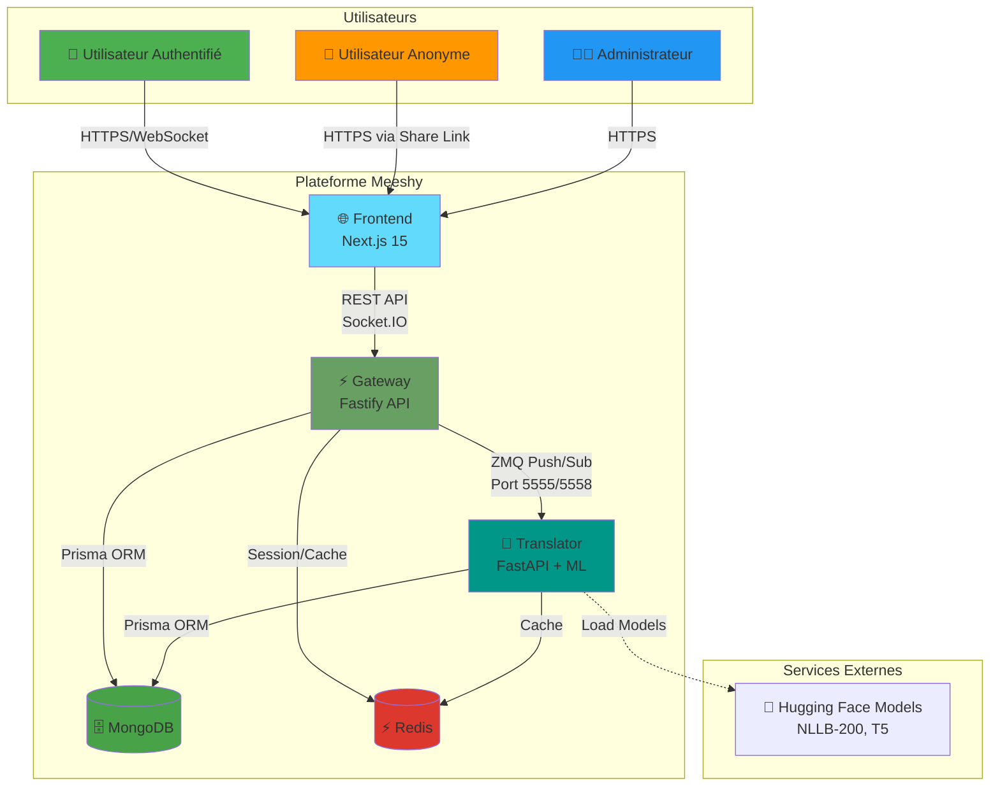
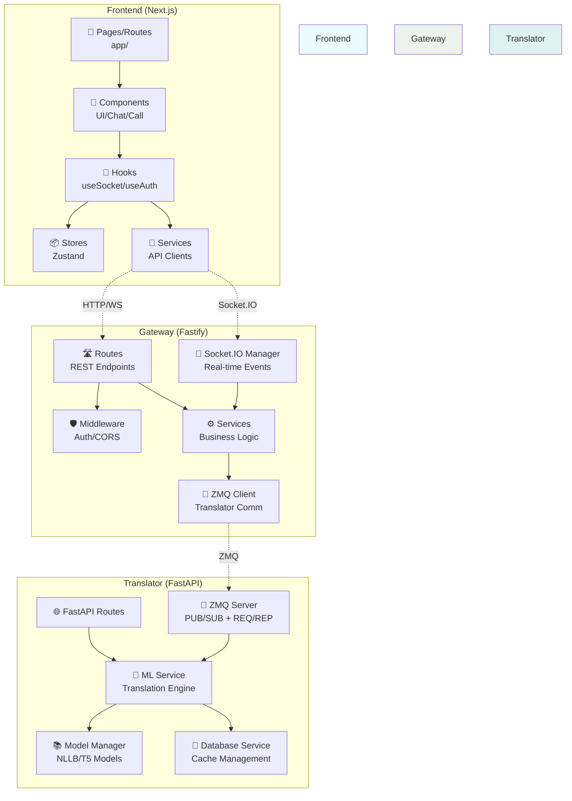
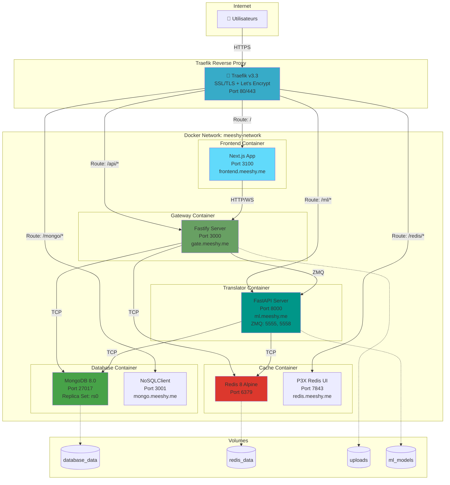
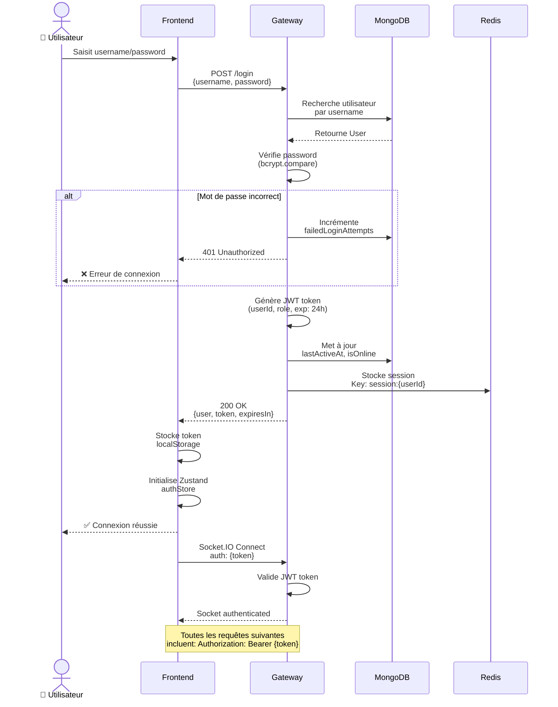
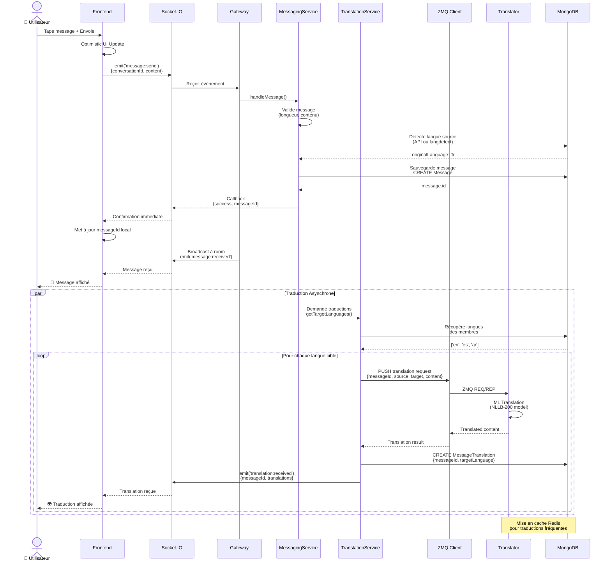
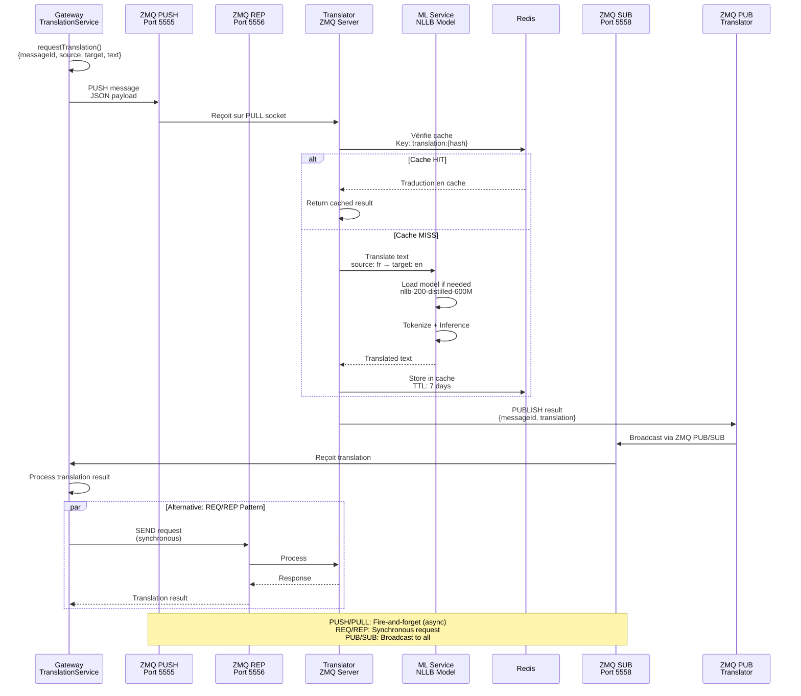
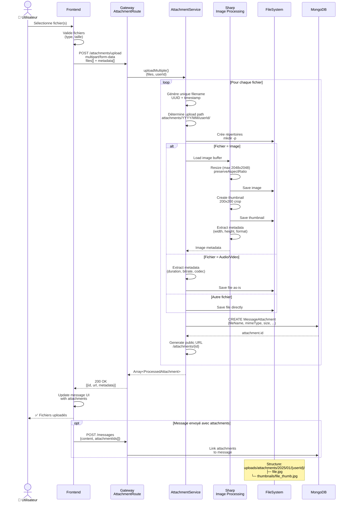
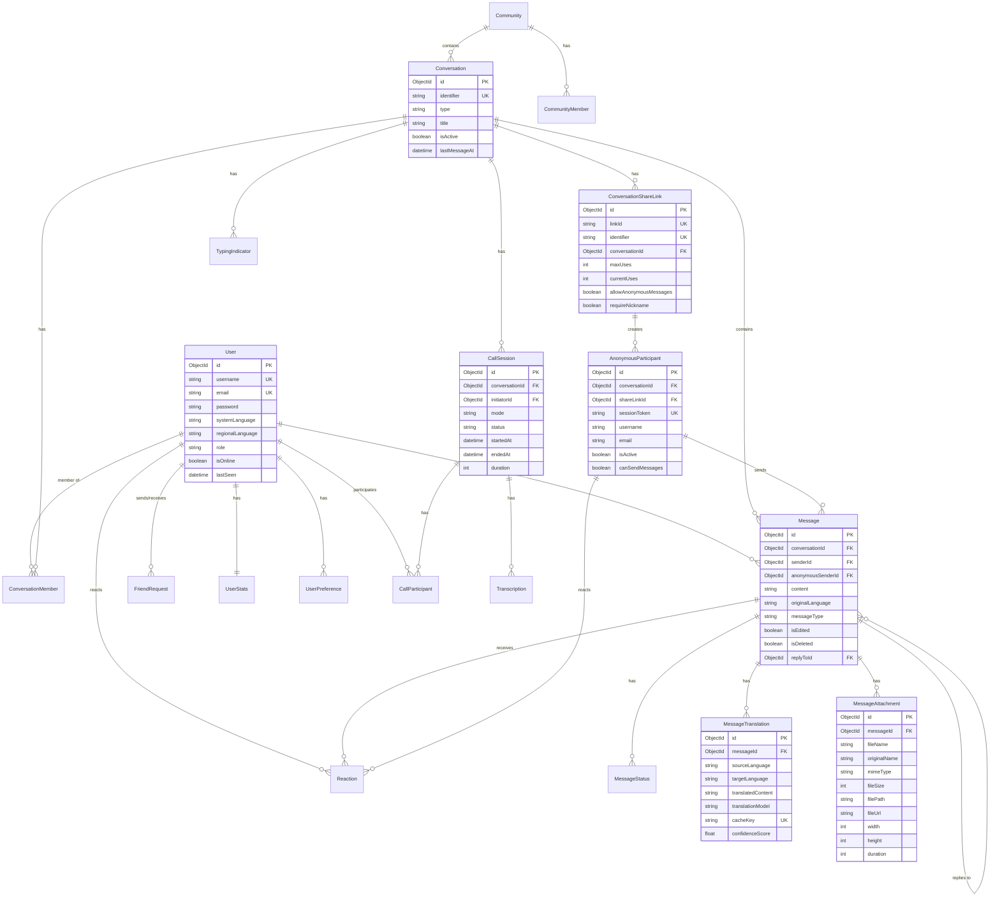
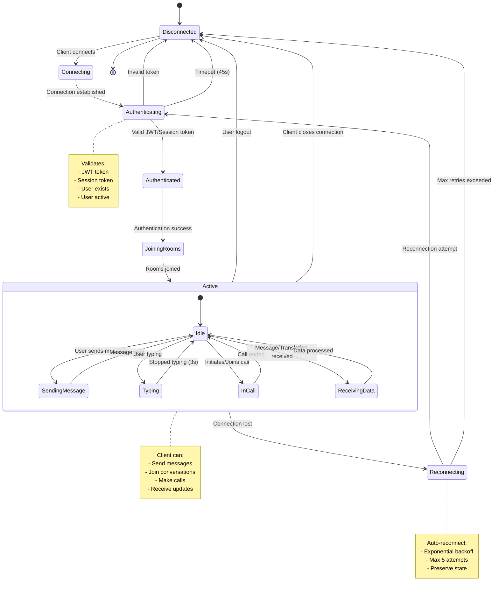
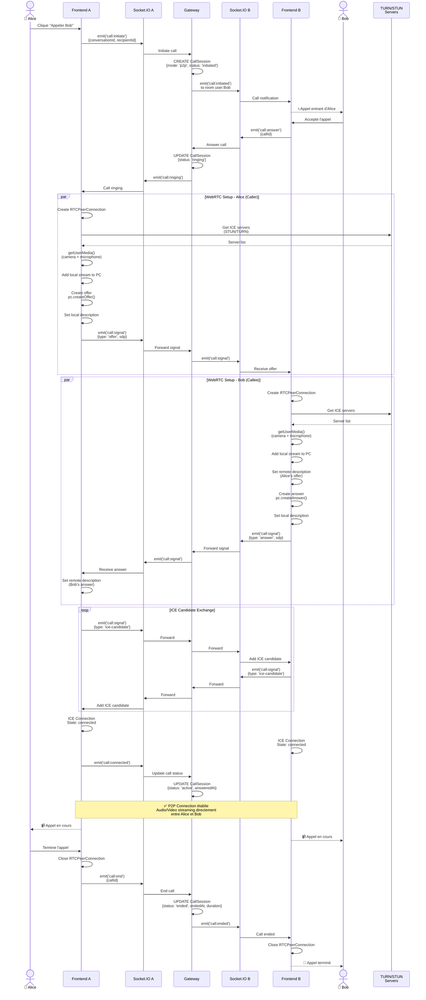

# Diagrammes d'Architecture Meeshy

Ce document contient une série de diagrammes Mermaid expliquant le fonctionnement de la plateforme Meeshy.

## Table des matières

1. [Architecture Globale (C4 Context)](#1-architecture-globale-c4-context)
2. [Structure des Composants](#2-structure-des-composants)
3. [Diagramme de Déploiement](#3-diagramme-de-déploiement)
4. [Séquence d'Authentification](#4-séquence-dauthentification)
5. [Séquence d'Envoi de Messages](#5-séquence-denvoi-de-messages)
6. [Séquence de Traduction](#6-séquence-de-traduction)
7. [Séquence d'Upload d'Attachements](#7-séquence-dupload-dattachements)
8. [Flux de Données en Temps Réel](#8-flux-de-données-en-temps-réel)
9. [Modèle de Base de Données (ERD)](#9-modèle-de-base-de-données-erd)
10. [Infrastructure Réseau](#10-infrastructure-réseau)
11. [États des Connexions WebSocket](#11-états-des-connexions-websocket)
12. [Séquence d'Appel Vidéo WebRTC](#12-séquence-dappel-vidéo-webrtc)

---

## 1. Architecture Globale (C4 Context)

Ce diagramme montre le contexte global de Meeshy et ses interactions avec les utilisateurs et systèmes externes.



---

## 2. Structure des Composants

Architecture détaillée des composants internes de chaque service.



---

## 3. Diagramme de Déploiement

Infrastructure de déploiement avec Docker et Traefik.



---

## 4. Séquence d'Authentification

Processus d'authentification JWT pour les utilisateurs enregistrés.



---

## 5. Séquence d'Envoi de Messages

Flux complet d'envoi et de distribution d'un message avec traduction automatique.



---

## 6. Séquence de Traduction

Communication ZMQ entre Gateway et Translator pour la traduction.



---

## 7. Séquence d'Upload d'Attachements

Processus d'upload de fichiers avec traitement d'images et métadonnées.



---

## 8. Flux de Données en Temps Réel

Architecture Socket.IO pour la communication en temps réel.

```mermaid
graph TB
    subgraph "Clients"
        User1[👤 User 1<br/>Socket ID: abc123]
        User2[👤 User 2<br/>Socket ID: def456]
        User3[👥 Anonymous<br/>Socket ID: ghi789]
    end

    subgraph "Gateway - Socket.IO Server"
        SocketManager[🔌 MeeshySocketIOManager]

        subgraph "Rooms"
            ConvRoom1[conversation:conv_001]
            ConvRoom2[conversation:conv_002]
            UserRoom1[user:userId_1]
            UserRoom2[user:userId_2]
        end

        subgraph "Event Handlers"
            MessageHandler[💬 Message Handler]
            TypingHandler[⌨️ Typing Handler]
            CallHandler[📞 Call Handler]
            StatusHandler[🟢 Status Handler]
        end
    end

    subgraph "Backend Services"
        MessagingService[📨 Messaging Service]
        TranslationService[🌍 Translation Service]
        CallService[📞 Call Service]
    end

    User1 -->|Socket.IO Connect<br/>auth: {token}| SocketManager
    User2 -->|Socket.IO Connect<br/>auth: {token}| SocketManager
    User3 -->|Socket.IO Connect<br/>auth: {sessionToken}| SocketManager

    SocketManager -->|join rooms| ConvRoom1
    SocketManager -->|join rooms| ConvRoom2
    SocketManager -->|join rooms| UserRoom1
    SocketManager -->|join rooms| UserRoom2

    User1 -.->|emit('message:send')| MessageHandler
    MessageHandler --> MessagingService
    MessagingService -.->|emit('message:received')| ConvRoom1

    User2 -.->|emit('user:typing')| TypingHandler
    TypingHandler -.->|broadcast| ConvRoom1

    MessagingService --> TranslationService
    TranslationService -.->|emit('translation:received')| ConvRoom1

    User1 -.->|emit('call:initiate')| CallHandler
    CallHandler --> CallService
    CallService -.->|emit('call:ringing')| UserRoom2

    ConvRoom1 -.->|message:received| User1
    ConvRoom1 -.->|message:received| User2
    ConvRoom1 -.->|translation:received| User1
    ConvRoom1 -.->|user:typing| User1

    StatusHandler -.->|emit('user:status')| SocketManager
    SocketManager -.->|broadcast| User1
    SocketManager -.->|broadcast| User2

    style User1 fill:#4CAF50
    style User2 fill:#2196F3
    style User3 fill:#FF9800
    style SocketManager fill:#FFC107
    style ConvRoom1 fill:#E91E63
    style ConvRoom2 fill:#9C27B0
```

---

## 9. Modèle de Base de Données (ERD)

Relations entre les principales entités MongoDB.



---

## 10. Infrastructure Réseau

Architecture réseau et flux de communication entre services.


---

## 11. États des Connexions WebSocket

Diagramme d'états pour les connexions Socket.IO.



---

## 12. Séquence d'Appel Vidéo WebRTC

Processus de signaling pour établir une connexion WebRTC P2P.



---

## Utilisation des Diagrammes

### Rendu des Diagrammes Mermaid

Ces diagrammes peuvent être rendus dans :

1. **GitHub** - Affichage natif dans les fichiers Markdown
2. **Mermaid Live Editor** - https://mermaid.live
3. **VS Code** - Extensions Mermaid Preview
4. **Documentation Sites** - Docusaurus, MkDocs, etc.

### Personnalisation

Vous pouvez modifier les diagrammes en ajustant :
- Les styles avec `style NodeName fill:#COLOR`
- Les légendes avec `Note over/right of/left of`
- Les formes des nœuds (rectangles, cercles, bases de données)
- Les types de flèches (solides, pointillées, directionnelles)

### Mise à Jour

Pour maintenir ces diagrammes à jour :
1. Mettre à jour après chaque changement architectural majeur
2. Versionner avec le code source
3. Inclure dans la documentation technique
4. Réviser lors des code reviews

---

**Version:** 1.0
**Dernière mise à jour:** 2025-11-06
**Maintenu par:** Équipe Meeshy
