# Diagrammes d'Architecture Meeshy

Ce document contient une série de diagrammes Mermaid expliquant le fonctionnement de la plateforme Meeshy.

## Table des matières

1. [Architecture Globale (C4 Context)](#1-architecture-globale-c4-context)
2. [Structure des Composants](#2-structure-des-composants)
3. [Diagramme de Déploiement](#3-diagramme-de-déploiement)
4. [Séquence d'Authentification](#4-séquence-dauthentification)
5. [Séquence d'Envoi de Messages](#5-séquence-denvoi-de-messages)
6. [Séquence de Traduction](#6-séquence-de-traduction)
7. [Séquence d'Upload d'Attachements](#7-séquence-dupload-dattachements)
8. [Flux de Données en Temps Réel](#8-flux-de-données-en-temps-réel)
9. [Modèle de Base de Données (ERD)](#9-modèle-de-base-de-données-erd)
10. [Infrastructure Réseau](#10-infrastructure-réseau)
11. [États des Connexions WebSocket](#11-états-des-connexions-websocket)
12. [Séquence d'Appel Vidéo WebRTC P2P](#12-séquence-dappel-vidéo-webrtc-p2p)
13. [États des Call Sessions](#13-états-des-call-sessions)
14. [Architecture des Audio Effects](#14-architecture-des-audio-effects)
15. [Séquence de Monitoring de Qualité d'Appel](#15-séquence-de-monitoring-de-qualité-dappel)
16. [Architecture des Document Viewers](#16-architecture-des-document-viewers)
17. [Séquence des User Preferences](#17-séquence-des-user-preferences)

---

## 1. Architecture Globale (C4 Context)

Ce diagramme montre le contexte global de Meeshy et ses interactions avec les utilisateurs et systèmes externes.

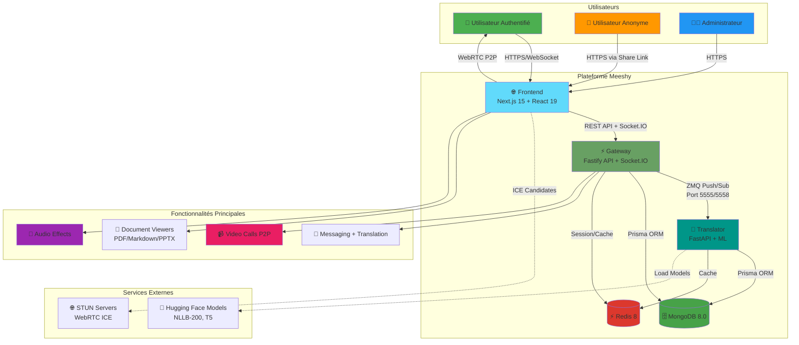
```mermaid
graph TB
    subgraph "Utilisateurs"
        User[👤 Utilisateur Authentifié]
        Anonymous[👥 Utilisateur Anonyme]
        Admin[👨‍💼 Administrateur]
    end

    subgraph "Plateforme Meeshy"
        Frontend[🌐 Frontend<br/>Next.js 15 + React 19]
        Gateway[⚡ Gateway<br/>Fastify API + Socket.IO]
        Translator[🤖 Translator<br/>FastAPI + ML]
        Database[(🗄️ MongoDB 8.0)]
        Cache[(⚡ Redis 8)]
    end

    subgraph "Services Externes"
        ML[🧠 Hugging Face Models<br/>NLLB-200, T5]
        STUN[🌐 STUN Servers<br/>WebRTC ICE]
    end

    subgraph "Fonctionnalités Principales"
        Messaging[💬 Messaging + Translation]
        VideoCall[📹 Video Calls P2P]
        Viewers[📄 Document Viewers<br/>PDF/Markdown/PPTX]
        AudioFX[🎵 Audio Effects]
    end

    User -->|HTTPS/WebSocket| Frontend
    Anonymous -->|HTTPS via Share Link| Frontend
    Admin -->|HTTPS| Frontend

    Frontend -->|REST API + Socket.IO| Gateway
    Frontend -->|WebRTC P2P| User
    Gateway -->|ZMQ Push/Sub<br/>Port 5555/5558| Translator
    Gateway -->|Prisma ORM| Database
    Gateway -->|Session/Cache| Cache

    Translator -->|Prisma ORM| Database
    Translator -->|Cache| Cache
    Translator -.->|Load Models| ML

    Frontend -.->|ICE Candidates| STUN

    Gateway --> Messaging
    Gateway --> VideoCall
    Frontend --> Viewers
    Frontend --> AudioFX

    style User fill:#4CAF50
    style Anonymous fill:#FF9800
    style Admin fill:#2196F3
    style Frontend fill:#61DAFB
    style Gateway fill:#68A063
    style Translator fill:#009688
    style Database fill:#47A248
    style Cache fill:#DC382D
    style VideoCall fill:#E91E63
    style AudioFX fill:#9C27B0
```

---

## 2. Structure des Composants

Architecture détaillée des composants internes de chaque service avec les nouvelles fonctionnalités.


```mermaid
graph TB
    subgraph "Frontend (Next.js 15)"
        subgraph "Pages/Routes"
            ChatPage[app/chat/]
            CallPage[app/call/]
            ConvPage[app/conversations/]
            LinksPage[app/links/]
        end

        subgraph "Components"
            VideoCallComponents[video-calls/<br/>VideoCallInterface<br/>AudioEffectsPanel<br/>ConnectionQualityBadge<br/>DraggableParticipantOverlay<br/>OngoingCallBanner]

            ViewerComponents[viewers/<br/>PDFViewer/Lightbox<br/>MarkdownViewer/Lightbox<br/>PPTXViewer/Lightbox<br/>TextViewer/Lightbox<br/>VideoPlayer/Lightbox<br/>MermaidDiagram]

            ConvComponents[conversations/<br/>ConversationHeader<br/>ConversationLayout<br/>ConversationList<br/>CommunityCarousel<br/>ConversationDetailsbar]

            AttachmentComponents[attachments/<br/>MessageAttachments<br/>ImageLightbox<br/>AttachmentGallery]
        end

        subgraph "Hooks"
            useWebRTCP2P[use-webrtc-p2p]
            useAudioEffects[use-audio-effects]
            useCallQuality[use-call-quality]
            useAuth[use-auth]
            useSocket[use-socket]
        end

        subgraph "Services"
            WebRTCService[webrtc-service]
            UserPreferencesService[user-preferences-service]
            APIClients[API Clients]
        end

        subgraph "Stores (Zustand)"
            AuthStore[auth-store]
            CallStore[call-store]
            MessagesStore[messages-store]
            UIStore[ui-store]
        end

        subgraph "Utils"
            AudioEffectsUtils[audio-effects<br/>VoiceCoderProcessor<br/>BabyVoiceProcessor<br/>DemonVoiceProcessor<br/>BackSoundProcessor]
            TagColors[tag-colors]
            Ringtone[ringtone]
        end

        ChatPage --> ConvComponents
        CallPage --> VideoCallComponents

        VideoCallComponents --> useWebRTCP2P
        VideoCallComponents --> useAudioEffects
        VideoCallComponents --> useCallQuality

        useWebRTCP2P --> WebRTCService
        useWebRTCP2P --> CallStore

        useAudioEffects --> AudioEffectsUtils

        ConvComponents --> UserPreferencesService
        ConvComponents --> useAuth

        ViewerComponents --> AttachmentComponents
    end

    subgraph "Gateway (Fastify)"
        subgraph "Routes"
            AuthRoutes[auth.ts]
            CallRoutes[calls.ts]
            ConvRoutes[conversations.ts]
            PrefsRoutes[conversation-preferences.ts]
            AttachRoutes[attachments.ts]
            UserRoutes[users.ts]
        end

        subgraph "Middleware"
            AuthMiddleware[auth.ts<br/>JWT + Session Token]
            CORSMiddleware[CORS]
            ValidationMiddleware[Validation]
        end

        subgraph "Socket.IO Handlers"
            SocketManager[MeeshySocketIOManager]
            CallEventsHandler[CallEventsHandler]
            MessageEventsHandler[Message Events]
            TypingEventsHandler[Typing Events]
        end

        subgraph "Services"
            CallService[CallService]
            MessagingService[MessagingService]
            TranslationService[TranslationService]
            AttachmentService[AttachmentService]
            CallCleanupService[CallCleanupService]
        end

        subgraph "ZMQ Communication"
            ZMQClient[ZMQ Client<br/>PUSH/SUB/REQ]
        end

        AuthRoutes --> AuthMiddleware
        CallRoutes --> CallService
        PrefsRoutes --> AuthMiddleware

        SocketManager --> CallEventsHandler
        SocketManager --> MessageEventsHandler

        CallEventsHandler --> CallService
        MessageEventsHandler --> MessagingService

        CallService --> SocketManager
        MessagingService --> TranslationService
        TranslationService --> ZMQClient
    end

    subgraph "Translator (FastAPI)"
        subgraph "API Routes"
            TranslationAPI[translation_api.py]
            HealthAPI[health endpoints]
        end

        subgraph "ZMQ Server"
            ZMQServer[zmq_server.py<br/>PUB/SUB + REQ/REP]
        end

        subgraph "ML Services"
            MLService[translation_ml_service.py]
            ModelManager[Model Manager<br/>NLLB-200<br/>T5-Small]
        end

        subgraph "Database"
            DBService[database_service.py]
        end

        TranslationAPI --> MLService
        ZMQServer --> MLService
        MLService --> ModelManager
        MLService --> DBService
    end

    WebRTCService -.->|REST + Socket.IO| AuthRoutes
    UserPreferencesService -.->|REST| PrefsRoutes
    APIClients -.->|HTTP| ConvRoutes

    SocketManager -.->|Socket.IO Events| useSocket
    ZMQClient -.->|ZMQ| ZMQServer

    style VideoCallComponents fill:#E91E6320
    style AudioEffectsUtils fill:#9C27B020
    style ViewerComponents fill:#FF980020
    style CallEventsHandler fill:#E91E6320
```

---

## 3. Diagramme de Déploiement

Infrastructure de déploiement avec Docker et Traefik (inchangé).

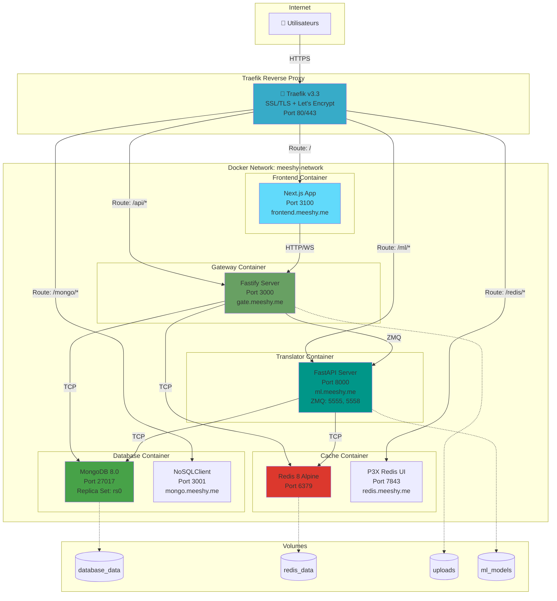
```mermaid
graph TB
    subgraph "Internet"
        Users[👥 Utilisateurs]
    end

    subgraph "Traefik Reverse Proxy"
        Traefik[🔀 Traefik v3.3<br/>SSL/TLS + Let's Encrypt<br/>Port 80/443]
    end

    subgraph "Docker Network: meeshy-network"
        subgraph "Frontend Container"
            FrontendApp[Next.js App<br/>Port 3100<br/>frontend.meeshy.me]
        end

        subgraph "Gateway Container"
            GatewayApp[Fastify Server<br/>Port 3000<br/>gate.meeshy.me]
        end

        subgraph "Translator Container"
            TranslatorApp[FastAPI Server<br/>Port 8000<br/>ml.meeshy.me<br/>ZMQ: 5555, 5558]
        end

        subgraph "Database Container"
            MongoDB[MongoDB 8.0<br/>Port 27017<br/>Replica Set: rs0]
            MongoUI[NoSQLClient<br/>Port 3001<br/>mongo.meeshy.me]
        end

        subgraph "Cache Container"
            RedisDB[Redis 8 Alpine<br/>Port 6379]
            RedisUI[P3X Redis UI<br/>Port 7843<br/>redis.meeshy.me]
        end
    end

    subgraph "Volumes"
        DBData[(database_data)]
        RedisData[(redis_data)]
        Uploads[(uploads)]
        Models[(ml_models)]
    end

    Users -->|HTTPS| Traefik

    Traefik -->|Route: /| FrontendApp
    Traefik -->|Route: /api/*| GatewayApp
    Traefik -->|Route: /ml/*| TranslatorApp
    Traefik -->|Route: /mongo/*| MongoUI
    Traefik -->|Route: /redis/*| RedisUI

    FrontendApp -->|HTTP/WS| GatewayApp
    GatewayApp -->|TCP| MongoDB
    GatewayApp -->|TCP| RedisDB
    GatewayApp -->|ZMQ| TranslatorApp
    TranslatorApp -->|TCP| MongoDB
    TranslatorApp -->|TCP| RedisDB

    MongoDB -.-> DBData
    RedisDB -.-> RedisData
    GatewayApp -.-> Uploads
    TranslatorApp -.-> Models

    style Traefik fill:#37ABC8
    style FrontendApp fill:#61DAFB
    style GatewayApp fill:#68A063
    style TranslatorApp fill:#009688
    style MongoDB fill:#47A248
    style RedisDB fill:#DC382D
```

---

## 4. Séquence d'Authentification

Processus d'authentification JWT pour les utilisateurs enregistrés (inchangé).

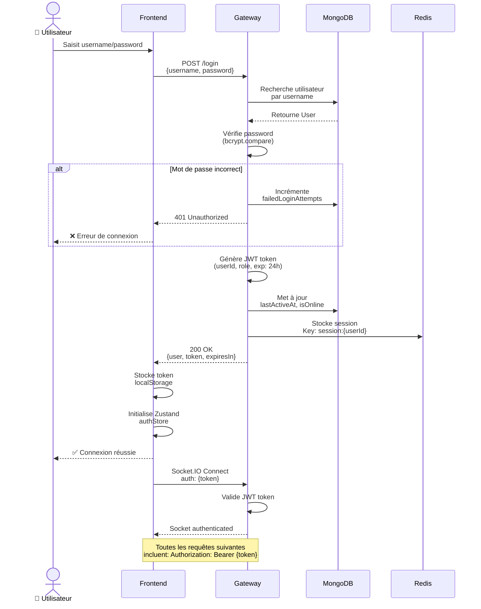
```mermaid
sequenceDiagram
    actor User as 👤 Utilisateur
    participant FE as Frontend
    participant GW as Gateway
    participant DB as MongoDB
    participant Cache as Redis

    User->>FE: Saisit username/password
    FE->>GW: POST /login<br/>{username, password}

    GW->>DB: Recherche utilisateur<br/>par username
    DB-->>GW: Retourne User

    GW->>GW: Vérifie password<br/>(bcrypt.compare)

    alt Mot de passe incorrect
        GW->>DB: Incrémente<br/>failedLoginAttempts
        GW-->>FE: 401 Unauthorized
        FE-->>User: ❌ Erreur de connexion
    end

    GW->>GW: Génère JWT token<br/>(userId, role, exp: 24h)

    GW->>DB: Met à jour<br/>lastActiveAt, isOnline

    GW->>Cache: Stocke session<br/>Key: session:{userId}

    GW-->>FE: 200 OK<br/>{user, token, expiresIn}

    FE->>FE: Stocke token<br/>localStorage

    FE->>FE: Initialise Zustand<br/>authStore

    FE-->>User: ✅ Connexion réussie

    FE->>GW: Socket.IO Connect<br/>auth: {token}
    GW->>GW: Valide JWT token
    GW-->>FE: Socket authenticated

    Note over FE,GW: Toutes les requêtes suivantes<br/>incluent: Authorization: Bearer {token}
```

---

## 5. Séquence d'Envoi de Messages

Flux complet d'envoi et de distribution d'un message avec traduction automatique (inchangé).

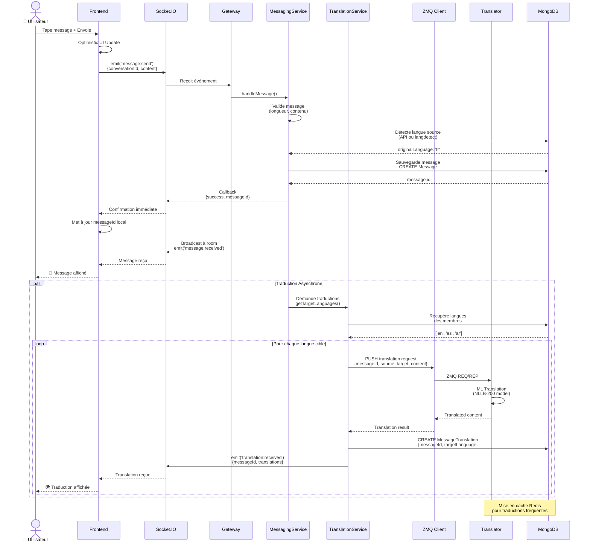
```mermaid
sequenceDiagram
    actor User as 👤 Utilisateur
    participant FE as Frontend
    participant Socket as Socket.IO
    participant GW as Gateway
    participant MS as MessagingService
    participant TS as TranslationService
    participant ZMQ as ZMQ Client
    participant Trans as Translator
    participant DB as MongoDB

    User->>FE: Tape message + Envoie
    FE->>FE: Optimistic UI Update

    FE->>Socket: emit('message:send')<br/>{conversationId, content}

    Socket->>GW: Reçoit événement
    GW->>MS: handleMessage()

    MS->>MS: Valide message<br/>(longueur, contenu)

    MS->>DB: Détecte langue source<br/>(API ou langdetect)
    DB-->>MS: originalLanguage: 'fr'

    MS->>DB: Sauvegarde message<br/>CREATE Message
    DB-->>MS: message.id

    MS-->>Socket: Callback<br/>{success, messageId}
    Socket-->>FE: Confirmation immédiate
    FE->>FE: Met à jour messageId local

    GW->>Socket: Broadcast à room<br/>emit('message:received')
    Socket-->>FE: Message reçu
    FE-->>User: 📨 Message affiché

    par Traduction Asynchrone
        MS->>TS: Demande traductions<br/>getTargetLanguages()
        TS->>DB: Récupère langues<br/>des membres
        DB-->>TS: ['en', 'es', 'ar']

        loop Pour chaque langue cible
            TS->>ZMQ: PUSH translation request<br/>{messageId, source, target, content}
            ZMQ->>Trans: ZMQ REQ/REP
            Trans->>Trans: ML Translation<br/>(NLLB-200 model)
            Trans-->>ZMQ: Translated content
            ZMQ-->>TS: Translation result

            TS->>DB: CREATE MessageTranslation<br/>{messageId, targetLanguage}

            TS->>Socket: emit('translation:received')<br/>{messageId, translations}
            Socket-->>FE: Translation reçue
            FE-->>User: 🌍 Traduction affichée
        end
    end

    Note over Trans,DB: Mise en cache Redis<br/>pour traductions fréquentes
```

---

## 6. Séquence de Traduction

Communication ZMQ entre Gateway et Translator pour la traduction (inchangé).

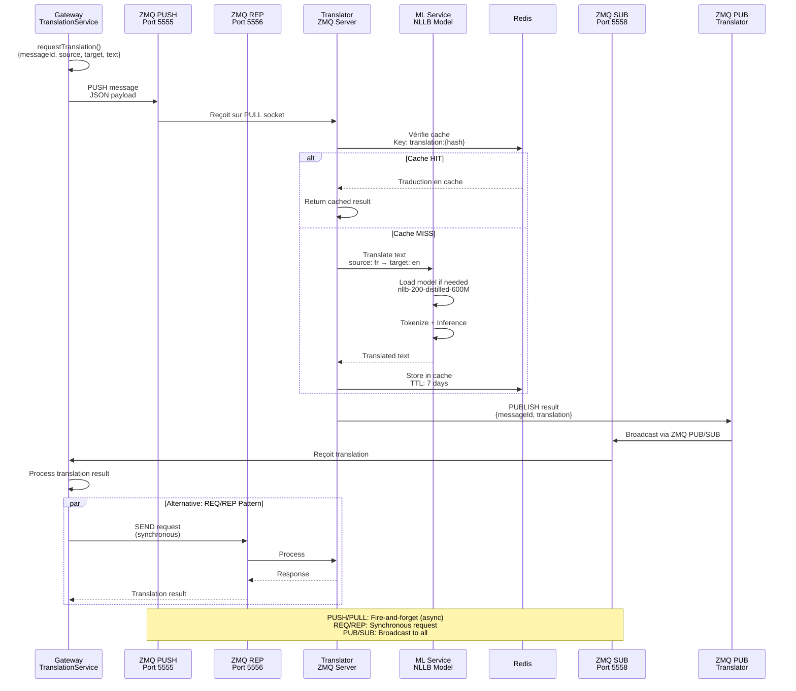
```mermaid
sequenceDiagram
    participant GW as Gateway<br/>TranslationService
    participant PUSH as ZMQ PUSH<br/>Port 5555
    participant REP as ZMQ REP<br/>Port 5556
    participant Trans as Translator<br/>ZMQ Server
    participant ML as ML Service<br/>NLLB Model
    participant Cache as Redis
    participant SUB as ZMQ SUB<br/>Port 5558
    participant PUB as ZMQ PUB<br/>Translator

    GW->>GW: requestTranslation()<br/>{messageId, source, target, text}

    GW->>PUSH: PUSH message<br/>JSON payload
    PUSH->>Trans: Reçoit sur PULL socket

    Trans->>Cache: Vérifie cache<br/>Key: translation:{hash}

    alt Cache HIT
        Cache-->>Trans: Traduction en cache
        Trans->>Trans: Return cached result
    else Cache MISS
        Trans->>ML: Translate text<br/>source: fr → target: en

        ML->>ML: Load model if needed<br/>nllb-200-distilled-600M
        ML->>ML: Tokenize + Inference
        ML-->>Trans: Translated text

        Trans->>Cache: Store in cache<br/>TTL: 7 days
    end

    Trans->>PUB: PUBLISH result<br/>{messageId, translation}
    PUB->>SUB: Broadcast via ZMQ PUB/SUB
    SUB->>GW: Reçoit translation

    GW->>GW: Process translation result

    par Alternative: REQ/REP Pattern
        GW->>REP: SEND request<br/>(synchronous)
        REP->>Trans: Process
        Trans-->>REP: Response
        REP-->>GW: Translation result
    end

    Note over PUSH,SUB: PUSH/PULL: Fire-and-forget (async)<br/>REQ/REP: Synchronous request<br/>PUB/SUB: Broadcast to all
```

---

## 7. Séquence d'Upload d'Attachements

Processus d'upload de fichiers avec traitement d'images et métadonnées (inchangé).

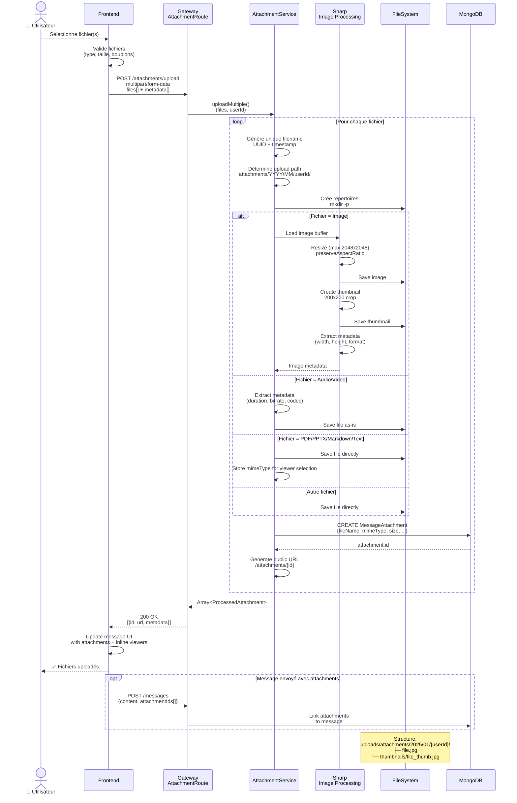
```mermaid
sequenceDiagram
    actor User as 👤 Utilisateur
    participant FE as Frontend
    participant GW as Gateway<br/>AttachmentRoute
    participant AS as AttachmentService
    participant Sharp as Sharp<br/>Image Processing
    participant FS as FileSystem
    participant DB as MongoDB

    User->>FE: Sélectionne fichier(s)
    FE->>FE: Valide fichiers<br/>(type, taille, doublons)

    FE->>GW: POST /attachments/upload<br/>multipart/form-data<br/>files[] + metadata[]

    GW->>AS: uploadMultiple()<br/>(files, userId)

    loop Pour chaque fichier
        AS->>AS: Génère unique filename<br/>UUID + timestamp

        AS->>AS: Détermine upload path<br/>attachments/YYYY/MM/userId/

        AS->>FS: Crée répertoires<br/>mkdir -p

        alt Fichier = Image
            AS->>Sharp: Load image buffer

            Sharp->>Sharp: Resize (max 2048x2048)<br/>preserveAspectRatio
            Sharp->>FS: Save image

            Sharp->>Sharp: Create thumbnail<br/>200x200 crop
            Sharp->>FS: Save thumbnail

            Sharp->>Sharp: Extract metadata<br/>(width, height, format)
            Sharp-->>AS: Image metadata

        else Fichier = Audio/Video
            AS->>AS: Extract metadata<br/>(duration, bitrate, codec)
            AS->>FS: Save file as-is

        else Fichier = PDF/PPTX/Markdown/Text
            AS->>FS: Save file directly
            AS->>AS: Store mimeType for viewer selection

        else Autre fichier
            AS->>FS: Save file directly
        end

        AS->>DB: CREATE MessageAttachment<br/>{fileName, mimeType, size, ...}
        DB-->>AS: attachment.id

        AS->>AS: Generate public URL<br/>/attachments/{id}
    end

    AS-->>GW: Array<ProcessedAttachment>
    GW-->>FE: 200 OK<br/>[{id, url, metadata}]

    FE->>FE: Update message UI<br/>with attachments + inline viewers
    FE-->>User: ✅ Fichiers uploadés

    opt Message envoyé avec attachments
        FE->>GW: POST /messages<br/>{content, attachmentIds[]}
        GW->>DB: Link attachments<br/>to message
    end

    Note over FS: Structure:<br/>uploads/attachments/2025/01/{userId}/<br/>  ├─ file.jpg<br/>  └─ thumbnails/file_thumb.jpg
```

---

## 8. Flux de Données en Temps Réel

Architecture Socket.IO pour la communication en temps réel avec événements d'appels vidéo.

```mermaid
graph TB
    subgraph "Clients"
        User1[👤 User 1<br/>Socket ID: abc123]
        User2[👤 User 2<br/>Socket ID: def456]
        User3[👥 Anonymous<br/>Socket ID: ghi789]
    end

    subgraph "Gateway - Socket.IO Server"
        SocketManager[🔌 MeeshySocketIOManager<br/>pingTimeout: 10s<br/>pingInterval: 25s]

        subgraph "Rooms"
            ConvRoom1[conversation:conv_001]
            ConvRoom2[conversation:conv_002]
            CallRoom1[call:call_001]
            UserRoom1[user:userId_1]
            UserRoom2[user:userId_2]
        end

        subgraph "Event Handlers"
            MessageHandler[💬 Message Handler]
            TypingHandler[⌨️ Typing Handler]
            CallHandler[📞 Call Events Handler<br/>call:initiate<br/>call:join<br/>call:leave<br/>call:signal<br/>call:media-toggle]
            StatusHandler[🟢 Status Handler]
        end
    end

    subgraph "Backend Services"
        MessagingService[📨 Messaging Service]
        TranslationService[🌍 Translation Service]
        CallService[📞 Call Service<br/>P2P Mode<br/>Rate Limiting]
        CallCleanupService[🧹 Call Cleanup Service]
    end

    User1 -->|Socket.IO Connect<br/>auth: {token}| SocketManager
    User2 -->|Socket.IO Connect<br/>auth: {token}| SocketManager
    User3 -->|Socket.IO Connect<br/>auth: {sessionToken}| SocketManager

    SocketManager -->|join rooms| ConvRoom1
    SocketManager -->|join rooms| ConvRoom2
    SocketManager -->|join rooms| CallRoom1
    SocketManager -->|join rooms| UserRoom1
    SocketManager -->|join rooms| UserRoom2

    User1 -.->|emit('message:send')| MessageHandler
    MessageHandler --> MessagingService
    MessagingService -.->|emit('message:received')| ConvRoom1

    User2 -.->|emit('user:typing')| TypingHandler
    TypingHandler -.->|broadcast| ConvRoom1

    MessagingService --> TranslationService
    TranslationService -.->|emit('translation:received')| ConvRoom1

    User1 -.->|emit('call:initiate')| CallHandler
    CallHandler --> CallService
    CallService -.->|emit('call:initiated')| UserRoom2
    CallService -.->|emit('call:participant-joined')| CallRoom1

    User1 -.->|emit('call:signal')<br/>{offer/answer/ice}| CallHandler
    CallHandler -.->|forward signal| User2

    CallService --> CallCleanupService

    ConvRoom1 -.->|message:received| User1
    ConvRoom1 -.->|message:received| User2
    ConvRoom1 -.->|translation:received| User1
    ConvRoom1 -.->|user:typing| User1

    CallRoom1 -.->|call:participant-joined| User1
    CallRoom1 -.->|call:participant-left| User2

    StatusHandler -.->|emit('user:status')| SocketManager
    SocketManager -.->|broadcast| User1
    SocketManager -.->|broadcast| User2

    style User1 fill:#4CAF50
    style User2 fill:#2196F3
    style User3 fill:#FF9800
    style SocketManager fill:#FFC107
    style ConvRoom1 fill:#E91E63
    style CallRoom1 fill:#9C27B0
    style CallHandler fill:#E91E6380
```

---

## 9. Modèle de Base de Données (ERD)

Relations entre les principales entités MongoDB avec les nouveaux modèles.

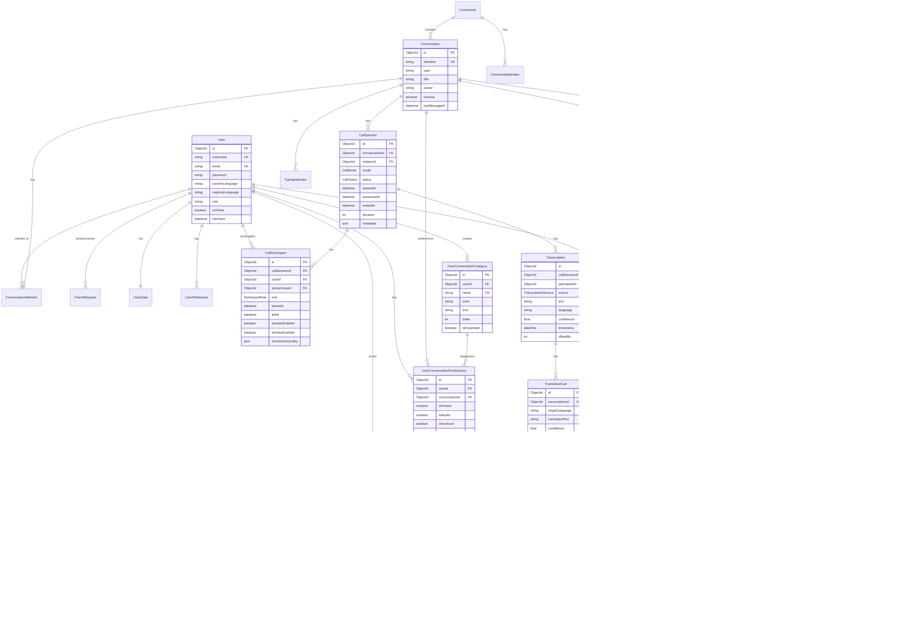
```mermaid
erDiagram
    User ||--o{ ConversationMember : "member of"
    User ||--o{ Message : "sends"
    User ||--o{ Reaction : "reacts"
    User ||--o{ FriendRequest : "sends/receives"
    User ||--|| UserStats : "has"
    User ||--o{ UserPreference : "has"
    User ||--o{ CallParticipant : "participates"
    User ||--o{ UserConversationPreferences : "has"
    User ||--o{ UserConversationCategory : "creates"

    Conversation ||--o{ ConversationMember : "has"
    Conversation ||--o{ Message : "contains"
    Conversation ||--o{ ConversationShareLink : "has"
    Conversation ||--o{ TypingIndicator : "has"
    Conversation ||--o{ CallSession : "has"
    Conversation ||--o{ UserConversationPreferences : "preferences"

    Community ||--o{ CommunityMember : "has"
    Community ||--o{ Conversation : "contains"

    Message ||--o{ MessageStatus : "has"
    Message ||--o{ MessageTranslation : "has"
    Message ||--o{ MessageAttachment : "has"
    Message ||--o{ Reaction : "receives"
    Message ||--o{ Message : "replies to"

    ConversationShareLink ||--o{ AnonymousParticipant : "creates"

    AnonymousParticipant ||--o{ Message : "sends"
    AnonymousParticipant ||--o{ Reaction : "reacts"

    CallSession ||--o{ CallParticipant : "has"
    CallSession ||--o{ Transcription : "has"

    Transcription ||--o{ TranslationCall : "has"

    UserConversationCategory ||--o{ UserConversationPreferences : "categorizes"

    User {
        ObjectId id PK
        string username UK
        string email UK
        string password
        string systemLanguage
        string regionalLanguage
        string role
        boolean isOnline
        datetime lastSeen
    }

    Conversation {
        ObjectId id PK
        string identifier UK
        string type
        string title
        string avatar
        boolean isActive
        datetime lastMessageAt
    }

    Message {
        ObjectId id PK
        ObjectId conversationId FK
        ObjectId senderId FK
        ObjectId anonymousSenderId FK
        string content
        string originalLanguage
        string messageType
        boolean isEdited
        boolean isDeleted
        ObjectId replyToId FK
    }

    MessageTranslation {
        ObjectId id PK
        ObjectId messageId FK
        string sourceLanguage
        string targetLanguage
        string translatedContent
        string translationModel
        string cacheKey UK
        float confidenceScore
    }

    MessageAttachment {
        ObjectId id PK
        ObjectId messageId FK
        string fileName
        string originalName
        string mimeType
        int fileSize
        string filePath
        string fileUrl
        int width
        int height
        int duration
    }

    ConversationShareLink {
        ObjectId id PK
        string linkId UK
        string identifier UK
        ObjectId conversationId FK
        int maxUses
        int currentUses
        boolean allowAnonymousMessages
        boolean requireNickname
    }

    AnonymousParticipant {
        ObjectId id PK
        ObjectId conversationId FK
        ObjectId shareLinkId FK
        string sessionToken UK
        string username
        string email
        boolean isActive
        boolean canSendMessages
    }

    CallSession {
        ObjectId id PK
        ObjectId conversationId FK
        ObjectId initiatorId FK
        CallMode mode
        CallStatus status
        datetime startedAt
        datetime answeredAt
        datetime endedAt
        int duration
        json metadata
    }

    CallParticipant {
        ObjectId id PK
        ObjectId callSessionId FK
        ObjectId userId FK
        ObjectId anonymousId FK
        ParticipantRole role
        datetime joinedAt
        datetime leftAt
        boolean isAudioEnabled
        boolean isVideoEnabled
        json connectionQuality
    }

    Transcription {
        ObjectId id PK
        ObjectId callSessionId FK
        ObjectId participantId FK
        TranscriptionSource source
        string text
        string language
        float confidence
        datetime timestamp
        int offsetMs
    }

    TranslationCall {
        ObjectId id PK
        ObjectId transcriptionId FK
        string targetLanguage
        string translatedText
        float confidence
        string model
        boolean cached
        datetime createdAt
    }

    UserConversationPreferences {
        ObjectId id PK
        ObjectId userId FK
        ObjectId conversationId FK
        boolean isPinned
        boolean isMuted
        boolean isArchived
        string_array tags
        ObjectId categoryId FK
        int orderInCategory
        string customName
        string reaction
    }

    UserConversationCategory {
        ObjectId id PK
        ObjectId userId FK
        string name UK
        string color
        string icon
        int order
        boolean isExpanded
    }
```

---

## 10. Infrastructure Réseau

Architecture réseau et flux de communication entre services (inchangé).

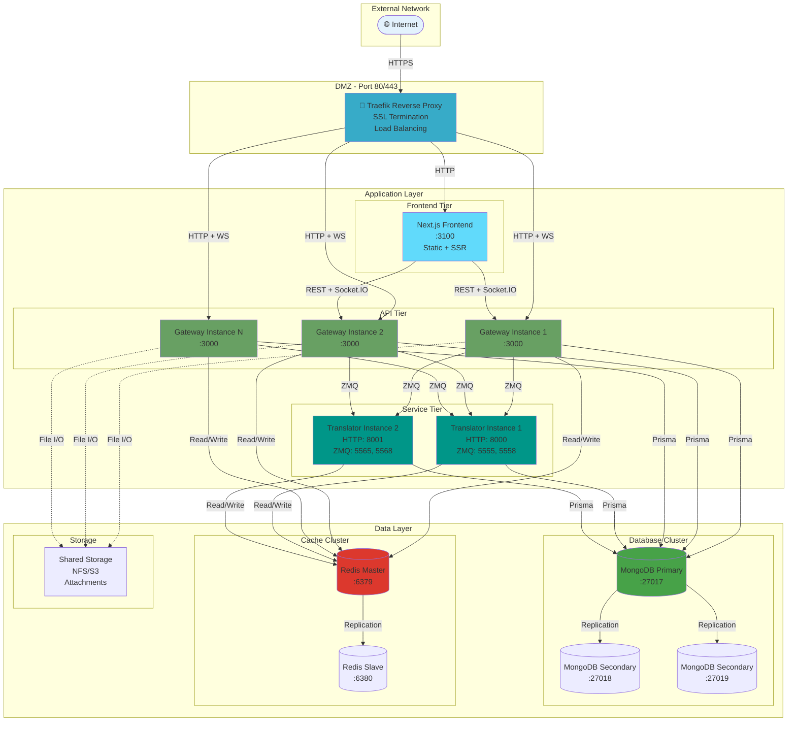
```mermaid
graph TB
    subgraph "External Network"
        Internet([🌐 Internet])
    end

    subgraph "DMZ - Port 80/443"
        Traefik[🔀 Traefik Reverse Proxy<br/>SSL Termination<br/>Load Balancing]
    end

    subgraph "Application Layer"
        subgraph "Frontend Tier"
            FE[Next.js Frontend<br/>:3100<br/>Static + SSR]
        end

        subgraph "API Tier"
            GW1[Gateway Instance 1<br/>:3000]
            GW2[Gateway Instance 2<br/>:3000]
            GW3[Gateway Instance N<br/>:3000]
        end

        subgraph "Service Tier"
            Trans1[Translator Instance 1<br/>HTTP: 8000<br/>ZMQ: 5555, 5558]
            Trans2[Translator Instance 2<br/>HTTP: 8001<br/>ZMQ: 5565, 5568]
        end
    end

    subgraph "Data Layer"
        subgraph "Database Cluster"
            MongoPrimary[(MongoDB Primary<br/>:27017)]
            MongoSecondary1[(MongoDB Secondary<br/>:27018)]
            MongoSecondary2[(MongoDB Secondary<br/>:27019)]
        end

        subgraph "Cache Cluster"
            RedisMaster[(Redis Master<br/>:6379)]
            RedisSlave[(Redis Slave<br/>:6380)]
        end

        subgraph "Storage"
            NFS[Shared Storage<br/>NFS/S3<br/>Attachments]
        end
    end

    Internet -->|HTTPS| Traefik

    Traefik -->|HTTP| FE
    Traefik -->|HTTP + WS| GW1
    Traefik -->|HTTP + WS| GW2
    Traefik -->|HTTP + WS| GW3

    FE -->|REST + Socket.IO| GW1
    FE -->|REST + Socket.IO| GW2

    GW1 -->|ZMQ| Trans1
    GW1 -->|ZMQ| Trans2
    GW2 -->|ZMQ| Trans1
    GW2 -->|ZMQ| Trans2
    GW3 -->|ZMQ| Trans1

    GW1 -->|Prisma| MongoPrimary
    GW2 -->|Prisma| MongoPrimary
    GW3 -->|Prisma| MongoPrimary

    Trans1 -->|Prisma| MongoPrimary
    Trans2 -->|Prisma| MongoPrimary

    GW1 -->|Read/Write| RedisMaster
    GW2 -->|Read/Write| RedisMaster
    GW3 -->|Read/Write| RedisMaster

    Trans1 -->|Read/Write| RedisMaster
    Trans2 -->|Read/Write| RedisMaster

    MongoPrimary -->|Replication| MongoSecondary1
    MongoPrimary -->|Replication| MongoSecondary2

    RedisMaster -->|Replication| RedisSlave

    GW1 -.->|File I/O| NFS
    GW2 -.->|File I/O| NFS
    GW3 -.->|File I/O| NFS

    style Internet fill:#E3F2FD
    style Traefik fill:#37ABC8
    style FE fill:#61DAFB
    style GW1 fill:#68A063
    style GW2 fill:#68A063
    style GW3 fill:#68A063
    style Trans1 fill:#009688
    style Trans2 fill:#009688
    style MongoPrimary fill:#47A248
    style RedisMaster fill:#DC382D
```

---

## 11. États des Connexions WebSocket

Diagramme d'états pour les connexions Socket.IO (inchangé).

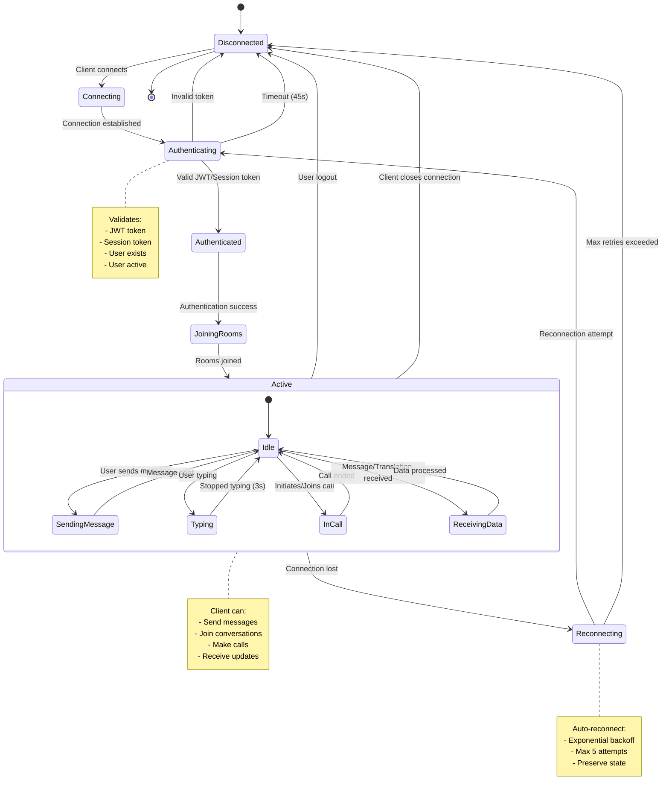
```mermaid
stateDiagram-v2
    [*] --> Disconnected

    Disconnected --> Connecting : Client connects
    Connecting --> Authenticating : Connection established

    Authenticating --> Authenticated : Valid JWT/Session token
    Authenticating --> Disconnected : Invalid token
    Authenticating --> Disconnected : Timeout (45s)

    Authenticated --> JoiningRooms : Authentication success
    JoiningRooms --> Active : Rooms joined

    state Active {
        [*] --> Idle
        Idle --> SendingMessage : User sends message
        SendingMessage --> Idle : Message sent

        Idle --> Typing : User typing
        Typing --> Idle : Stopped typing (3s)

        Idle --> InCall : Initiates/Joins call
        InCall --> Idle : Call ended

        Idle --> ReceivingData : Message/Translation received
        ReceivingData --> Idle : Data processed
    }

    Active --> Reconnecting : Connection lost
    Reconnecting --> Authenticating : Reconnection attempt
    Reconnecting --> Disconnected : Max retries exceeded

    Active --> Disconnected : User logout
    Active --> Disconnected : Client closes connection

    Disconnected --> [*]

    note right of Authenticating
        Validates:
        - JWT token
        - Session token
        - User exists
        - User active
    end note

    note right of Active
        Client can:
        - Send messages
        - Join conversations
        - Make calls
        - Receive updates
    end note

    note right of Reconnecting
        Auto-reconnect:
        - Exponential backoff
        - Max 5 attempts
        - Preserve state
    end note
```

---

## 12. Séquence d'Appel Vidéo WebRTC P2P

Processus complet de signaling WebRTC avec les nouveaux composants.

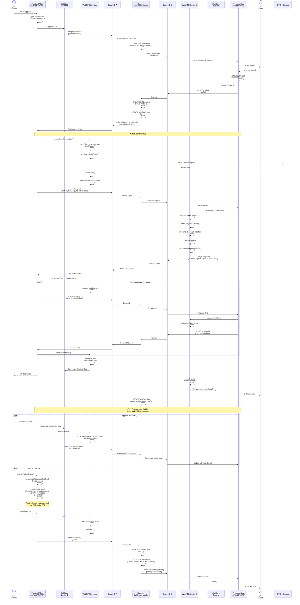
```mermaid
sequenceDiagram
    actor Alice as 👤 Alice
    participant FE_A as Frontend Alice<br/>useWebRTCP2P
    participant Store_A as CallStore<br/>Zustand
    participant WS_A as WebRTCService A
    participant Socket_A as Socket.IO A
    participant GW as Gateway<br/>CallEventsHandler
    participant Socket_B as Socket.IO B
    participant WS_B as WebRTCService B
    participant Store_B as CallStore<br/>Zustand
    participant FE_B as Frontend Bob<br/>useWebRTCP2P
    actor Bob as 👤 Bob
    participant STUN as STUN Servers

    Alice->>FE_A: Clique "Appeler"
    FE_A->>FE_A: getUserMedia()<br/>request camera/mic
    FE_A->>Store_A: Set localStream

    FE_A->>Socket_A: emit('call:initiate')<br/>{conversationId}
    Socket_A->>GW: Rate limit check (5/min)
    GW->>GW: CREATE CallSession<br/>{mode: 'p2p', status: 'initiated'}

    GW->>Socket_B: emit('call:initiated')<br/>to user:Bob
    Socket_B->>FE_B: Call notification + ringtone
    FE_B-->>Bob: 📞 Appel entrant

    Bob->>FE_B: Accepte l'appel
    FE_B->>FE_B: getUserMedia()<br/>request camera/mic
    FE_B->>Store_B: Set localStream

    FE_B->>Socket_B: emit('call:join')<br/>{callId}
    Socket_B->>GW: Join call
    GW->>GW: UPDATE CallSession<br/>{status: 'ringing'}
    GW->>GW: CREATE CallParticipant<br/>(Bob)

    GW->>Socket_A: emit('call:participant-joined')<br/>{participantId: Bob}
    Socket_A->>FE_A: Participant joined

    Note over FE_A,FE_B: WebRTC P2P Setup

    FE_A->>WS_A: createPeerConnection()
    WS_A->>WS_A: new RTCPeerConnection<br/>(iceServers)
    WS_A->>WS_A: addTrack(localStream)

    WS_A->>STUN: STUN binding request
    STUN-->>WS_A: Public IP/Port

    WS_A->>WS_A: createOffer()
    WS_A->>WS_A: setLocalDescription(offer)

    FE_A->>Socket_A: emit('call:signal')<br/>{to: Bob, signal: {type: 'offer', sdp}}
    Socket_A->>GW: Forward signal
    GW->>Socket_B: emit('call:signal')
    Socket_B->>FE_B: Receive offer

    FE_B->>WS_B: createPeerConnection()
    WS_B->>WS_B: new RTCPeerConnection
    WS_B->>WS_B: addTrack(localStream)
    WS_B->>WS_B: setRemoteDescription(offer)

    WS_B->>WS_B: createAnswer()
    WS_B->>WS_B: setLocalDescription(answer)

    FE_B->>Socket_B: emit('call:signal')<br/>{to: Alice, signal: {type: 'answer', sdp}}
    Socket_B->>GW: Forward signal
    GW->>Socket_A: emit('call:signal')
    Socket_A->>FE_A: Receive answer

    FE_A->>WS_A: setRemoteDescription(answer)

    loop ICE Candidate Exchange
        WS_A->>WS_A: onicecandidate event
        FE_A->>Socket_A: emit('call:signal')<br/>{type: 'ice-candidate'}
        Socket_A->>GW: Forward
        GW->>Socket_B: Forward to Bob
        Socket_B->>FE_B: Receive ICE
        FE_B->>WS_B: addIceCandidate()

        WS_B->>WS_B: onicecandidate event
        FE_B->>Socket_B: emit('call:signal')<br/>{type: 'ice-candidate'}
        Socket_B->>GW: Forward
        GW->>Socket_A: Forward to Alice
        Socket_A->>FE_A: Receive ICE
        FE_A->>WS_A: addIceCandidate()
    end

    WS_A->>WS_A: ontrack event<br/>(remote stream)
    WS_A->>Store_A: Set remoteStreams[Bob]
    FE_A-->>Alice: 📹 Bob visible

    WS_B->>WS_B: ontrack event<br/>(remote stream)
    WS_B->>Store_B: Set remoteStreams[Alice]
    FE_B-->>Bob: 📹 Alice visible

    GW->>GW: UPDATE CallSession<br/>{status: 'active', answeredAt}

    Note over FE_A,FE_B: ✅ P2P Connection établie<br/>Direct audio/video streaming

    opt Toggle Audio/Video
        Alice->>FE_A: Désactive audio
        FE_A->>Store_A: Set isAudioEnabled = false
        FE_A->>WS_A: toggleAudio()
        WS_A->>WS_A: localStream.getAudioTracks()[0]<br/>.enabled = false
        FE_A->>Socket_A: emit('call:media-toggle')<br/>{audio: false}
        Socket_A->>GW: Update participant state
        GW->>Socket_B: Broadcast media state
        Socket_B->>FE_B: Update UI (muted icon)
    end

    opt Audio Effects
        Alice->>FE_A: Active "Voice Coder"
        FE_A->>FE_A: useAudioEffects.toggleEffect()<br/>(voice-coder)
        FE_A->>FE_A: Rebuild audio graph<br/>MediaStream → AudioContext<br/>→ VoiceCoderProcessor<br/>→ Destination
        Note over FE_A: Audio effectué en temps réel<br/>via Web Audio API
    end

    Alice->>FE_A: Termine l'appel
    FE_A->>WS_A: close()
    WS_A->>WS_A: peerConnection.close()
    WS_A->>WS_A: Stop tracks

    FE_A->>Socket_A: emit('call:leave')<br/>{callId}
    Socket_A->>GW: Leave call
    GW->>GW: UPDATE CallParticipant<br/>{leftAt}
    GW->>GW: UPDATE CallSession<br/>{status: 'ended', endedAt, duration}

    GW->>Socket_B: emit('call:participant-left')<br/>{participantId: Alice}
    Socket_B->>FE_B: Participant left
    FE_B->>WS_B: close()

    FE_B-->>Bob: 📵 Appel terminé
```

---

## 13. États des Call Sessions

Machine à états pour les sessions d'appel vidéo.

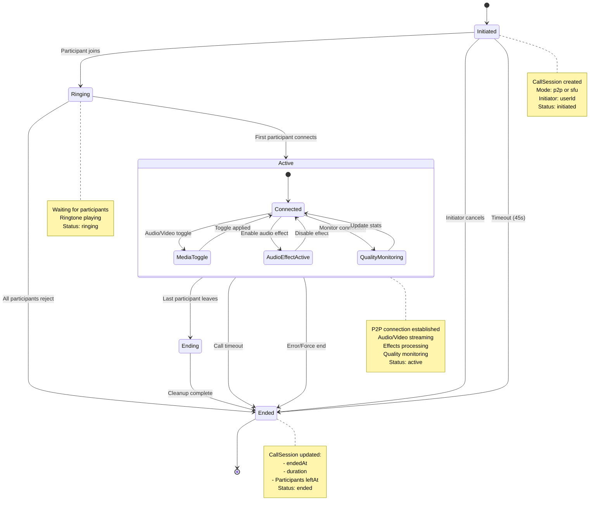
```mermaid
stateDiagram-v2
    [*] --> Initiated

    Initiated --> Ringing : Participant joins
    Initiated --> Ended : Initiator cancels
    Initiated --> Ended : Timeout (45s)

    Ringing --> Active : First participant connects
    Ringing --> Ended : All participants reject

    state Active {
        [*] --> Connected
        Connected --> MediaToggle : Audio/Video toggle
        MediaToggle --> Connected : Toggle applied

        Connected --> AudioEffectActive : Enable audio effect
        AudioEffectActive --> Connected : Disable effect

        Connected --> QualityMonitoring : Monitor connection
        QualityMonitoring --> Connected : Update stats
    }

    Active --> Ending : Last participant leaves
    Active --> Ended : Call timeout
    Active --> Ended : Error/Force end

    Ending --> Ended : Cleanup complete

    Ended --> [*]

    note right of Initiated
        CallSession created
        Mode: p2p or sfu
        Initiator: userId
        Status: initiated
    end note

    note right of Ringing
        Waiting for participants
        Ringtone playing
        Status: ringing
    end note

    note right of Active
        P2P connection established
        Audio/Video streaming
        Effects processing
        Quality monitoring
        Status: active
    end note

    note right of Ended
        CallSession updated:
        - endedAt
        - duration
        - Participants leftAt
        Status: ended
    end note
```

---

## 14. Architecture des Audio Effects

Architecture Web Audio API pour le traitement des effets audio en temps réel.

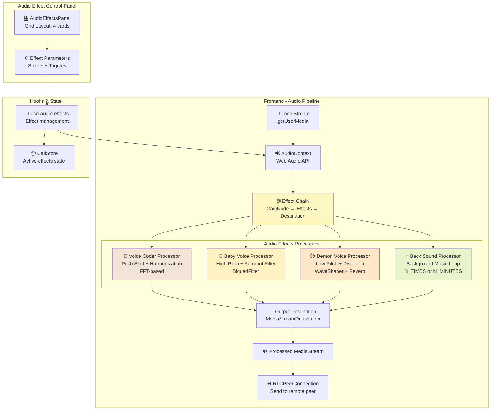
```mermaid
graph TB
    subgraph "Frontend - Audio Pipeline"
        LocalStream[🎤 LocalStream<br/>getUserMedia]
        AudioContext[🔊 AudioContext<br/>Web Audio API]

        subgraph "Audio Effects Processors"
            VoiceCoder[🎵 Voice Coder Processor<br/>Pitch Shift + Harmonization<br/>FFT-based]
            BabyVoice[👶 Baby Voice Processor<br/>High Pitch + Formant Filter<br/>BiquadFilter]
            DemonVoice[😈 Demon Voice Processor<br/>Low Pitch + Distortion<br/>WaveShaper + Reverb]
            BackSound[🎶 Back Sound Processor<br/>Background Music Loop<br/>N_TIMES or N_MINUTES]
        end

        EffectChain[⛓️ Effect Chain<br/>GainNode → Effects → Destination]
        OutputDest[📢 Output Destination<br/>MediaStreamDestination]
        ProcessedStream[🔊 Processed MediaStream]
        PeerConnection[🌐 RTCPeerConnection<br/>Send to remote peer]
    end

    subgraph "Audio Effect Control Panel"
        EffectUI[🎛️ AudioEffectsPanel<br/>Grid Layout: 4 cards]
        EffectParams[⚙️ Effect Parameters<br/>Sliders + Toggles]
    end

    subgraph "Hooks & State"
        useAudioEffects[🎣 use-audio-effects<br/>Effect management]
        CallStore[📦 CallStore<br/>Active effects state]
    end

    LocalStream --> AudioContext
    AudioContext --> EffectChain

    EffectChain --> VoiceCoder
    EffectChain --> BabyVoice
    EffectChain --> DemonVoice
    EffectChain --> BackSound

    VoiceCoder --> OutputDest
    BabyVoice --> OutputDest
    DemonVoice --> OutputDest
    BackSound --> OutputDest

    OutputDest --> ProcessedStream
    ProcessedStream --> PeerConnection

    EffectUI --> EffectParams
    EffectParams --> useAudioEffects
    useAudioEffects --> AudioContext
    useAudioEffects --> CallStore

    style VoiceCoder fill:#9C27B020
    style BabyVoice fill:#FF980020
    style DemonVoice fill:#F4433620
    style BackSound fill:#4CAF5020
    style EffectChain fill:#FFC10720
```

**Voice Coder Parameters:**
- Pitch shift (-12 à +12 semitones)
- Auto-tune strength (0-100%)
- Harmonizer mix (0-100%)

**Baby Voice Parameters:**
- Pitch multiplier (1.5x - 2.5x)
- Formant frequency (2000-4000 Hz)
- High-pass filter cutoff

**Demon Voice Parameters:**
- Pitch multiplier (0.5x - 0.8x)
- Distortion amount (0-100%)
- Reverb mix (0-100%)

**Back Sound Parameters:**
- Volume (0-100%)
- Loop mode (N_TIMES or N_MINUTES)
- Audio source selection

---

## 15. Séquence de Monitoring de Qualité d'Appel

Processus de monitoring en temps réel de la qualité de connexion WebRTC.

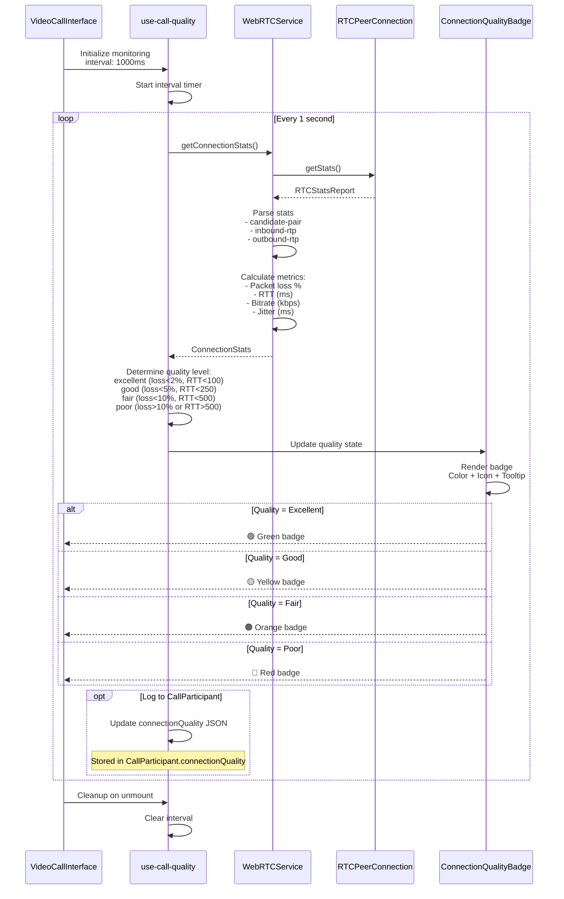
```mermaid
sequenceDiagram
    participant UI as VideoCallInterface
    participant Hook as use-call-quality
    participant WS as WebRTCService
    participant PC as RTCPeerConnection
    participant Badge as ConnectionQualityBadge

    UI->>Hook: Initialize monitoring<br/>interval: 1000ms
    Hook->>Hook: Start interval timer

    loop Every 1 second
        Hook->>WS: getConnectionStats()
        WS->>PC: getStats()
        PC-->>WS: RTCStatsReport

        WS->>WS: Parse stats<br/>- candidate-pair<br/>- inbound-rtp<br/>- outbound-rtp

        WS->>WS: Calculate metrics:<br/>- Packet loss %<br/>- RTT (ms)<br/>- Bitrate (kbps)<br/>- Jitter (ms)

        WS-->>Hook: ConnectionStats

        Hook->>Hook: Determine quality level:<br/>excellent (loss<2%, RTT<100)<br/>good (loss<5%, RTT<250)<br/>fair (loss<10%, RTT<500)<br/>poor (loss>10% or RTT>500)

        Hook->>Badge: Update quality state
        Badge->>Badge: Render badge<br/>Color + Icon + Tooltip

        alt Quality = Excellent
            Badge-->>UI: 🟢 Green badge
        else Quality = Good
            Badge-->>UI: 🟡 Yellow badge
        else Quality = Fair
            Badge-->>UI: 🟠 Orange badge
        else Quality = Poor
            Badge-->>UI: 🔴 Red badge
        end

        opt Log to CallParticipant
            Hook->>Hook: Update connectionQuality JSON
            Note over Hook: Stored in CallParticipant.connectionQuality
        end
    end

    UI->>Hook: Cleanup on unmount
    Hook->>Hook: Clear interval
```

**Quality Metrics:**
```typescript
interface ConnectionQualityStats {
  level: 'excellent' | 'good' | 'fair' | 'poor'
  packetLoss: number        // Percentage
  roundTripTime: number     // Milliseconds
  bitrate: number          // Kbps
  jitter: number           // Milliseconds
  timestamp: Date
}
```

---

## 16. Architecture des Document Viewers

Architecture des viewers pour documents avec lightbox et inline display.

```mermaid
graph TB
    subgraph "Message Attachments"
        Attachment[MessageAttachment<br/>{mimeType, fileUrl, fileName}]
    end

    subgraph "Viewer Selection Logic"
        Dispatcher[Attachment Type Dispatcher]
    end

    subgraph "PDF Viewer"
        PDFViewer[PDFViewer.tsx<br/>Inline iframe display]
        PDFLightbox[PDFLightbox.tsx<br/>Fullscreen view]
        PDFViewer -.->|fullscreen| PDFLightbox
    end

    subgraph "Markdown Viewer"
        MDViewer[MarkdownViewer.tsx<br/>react-markdown + GFM<br/>Syntax highlighting]
        MDLightbox[MarkdownLightbox.tsx<br/>Fullscreen view]
        MermaidDiagram[MermaidDiagram.tsx<br/>Diagram rendering]
        MDViewer --> MermaidDiagram
        MDViewer -.->|fullscreen| MDLightbox
    end

    subgraph "PPTX Viewer"
        PPTXViewer[PPTXViewer.tsx<br/>MS Office Online embed]
        PPTXLightbox[PPTXLightbox.tsx<br/>Fullscreen view]
        PPTXViewer -.->|fullscreen| PPTXLightbox
    end

    subgraph "Text Viewer"
        TextViewer[TextViewer.tsx<br/>Plain text + syntax<br/>Copy to clipboard]
        TextLightbox[TextLightbox.tsx<br/>Fullscreen view]
        TextViewer -.->|fullscreen| TextLightbox
    end

    subgraph "Video Viewer"
        VideoPlayer[VideoPlayer.tsx<br/>HTML5 video controls<br/>Inline playback]
        VideoLightbox[VideoLightbox.tsx<br/>Fullscreen view]
        VideoPlayer -.->|fullscreen| VideoLightbox
    end

    subgraph "Image Viewer"
        ImageInline[Image inline<br/>Thumbnail preview]
        ImageLightbox[ImageLightbox.tsx<br/>Fullscreen gallery]
        ImageInline -.->|click| ImageLightbox
    end

    Attachment --> Dispatcher

    Dispatcher -->|application/pdf| PDFViewer
    Dispatcher -->|text/markdown| MDViewer
    Dispatcher -->|application/vnd.ms-powerpoint| PPTXViewer
    Dispatcher -->|text/plain| TextViewer
    Dispatcher -->|video/*| VideoPlayer
    Dispatcher -->|image/*| ImageInline

    style PDFViewer fill:#FF572220
    style MDViewer fill:#4CAF5020
    style PPTXViewer fill:#FF980020
    style TextViewer fill:#2196F320
    style VideoPlayer fill:#9C27B020
```

**Supported MIME Types:**

| MIME Type | Viewer | Features |
|-----------|--------|----------|
| `application/pdf` | PDFViewer | Inline iframe, download, fullscreen |
| `text/markdown` | MarkdownViewer | GFM, syntax highlight, Mermaid, raw view |
| `application/vnd.ms-powerpoint`<br/>`application/vnd.openxmlformats-officedocument.presentationml.presentation` | PPTXViewer | MS Office Online embed |
| `text/plain`<br/>`text/csv` | TextViewer | Syntax highlighting, copy, word wrap |
| `video/mp4`<br/>`video/webm` | VideoPlayer | HTML5 controls, inline playback |
| `image/jpeg`<br/>`image/png`<br/>`image/gif`<br/>`image/webp` | ImageLightbox | Gallery, zoom, navigation |

---

## 17. Séquence des User Preferences

Gestion des préférences personnalisées par utilisateur et par conversation.

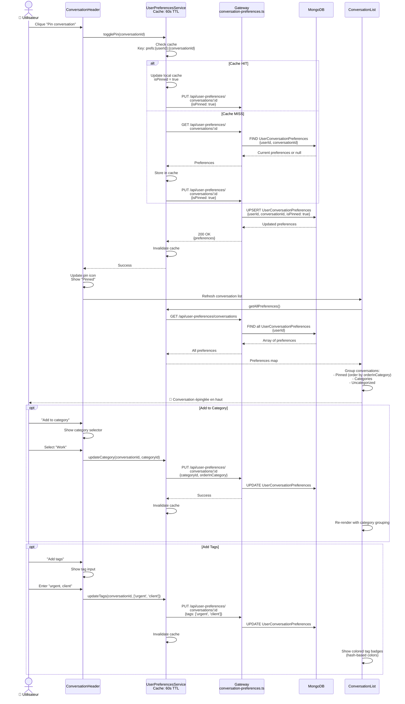
```mermaid
sequenceDiagram
    actor User as 👤 Utilisateur
    participant UI as ConversationHeader
    participant Service as UserPreferencesService<br/>Cache: 60s TTL
    participant GW as Gateway<br/>conversation-preferences.ts
    participant DB as MongoDB
    participant List as ConversationList

    User->>UI: Clique "Pin conversation"
    UI->>Service: togglePin(conversationId)

    Service->>Service: Check cache<br/>Key: prefs:{userId}:{conversationId}

    alt Cache HIT
        Service->>Service: Update local cache<br/>isPinned = true
        Service->>GW: PUT /api/user-preferences/<br/>conversations/:id<br/>{isPinned: true}
    else Cache MISS
        Service->>GW: GET /api/user-preferences/<br/>conversations/:id
        GW->>DB: FIND UserConversationPreferences<br/>{userId, conversationId}
        DB-->>GW: Current preferences or null
        GW-->>Service: Preferences
        Service->>Service: Store in cache
        Service->>GW: PUT /api/user-preferences/<br/>conversations/:id<br/>{isPinned: true}
    end

    GW->>DB: UPSERT UserConversationPreferences<br/>{userId, conversationId, isPinned: true}
    DB-->>GW: Updated preferences

    GW-->>Service: 200 OK<br/>{preferences}
    Service->>Service: Invalidate cache
    Service-->>UI: Success

    UI->>UI: Update pin icon<br/>Show "Pinned"
    UI->>List: Refresh conversation list
    List->>Service: getAllPreferences()
    Service->>GW: GET /api/user-preferences/conversations
    GW->>DB: FIND all UserConversationPreferences<br/>{userId}
    DB-->>GW: Array of preferences
    GW-->>Service: All preferences
    Service-->>List: Preferences map

    List->>List: Group conversations:<br/>- Pinned (order by orderInCategory)<br/>- Categories<br/>- Uncategorized

    List-->>User: 📌 Conversation épinglée en haut

    opt Add to Category
        User->>UI: "Add to category"
        UI->>UI: Show category selector
        User->>UI: Select "Work"
        UI->>Service: updateCategory(conversationId, categoryId)
        Service->>GW: PUT /api/user-preferences/<br/>conversations/:id<br/>{categoryId, orderInCategory}
        GW->>DB: UPDATE UserConversationPreferences
        GW-->>Service: Success
        Service->>Service: Invalidate cache
        List->>List: Re-render with category grouping
    end

    opt Add Tags
        User->>UI: "Add tags"
        UI->>UI: Show tag input
        User->>UI: Enter "urgent, client"
        UI->>Service: updateTags(conversationId, ['urgent', 'client'])
        Service->>GW: PUT /api/user-preferences/<br/>conversations/:id<br/>{tags: ['urgent', 'client']}
        GW->>DB: UPDATE UserConversationPreferences
        Service->>Service: Invalidate cache
        List->>List: Show colored tag badges<br/>(hash-based colors)
    end
```

**User Preferences Features:**
- **isPinned**: Épingler conversation en haut
- **isMuted**: Désactiver notifications
- **isArchived**: Archiver conversation
- **tags**: Tags colorés (hash-based colors)
- **categoryId**: Grouper par catégorie personnalisée
- **orderInCategory**: Ordre custom dans catégorie
- **customName**: Nom personnalisé
- **reaction**: Emoji personnalisé

**Categories Features:**
- **name**: Nom unique par utilisateur
- **color**: Couleur hex
- **icon**: Emoji
- **order**: Ordre d'affichage
- **isExpanded**: État accordion

---

## Changelog des Changements Majeurs

### Version 2.0 (Janvier 2025)

**Nouvelles Fonctionnalités:**

1. **P2P Video Calls (Phase 1A MVP)**
   - Appels vidéo peer-to-peer via WebRTC
   - Signaling via Socket.IO
   - Support audio/vidéo avec toggles
   - ICE candidates via STUN servers
   - CallSession, CallParticipant models
   - CallEventsHandler pour Socket.IO
   - CallService avec rate limiting
   - useWebRTCP2P hook avec gestion des streams

2. **Audio Effects en Temps Réel**
   - Voice Coder (auto-tune + pitch shift)
   - Baby Voice (high pitch + formant)
   - Demon Voice (low pitch + distortion)
   - Back Sound (background music loop)
   - Web Audio API processing pipeline
   - AudioEffectsPanel UI component
   - use-audio-effects hook

3. **Connection Quality Monitoring**
   - Monitoring temps réel de la qualité WebRTC
   - Métriques: packet loss, RTT, bitrate, jitter
   - Quality levels: excellent/good/fair/poor
   - ConnectionQualityBadge UI component
   - use-call-quality hook
   - Stockage dans CallParticipant.connectionQuality

4. **Document Viewers avec Lightbox**
   - PDFViewer + PDFLightbox
   - MarkdownViewer + MarkdownLightbox + MermaidDiagram
   - PPTXViewer + PPTXLightbox
   - TextViewer + TextLightbox
   - VideoPlayer + VideoLightbox (amélioré)
   - ImageLightbox (existant)
   - Support inline + fullscreen pour tous

5. **User Preferences System**
   - UserConversationPreferences model
   - UserConversationCategory model
   - Pin/Mute/Archive conversations
   - Tags colorés avec hash-based colors
   - Catégories personnalisées
   - Ordre custom et custom names
   - UserPreferencesService avec cache (60s)
   - Routes conversation-preferences.ts
   - CommunityCarousel avec filtres
   - ConversationList grouping par catégories

6. **UI/UX Improvements**
   - OngoingCallBanner dans conversations
   - DraggableParticipantOverlay pour vidéo
   - ConversationHeader avec actions preferences
   - Duplicate file upload prevention
   - Attachment limit modal redesign
   - Tag colors utility (17 couleurs Tailwind-safe)

**Modèles de Base de Données Ajoutés:**
- CallSession
- CallParticipant
- Transcription (Phase 2A prep)
- TranslationCall (Phase 3 prep)
- UserConversationPreferences
- UserConversationCategory

**Nouveaux Événements Socket.IO:**
- `call:initiate`, `call:initiated`
- `call:join`, `call:participant-joined`
- `call:leave`, `call:participant-left`
- `call:signal` (offer/answer/ice-candidate)
- `call:media-toggle`
- `call:ended`, `call:error`

**Nouveaux Endpoints API:**
- `POST /api/calls` - Initiate call
- `POST /api/calls/:id/join` - Join call
- `POST /api/calls/:id/leave` - Leave call
- `GET /api/calls/:id` - Get call details
- `PUT /api/calls/:id/controls` - Toggle media
- `GET /api/user-preferences/conversations/:id`
- `GET /api/user-preferences/conversations`
- `PUT /api/user-preferences/conversations/:id`
- `DELETE /api/user-preferences/conversations/:id`
- `POST /api/user-preferences/reorder`
- Category CRUD endpoints

---

## Utilisation des Diagrammes

### Rendu des Diagrammes Mermaid

Ces diagrammes peuvent être rendus dans :

1. **GitHub** - Affichage natif dans les fichiers Markdown
2. **Mermaid Live Editor** - https://mermaid.live
3. **VS Code** - Extensions Mermaid Preview
4. **Documentation Sites** - Docusaurus, MkDocs, etc.

### Personnalisation

Vous pouvez modifier les diagrammes en ajustant :
- Les styles avec `style NodeName fill:#COLOR`
- Les légendes avec `Note over/right of/left of`
- Les formes des nœuds (rectangles, cercles, bases de données)
- Les types de flèches (solides, pointillées, directionnelles)

### Mise à Jour

Pour maintenir ces diagrammes à jour :
1. Mettre à jour après chaque changement architectural majeur
2. Versionner avec le code source
3. Inclure dans la documentation technique
4. Réviser lors des code reviews

---

**Version:** 2.0
**Dernière mise à jour:** 2025-01-07
**Maintenu par:** Équipe Meeshy
