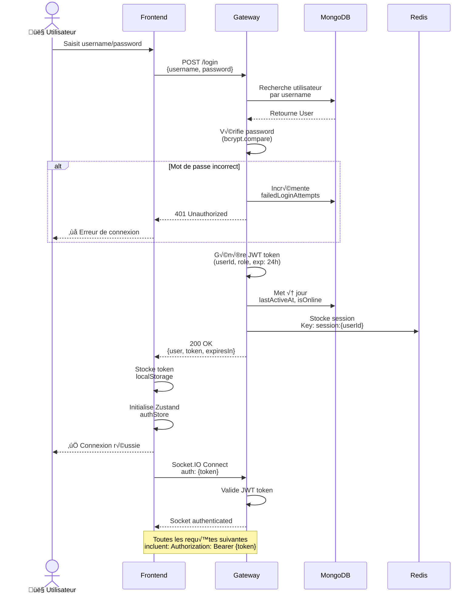
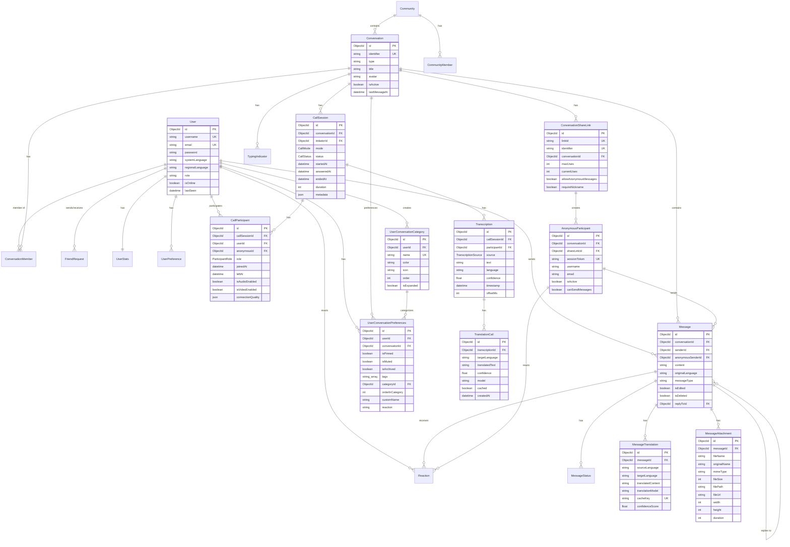

# Diagrammes d'Architecture Meeshy

Ce document contient une série de diagrammes Mermaid expliquant le fonctionnement de la plateforme Meeshy.

## Table des matières

1. [Architecture Globale (C4 Context)](#1-architecture-globale-c4-context)
2. [Structure des Composants](#2-structure-des-composants)
3. [Diagramme de Déploiement](#3-diagramme-de-déploiement)
4. [Séquence d'Authentification](#4-séquence-dauthentification)
5. [Séquence d'Envoi de Messages](#5-séquence-denvoi-de-messages)
6. [Séquence de Traduction](#6-séquence-de-traduction)
7. [Séquence d'Upload d'Attachements](#7-séquence-dupload-dattachements)
8. [Flux de Données en Temps Réel](#8-flux-de-données-en-temps-réel)
9. [Modèle de Base de Données (ERD)](#9-modèle-de-base-de-données-erd)
10. [Infrastructure Réseau](#10-infrastructure-réseau)
11. [États des Connexions WebSocket](#11-états-des-connexions-websocket)
12. [Séquence d'Appel Vidéo WebRTC P2P](#12-séquence-dappel-vidéo-webrtc-p2p)
13. [États des Call Sessions](#13-états-des-call-sessions)
14. [Architecture des Audio Effects](#14-architecture-des-audio-effects)
15. [Séquence de Monitoring de Qualité d'Appel](#15-séquence-de-monitoring-de-qualité-dappel)
16. [Architecture des Document Viewers](#16-architecture-des-document-viewers)
17. [Séquence des User Preferences](#17-séquence-des-user-preferences)

---

## 1. Architecture Globale (C4 Context)

Ce diagramme montre le contexte global de Meeshy et ses interactions avec les utilisateurs et systèmes externes.

```mermaid
graph TB
    subgraph "Utilisateurs"
        User[👤 Utilisateur Authentifié]
        Anonymous[👥 Utilisateur Anonyme]
        Admin[👨‍💼 Administrateur]
    end

    subgraph "Plateforme Meeshy"
        Frontend[🌐 Frontend<br/>Next.js 15 + React 19]
        Gateway[⚡ Gateway<br/>Fastify API + Socket.IO]
        Translator[🤖 Translator<br/>FastAPI + ML]
        Database[(🗄️ MongoDB 8.0)]
        Cache[(⚡ Redis 8)]
    end

    subgraph "Services Externes"
        ML[🧠 Hugging Face Models<br/>NLLB-200, T5]
        STUN[🌐 STUN Servers<br/>WebRTC ICE]
    end

    subgraph "Fonctionnalités Principales"
        Messaging[💬 Messaging + Translation]
        VideoCall[📹 Video Calls P2P]
        Viewers[📄 Document Viewers<br/>PDF/Markdown/PPTX]
        AudioFX[🎵 Audio Effects]
    end

    User -->|HTTPS/WebSocket| Frontend
    Anonymous -->|HTTPS via Share Link| Frontend
    Admin -->|HTTPS| Frontend

    Frontend -->|REST API + Socket.IO| Gateway
    Frontend -->|WebRTC P2P| User
    Gateway -->|ZMQ Push/Sub<br/>Port 5555/5558| Translator
    Gateway -->|Prisma ORM| Database
    Gateway -->|Session/Cache| Cache

    Translator -->|Prisma ORM| Database
    Translator -->|Cache| Cache
    Translator -.->|Load Models| ML

    Frontend -.->|ICE Candidates| STUN

    Gateway --> Messaging
    Gateway --> VideoCall
    Frontend --> Viewers
    Frontend --> AudioFX

    style User fill:#4CAF50
    style Anonymous fill:#FF9800
    style Admin fill:#2196F3
    style Frontend fill:#61DAFB
    style Gateway fill:#68A063
    style Translator fill:#009688
    style Database fill:#47A248
    style Cache fill:#DC382D
    style VideoCall fill:#E91E63
    style AudioFX fill:#9C27B0
```



---

## 2. Structure des Composants

Architecture détaillée des composants internes de chaque service avec les nouvelles fonctionnalités.


---

## 3. Diagramme de Déploiement

Infrastructure de déploiement avec Docker et Traefik (inchangé).


---

## 4. Séquence d'Authentification

Processus d'authentification JWT pour les utilisateurs enregistrés (inchangé).



---

## 5. Séquence d'Envoi de Messages

Flux complet d'envoi et de distribution d'un message avec traduction automatique (inchangé).


---

## 6. Séquence de Traduction

Communication ZMQ entre Gateway et Translator pour la traduction (inchangé).

```mermaid
sequenceDiagram
    participant GW as Gateway<br/>TranslationService
    participant PUSH as ZMQ PUSH<br/>Port 5555
    participant REP as ZMQ REP<br/>Port 5556
    participant Trans as Translator<br/>ZMQ Server
    participant ML as ML Service<br/>NLLB Model
    participant Cache as Redis
    participant SUB as ZMQ SUB<br/>Port 5558
    participant PUB as ZMQ PUB<br/>Translator

    GW->>GW: requestTranslation()<br/>{messageId, source, target, text}

    GW->>PUSH: PUSH message<br/>JSON payload
    PUSH->>Trans: Reçoit sur PULL socket

    Trans->>Cache: Vérifie cache<br/>Key: translation:{hash}

    alt Cache HIT
        Cache-->>Trans: Traduction en cache
        Trans->>Trans: Return cached result
    else Cache MISS
        Trans->>ML: Translate text<br/>source: fr → target: en

        ML->>ML: Load model if needed<br/>nllb-200-distilled-600M
        ML->>ML: Tokenize + Inference
        ML-->>Trans: Translated text

        Trans->>Cache: Store in cache<br/>TTL: 7 days
    end

    Trans->>PUB: PUBLISH result<br/>{messageId, translation}
    PUB->>SUB: Broadcast via ZMQ PUB/SUB
    SUB->>GW: Reçoit translation

    GW->>GW: Process translation result

    par Alternative: REQ/REP Pattern
        GW->>REP: SEND request<br/>(synchronous)
        REP->>Trans: Process
        Trans-->>REP: Response
        REP-->>GW: Translation result
    end

    Note over PUSH,SUB: PUSH/PULL: Fire-and-forget (async)<br/>REQ/REP: Synchronous request<br/>PUB/SUB: Broadcast to all
```



---

## 7. Séquence d'Upload d'Attachements

Processus d'upload de fichiers avec traitement d'images et métadonnées (inchangé).

```mermaid
sequenceDiagram
    actor User as 👤 Utilisateur
    participant FE as Frontend
    participant GW as Gateway<br/>AttachmentRoute
    participant AS as AttachmentService
    participant Sharp as Sharp<br/>Image Processing
    participant FS as FileSystem
    participant DB as MongoDB

    User->>FE: Sélectionne fichier(s)
    FE->>FE: Valide fichiers<br/>(type, taille, doublons)

    FE->>GW: POST /attachments/upload<br/>multipart/form-data<br/>files[] + metadata[]

    GW->>AS: uploadMultiple()<br/>(files, userId)

    loop Pour chaque fichier
        AS->>AS: Génère unique filename<br/>UUID + timestamp

        AS->>AS: Détermine upload path<br/>attachments/YYYY/MM/userId/

        AS->>FS: Crée répertoires<br/>mkdir -p

        alt Fichier = Image
            AS->>Sharp: Load image buffer

            Sharp->>Sharp: Resize (max 2048x2048)<br/>preserveAspectRatio
            Sharp->>FS: Save image

            Sharp->>Sharp: Create thumbnail<br/>200x200 crop
            Sharp->>FS: Save thumbnail

            Sharp->>Sharp: Extract metadata<br/>(width, height, format)
            Sharp-->>AS: Image metadata

        else Fichier = Audio/Video
            AS->>AS: Extract metadata<br/>(duration, bitrate, codec)
            AS->>FS: Save file as-is

        else Fichier = PDF/PPTX/Markdown/Text
            AS->>FS: Save file directly
            AS->>AS: Store mimeType for viewer selection

        else Autre fichier
            AS->>FS: Save file directly
        end

        AS->>DB: CREATE MessageAttachment<br/>{fileName, mimeType, size, ...}
        DB-->>AS: attachment.id

        AS->>AS: Generate public URL<br/>/attachments/{id}
    end

    AS-->>GW: Array<ProcessedAttachment>
    GW-->>FE: 200 OK<br/>[{id, url, metadata}]

    FE->>FE: Update message UI<br/>with attachments + inline viewers
    FE-->>User: ✅ Fichiers uploadés

    opt Message envoyé avec attachments
        FE->>GW: POST /messages<br/>{content, attachmentIds[]}
        GW->>DB: Link attachments<br/>to message
    end

    Note over FS: Structure:<br/>uploads/attachments/2025/01/{userId}/<br/>  ├─ file.jpg<br/>  └─ thumbnails/file_thumb.jpg
```



---

## 8. Flux de Données en Temps Réel

Architecture Socket.IO pour la communication en temps réel avec événements d'appels vidéo.

```mermaid
graph TB
    subgraph "Clients"
        User1[👤 User 1<br/>Socket ID: abc123]
        User2[👤 User 2<br/>Socket ID: def456]
        User3[👥 Anonymous<br/>Socket ID: ghi789]
    end

    subgraph "Gateway - Socket.IO Server"
        SocketManager[🔌 MeeshySocketIOManager<br/>pingTimeout: 10s<br/>pingInterval: 25s]

        subgraph "Rooms"
            ConvRoom1[conversation:conv_001]
            ConvRoom2[conversation:conv_002]
            CallRoom1[call:call_001]
            UserRoom1[user:userId_1]
            UserRoom2[user:userId_2]
        end

        subgraph "Event Handlers"
            MessageHandler[💬 Message Handler]
            TypingHandler[⌨️ Typing Handler]
            CallHandler[📞 Call Events Handler<br/>call:initiate<br/>call:join<br/>call:leave<br/>call:signal<br/>call:media-toggle]
            StatusHandler[🟢 Status Handler]
        end
    end

    subgraph "Backend Services"
        MessagingService[📨 Messaging Service]
        TranslationService[🌍 Translation Service]
        CallService[📞 Call Service<br/>P2P Mode<br/>Rate Limiting]
        CallCleanupService[🧹 Call Cleanup Service]
    end

    User1 -->|Socket.IO Connect<br/>auth: {token}| SocketManager
    User2 -->|Socket.IO Connect<br/>auth: {token}| SocketManager
    User3 -->|Socket.IO Connect<br/>auth: {sessionToken}| SocketManager

    SocketManager -->|join rooms| ConvRoom1
    SocketManager -->|join rooms| ConvRoom2
    SocketManager -->|join rooms| CallRoom1
    SocketManager -->|join rooms| UserRoom1
    SocketManager -->|join rooms| UserRoom2

    User1 -.->|emit('message:send')| MessageHandler
    MessageHandler --> MessagingService
    MessagingService -.->|emit('message:received')| ConvRoom1

    User2 -.->|emit('user:typing')| TypingHandler
    TypingHandler -.->|broadcast| ConvRoom1

    MessagingService --> TranslationService
    TranslationService -.->|emit('translation:received')| ConvRoom1

    User1 -.->|emit('call:initiate')| CallHandler
    CallHandler --> CallService
    CallService -.->|emit('call:initiated')| UserRoom2
    CallService -.->|emit('call:participant-joined')| CallRoom1

    User1 -.->|emit('call:signal')<br/>{offer/answer/ice}| CallHandler
    CallHandler -.->|forward signal| User2

    CallService --> CallCleanupService

    ConvRoom1 -.->|message:received| User1
    ConvRoom1 -.->|message:received| User2
    ConvRoom1 -.->|translation:received| User1
    ConvRoom1 -.->|user:typing| User1

    CallRoom1 -.->|call:participant-joined| User1
    CallRoom1 -.->|call:participant-left| User2

    StatusHandler -.->|emit('user:status')| SocketManager
    SocketManager -.->|broadcast| User1
    SocketManager -.->|broadcast| User2

    style User1 fill:#4CAF50
    style User2 fill:#2196F3
    style User3 fill:#FF9800
    style SocketManager fill:#FFC107
    style ConvRoom1 fill:#E91E63
    style CallRoom1 fill:#9C27B0
    style CallHandler fill:#E91E6380
```

---

## 9. Modèle de Base de Données (ERD)

Relations entre les principales entités MongoDB avec les nouveaux modèles.



---

## 10. Infrastructure Réseau

Architecture réseau et flux de communication entre services (inchangé).

```mermaid
graph TB
    subgraph "External Network"
        Internet([🌐 Internet])
    end

    subgraph "DMZ - Port 80/443"
        Traefik[🔀 Traefik Reverse Proxy<br/>SSL Termination<br/>Load Balancing]
    end

    subgraph "Application Layer"
        subgraph "Frontend Tier"
            FE[Next.js Frontend<br/>:3100<br/>Static + SSR]
        end

        subgraph "API Tier"
            GW1[Gateway Instance 1<br/>:3000]
            GW2[Gateway Instance 2<br/>:3000]
            GW3[Gateway Instance N<br/>:3000]
        end

        subgraph "Service Tier"
            Trans1[Translator Instance 1<br/>HTTP: 8000<br/>ZMQ: 5555, 5558]
            Trans2[Translator Instance 2<br/>HTTP: 8001<br/>ZMQ: 5565, 5568]
        end
    end

    subgraph "Data Layer"
        subgraph "Database Cluster"
            MongoPrimary[(MongoDB Primary<br/>:27017)]
            MongoSecondary1[(MongoDB Secondary<br/>:27018)]
            MongoSecondary2[(MongoDB Secondary<br/>:27019)]
        end

        subgraph "Cache Cluster"
            RedisMaster[(Redis Master<br/>:6379)]
            RedisSlave[(Redis Slave<br/>:6380)]
        end

        subgraph "Storage"
            NFS[Shared Storage<br/>NFS/S3<br/>Attachments]
        end
    end

    Internet -->|HTTPS| Traefik

    Traefik -->|HTTP| FE
    Traefik -->|HTTP + WS| GW1
    Traefik -->|HTTP + WS| GW2
    Traefik -->|HTTP + WS| GW3

    FE -->|REST + Socket.IO| GW1
    FE -->|REST + Socket.IO| GW2

    GW1 -->|ZMQ| Trans1
    GW1 -->|ZMQ| Trans2
    GW2 -->|ZMQ| Trans1
    GW2 -->|ZMQ| Trans2
    GW3 -->|ZMQ| Trans1

    GW1 -->|Prisma| MongoPrimary
    GW2 -->|Prisma| MongoPrimary
    GW3 -->|Prisma| MongoPrimary

    Trans1 -->|Prisma| MongoPrimary
    Trans2 -->|Prisma| MongoPrimary

    GW1 -->|Read/Write| RedisMaster
    GW2 -->|Read/Write| RedisMaster
    GW3 -->|Read/Write| RedisMaster

    Trans1 -->|Read/Write| RedisMaster
    Trans2 -->|Read/Write| RedisMaster

    MongoPrimary -->|Replication| MongoSecondary1
    MongoPrimary -->|Replication| MongoSecondary2

    RedisMaster -->|Replication| RedisSlave

    GW1 -.->|File I/O| NFS
    GW2 -.->|File I/O| NFS
    GW3 -.->|File I/O| NFS

    style Internet fill:#E3F2FD
    style Traefik fill:#37ABC8
    style FE fill:#61DAFB
    style GW1 fill:#68A063
    style GW2 fill:#68A063
    style GW3 fill:#68A063
    style Trans1 fill:#009688
    style Trans2 fill:#009688
    style MongoPrimary fill:#47A248
    style RedisMaster fill:#DC382D
```



---

## 11. États des Connexions WebSocket

Diagramme d'états pour les connexions Socket.IO (inchangé).


---

## 12. Séquence d'Appel Vidéo WebRTC P2P

Processus complet de signaling WebRTC avec les nouveaux composants.

```mermaid
sequenceDiagram
    actor Alice as 👤 Alice
    participant FE_A as Frontend Alice<br/>useWebRTCP2P
    participant Store_A as CallStore<br/>Zustand
    participant WS_A as WebRTCService A
    participant Socket_A as Socket.IO A
    participant GW as Gateway<br/>CallEventsHandler
    participant Socket_B as Socket.IO B
    participant WS_B as WebRTCService B
    participant Store_B as CallStore<br/>Zustand
    participant FE_B as Frontend Bob<br/>useWebRTCP2P
    actor Bob as 👤 Bob
    participant STUN as STUN Servers

    Alice->>FE_A: Clique "Appeler"
    FE_A->>FE_A: getUserMedia()<br/>request camera/mic
    FE_A->>Store_A: Set localStream

    FE_A->>Socket_A: emit('call:initiate')<br/>{conversationId}
    Socket_A->>GW: Rate limit check (5/min)
    GW->>GW: CREATE CallSession<br/>{mode: 'p2p', status: 'initiated'}

    GW->>Socket_B: emit('call:initiated')<br/>to user:Bob
    Socket_B->>FE_B: Call notification + ringtone
    FE_B-->>Bob: 📞 Appel entrant

    Bob->>FE_B: Accepte l'appel
    FE_B->>FE_B: getUserMedia()<br/>request camera/mic
    FE_B->>Store_B: Set localStream

    FE_B->>Socket_B: emit('call:join')<br/>{callId}
    Socket_B->>GW: Join call
    GW->>GW: UPDATE CallSession<br/>{status: 'ringing'}
    GW->>GW: CREATE CallParticipant<br/>(Bob)

    GW->>Socket_A: emit('call:participant-joined')<br/>{participantId: Bob}
    Socket_A->>FE_A: Participant joined

    Note over FE_A,FE_B: WebRTC P2P Setup

    FE_A->>WS_A: createPeerConnection()
    WS_A->>WS_A: new RTCPeerConnection<br/>(iceServers)
    WS_A->>WS_A: addTrack(localStream)

    WS_A->>STUN: STUN binding request
    STUN-->>WS_A: Public IP/Port

    WS_A->>WS_A: createOffer()
    WS_A->>WS_A: setLocalDescription(offer)

    FE_A->>Socket_A: emit('call:signal')<br/>{to: Bob, signal: {type: 'offer', sdp}}
    Socket_A->>GW: Forward signal
    GW->>Socket_B: emit('call:signal')
    Socket_B->>FE_B: Receive offer

    FE_B->>WS_B: createPeerConnection()
    WS_B->>WS_B: new RTCPeerConnection
    WS_B->>WS_B: addTrack(localStream)
    WS_B->>WS_B: setRemoteDescription(offer)

    WS_B->>WS_B: createAnswer()
    WS_B->>WS_B: setLocalDescription(answer)

    FE_B->>Socket_B: emit('call:signal')<br/>{to: Alice, signal: {type: 'answer', sdp}}
    Socket_B->>GW: Forward signal
    GW->>Socket_A: emit('call:signal')
    Socket_A->>FE_A: Receive answer

    FE_A->>WS_A: setRemoteDescription(answer)

    loop ICE Candidate Exchange
        WS_A->>WS_A: onicecandidate event
        FE_A->>Socket_A: emit('call:signal')<br/>{type: 'ice-candidate'}
        Socket_A->>GW: Forward
        GW->>Socket_B: Forward to Bob
        Socket_B->>FE_B: Receive ICE
        FE_B->>WS_B: addIceCandidate()

        WS_B->>WS_B: onicecandidate event
        FE_B->>Socket_B: emit('call:signal')<br/>{type: 'ice-candidate'}
        Socket_B->>GW: Forward
        GW->>Socket_A: Forward to Alice
        Socket_A->>FE_A: Receive ICE
        FE_A->>WS_A: addIceCandidate()
    end

    WS_A->>WS_A: ontrack event<br/>(remote stream)
    WS_A->>Store_A: Set remoteStreams[Bob]
    FE_A-->>Alice: 📹 Bob visible

    WS_B->>WS_B: ontrack event<br/>(remote stream)
    WS_B->>Store_B: Set remoteStreams[Alice]
    FE_B-->>Bob: 📹 Alice visible

    GW->>GW: UPDATE CallSession<br/>{status: 'active', answeredAt}

    Note over FE_A,FE_B: ✅ P2P Connection établie<br/>Direct audio/video streaming

    opt Toggle Audio/Video
        Alice->>FE_A: Désactive audio
        FE_A->>Store_A: Set isAudioEnabled = false
        FE_A->>WS_A: toggleAudio()
        WS_A->>WS_A: localStream.getAudioTracks()[0]<br/>.enabled = false
        FE_A->>Socket_A: emit('call:media-toggle')<br/>{audio: false}
        Socket_A->>GW: Update participant state
        GW->>Socket_B: Broadcast media state
        Socket_B->>FE_B: Update UI (muted icon)
    end

    opt Audio Effects
        Alice->>FE_A: Active "Voice Coder"
        FE_A->>FE_A: useAudioEffects.toggleEffect()<br/>(voice-coder)
        FE_A->>FE_A: Rebuild audio graph<br/>MediaStream → AudioContext<br/>→ VoiceCoderProcessor<br/>→ Destination
        Note over FE_A: Audio effectué en temps réel<br/>via Web Audio API
    end

    Alice->>FE_A: Termine l'appel
    FE_A->>WS_A: close()
    WS_A->>WS_A: peerConnection.close()
    WS_A->>WS_A: Stop tracks

    FE_A->>Socket_A: emit('call:leave')<br/>{callId}
    Socket_A->>GW: Leave call
    GW->>GW: UPDATE CallParticipant<br/>{leftAt}
    GW->>GW: UPDATE CallSession<br/>{status: 'ended', endedAt, duration}

    GW->>Socket_B: emit('call:participant-left')<br/>{participantId: Alice}
    Socket_B->>FE_B: Participant left
    FE_B->>WS_B: close()

    FE_B-->>Bob: 📵 Appel terminé
```



---

## 13. États des Call Sessions

Machine à états pour les sessions d'appel vidéo.


---

## 14. Architecture des Audio Effects

Architecture Web Audio API pour le traitement des effets audio en temps réel.

```mermaid
graph TB
    subgraph "Frontend - Audio Pipeline"
        LocalStream[🎤 LocalStream<br/>getUserMedia]
        AudioContext[🔊 AudioContext<br/>Web Audio API]

        subgraph "Audio Effects Processors"
            VoiceCoder[🎵 Voice Coder Processor<br/>Pitch Shift + Harmonization<br/>FFT-based]
            BabyVoice[👶 Baby Voice Processor<br/>High Pitch + Formant Filter<br/>BiquadFilter]
            DemonVoice[😈 Demon Voice Processor<br/>Low Pitch + Distortion<br/>WaveShaper + Reverb]
            BackSound[🎶 Back Sound Processor<br/>Background Music Loop<br/>N_TIMES or N_MINUTES]
        end

        EffectChain[⛓️ Effect Chain<br/>GainNode → Effects → Destination]
        OutputDest[📢 Output Destination<br/>MediaStreamDestination]
        ProcessedStream[🔊 Processed MediaStream]
        PeerConnection[🌐 RTCPeerConnection<br/>Send to remote peer]
    end

    subgraph "Audio Effect Control Panel"
        EffectUI[🎛️ AudioEffectsPanel<br/>Grid Layout: 4 cards]
        EffectParams[⚙️ Effect Parameters<br/>Sliders + Toggles]
    end

    subgraph "Hooks & State"
        useAudioEffects[🎣 use-audio-effects<br/>Effect management]
        CallStore[📦 CallStore<br/>Active effects state]
    end

    LocalStream --> AudioContext
    AudioContext --> EffectChain

    EffectChain --> VoiceCoder
    EffectChain --> BabyVoice
    EffectChain --> DemonVoice
    EffectChain --> BackSound

    VoiceCoder --> OutputDest
    BabyVoice --> OutputDest
    DemonVoice --> OutputDest
    BackSound --> OutputDest

    OutputDest --> ProcessedStream
    ProcessedStream --> PeerConnection

    EffectUI --> EffectParams
    EffectParams --> useAudioEffects
    useAudioEffects --> AudioContext
    useAudioEffects --> CallStore

    style VoiceCoder fill:#9C27B020
    style BabyVoice fill:#FF980020
    style DemonVoice fill:#F4433620
    style BackSound fill:#4CAF5020
    style EffectChain fill:#FFC10720
```



**Voice Coder Parameters:**
- Pitch shift (-12 à +12 semitones)
- Auto-tune strength (0-100%)
- Harmonizer mix (0-100%)

**Baby Voice Parameters:**
- Pitch multiplier (1.5x - 2.5x)
- Formant frequency (2000-4000 Hz)
- High-pass filter cutoff

**Demon Voice Parameters:**
- Pitch multiplier (0.5x - 0.8x)
- Distortion amount (0-100%)
- Reverb mix (0-100%)

**Back Sound Parameters:**
- Volume (0-100%)
- Loop mode (N_TIMES or N_MINUTES)
- Audio source selection

---

## 15. Séquence de Monitoring de Qualité d'Appel

Processus de monitoring en temps réel de la qualité de connexion WebRTC.


**Quality Metrics:**
```typescript
interface ConnectionQualityStats {
  level: 'excellent' | 'good' | 'fair' | 'poor'
  packetLoss: number        // Percentage
  roundTripTime: number     // Milliseconds
  bitrate: number          // Kbps
  jitter: number           // Milliseconds
  timestamp: Date
}
```

---

## 16. Architecture des Document Viewers

Architecture des viewers pour documents avec lightbox et inline display.

```mermaid
graph TB
    subgraph "Message Attachments"
        Attachment[MessageAttachment<br/>{mimeType, fileUrl, fileName}]
    end

    subgraph "Viewer Selection Logic"
        Dispatcher[Attachment Type Dispatcher]
    end

    subgraph "PDF Viewer"
        PDFViewer[PDFViewer.tsx<br/>Inline iframe display]
        PDFLightbox[PDFLightbox.tsx<br/>Fullscreen view]
        PDFViewer -.->|fullscreen| PDFLightbox
    end

    subgraph "Markdown Viewer"
        MDViewer[MarkdownViewer.tsx<br/>react-markdown + GFM<br/>Syntax highlighting]
        MDLightbox[MarkdownLightbox.tsx<br/>Fullscreen view]
        MermaidDiagram[MermaidDiagram.tsx<br/>Diagram rendering]
        MDViewer --> MermaidDiagram
        MDViewer -.->|fullscreen| MDLightbox
    end

    subgraph "PPTX Viewer"
        PPTXViewer[PPTXViewer.tsx<br/>MS Office Online embed]
        PPTXLightbox[PPTXLightbox.tsx<br/>Fullscreen view]
        PPTXViewer -.->|fullscreen| PPTXLightbox
    end

    subgraph "Text Viewer"
        TextViewer[TextViewer.tsx<br/>Plain text + syntax<br/>Copy to clipboard]
        TextLightbox[TextLightbox.tsx<br/>Fullscreen view]
        TextViewer -.->|fullscreen| TextLightbox
    end

    subgraph "Video Viewer"
        VideoPlayer[VideoPlayer.tsx<br/>HTML5 video controls<br/>Inline playback]
        VideoLightbox[VideoLightbox.tsx<br/>Fullscreen view]
        VideoPlayer -.->|fullscreen| VideoLightbox
    end

    subgraph "Image Viewer"
        ImageInline[Image inline<br/>Thumbnail preview]
        ImageLightbox[ImageLightbox.tsx<br/>Fullscreen gallery]
        ImageInline -.->|click| ImageLightbox
    end

    Attachment --> Dispatcher

    Dispatcher -->|application/pdf| PDFViewer
    Dispatcher -->|text/markdown| MDViewer
    Dispatcher -->|application/vnd.ms-powerpoint| PPTXViewer
    Dispatcher -->|text/plain| TextViewer
    Dispatcher -->|video/*| VideoPlayer
    Dispatcher -->|image/*| ImageInline

    style PDFViewer fill:#FF572220
    style MDViewer fill:#4CAF5020
    style PPTXViewer fill:#FF980020
    style TextViewer fill:#2196F320
    style VideoPlayer fill:#9C27B020
```

**Supported MIME Types:**

| MIME Type | Viewer | Features |
|-----------|--------|----------|
| `application/pdf` | PDFViewer | Inline iframe, download, fullscreen |
| `text/markdown` | MarkdownViewer | GFM, syntax highlight, Mermaid, raw view |
| `application/vnd.ms-powerpoint`<br/>`application/vnd.openxmlformats-officedocument.presentationml.presentation` | PPTXViewer | MS Office Online embed |
| `text/plain`<br/>`text/csv` | TextViewer | Syntax highlighting, copy, word wrap |
| `video/mp4`<br/>`video/webm` | VideoPlayer | HTML5 controls, inline playback |
| `image/jpeg`<br/>`image/png`<br/>`image/gif`<br/>`image/webp` | ImageLightbox | Gallery, zoom, navigation |

---

## 17. Séquence des User Preferences

Gestion des préférences personnalisées par utilisateur et par conversation.


**User Preferences Features:**
- **isPinned**: Épingler conversation en haut
- **isMuted**: Désactiver notifications
- **isArchived**: Archiver conversation
- **tags**: Tags colorés (hash-based colors)
- **categoryId**: Grouper par catégorie personnalisée
- **orderInCategory**: Ordre custom dans catégorie
- **customName**: Nom personnalisé
- **reaction**: Emoji personnalisé

**Categories Features:**
- **name**: Nom unique par utilisateur
- **color**: Couleur hex
- **icon**: Emoji
- **order**: Ordre d'affichage
- **isExpanded**: État accordion

---

## Changelog des Changements Majeurs

### Version 2.0 (Janvier 2025)

**Nouvelles Fonctionnalités:**

1. **P2P Video Calls (Phase 1A MVP)**
   - Appels vidéo peer-to-peer via WebRTC
   - Signaling via Socket.IO
   - Support audio/vidéo avec toggles
   - ICE candidates via STUN servers
   - CallSession, CallParticipant models
   - CallEventsHandler pour Socket.IO
   - CallService avec rate limiting
   - useWebRTCP2P hook avec gestion des streams

2. **Audio Effects en Temps Réel**
   - Voice Coder (auto-tune + pitch shift)
   - Baby Voice (high pitch + formant)
   - Demon Voice (low pitch + distortion)
   - Back Sound (background music loop)
   - Web Audio API processing pipeline
   - AudioEffectsPanel UI component
   - use-audio-effects hook

3. **Connection Quality Monitoring**
   - Monitoring temps réel de la qualité WebRTC
   - Métriques: packet loss, RTT, bitrate, jitter
   - Quality levels: excellent/good/fair/poor
   - ConnectionQualityBadge UI component
   - use-call-quality hook
   - Stockage dans CallParticipant.connectionQuality

4. **Document Viewers avec Lightbox**
   - PDFViewer + PDFLightbox
   - MarkdownViewer + MarkdownLightbox + MermaidDiagram
   - PPTXViewer + PPTXLightbox
   - TextViewer + TextLightbox
   - VideoPlayer + VideoLightbox (amélioré)
   - ImageLightbox (existant)
   - Support inline + fullscreen pour tous

5. **User Preferences System**
   - UserConversationPreferences model
   - UserConversationCategory model
   - Pin/Mute/Archive conversations
   - Tags colorés avec hash-based colors
   - Catégories personnalisées
   - Ordre custom et custom names
   - UserPreferencesService avec cache (60s)
   - Routes conversation-preferences.ts
   - CommunityCarousel avec filtres
   - ConversationList grouping par catégories

6. **UI/UX Improvements**
   - OngoingCallBanner dans conversations
   - DraggableParticipantOverlay pour vidéo
   - ConversationHeader avec actions preferences
   - Duplicate file upload prevention
   - Attachment limit modal redesign
   - Tag colors utility (17 couleurs Tailwind-safe)

**Modèles de Base de Données Ajoutés:**
- CallSession
- CallParticipant
- Transcription (Phase 2A prep)
- TranslationCall (Phase 3 prep)
- UserConversationPreferences
- UserConversationCategory

**Nouveaux Événements Socket.IO:**
- `call:initiate`, `call:initiated`
- `call:join`, `call:participant-joined`
- `call:leave`, `call:participant-left`
- `call:signal` (offer/answer/ice-candidate)
- `call:media-toggle`
- `call:ended`, `call:error`

**Nouveaux Endpoints API:**
- `POST /api/calls` - Initiate call
- `POST /api/calls/:id/join` - Join call
- `POST /api/calls/:id/leave` - Leave call
- `GET /api/calls/:id` - Get call details
- `PUT /api/calls/:id/controls` - Toggle media
- `GET /api/user-preferences/conversations/:id`
- `GET /api/user-preferences/conversations`
- `PUT /api/user-preferences/conversations/:id`
- `DELETE /api/user-preferences/conversations/:id`
- `POST /api/user-preferences/reorder`
- Category CRUD endpoints

---

## Utilisation des Diagrammes

### Rendu des Diagrammes Mermaid

Ces diagrammes peuvent être rendus dans :

1. **GitHub** - Affichage natif dans les fichiers Markdown
2. **Mermaid Live Editor** - https://mermaid.live
3. **VS Code** - Extensions Mermaid Preview
4. **Documentation Sites** - Docusaurus, MkDocs, etc.

### Personnalisation

Vous pouvez modifier les diagrammes en ajustant :
- Les styles avec `style NodeName fill:#COLOR`
- Les légendes avec `Note over/right of/left of`
- Les formes des nœuds (rectangles, cercles, bases de données)
- Les types de flèches (solides, pointillées, directionnelles)

### Mise à Jour

Pour maintenir ces diagrammes à jour :
1. Mettre à jour après chaque changement architectural majeur
2. Versionner avec le code source
3. Inclure dans la documentation technique
4. Réviser lors des code reviews

---

**Version:** 2.0
**Dernière mise à jour:** 2025-01-07
**Maintenu par:** Équipe Meeshy
