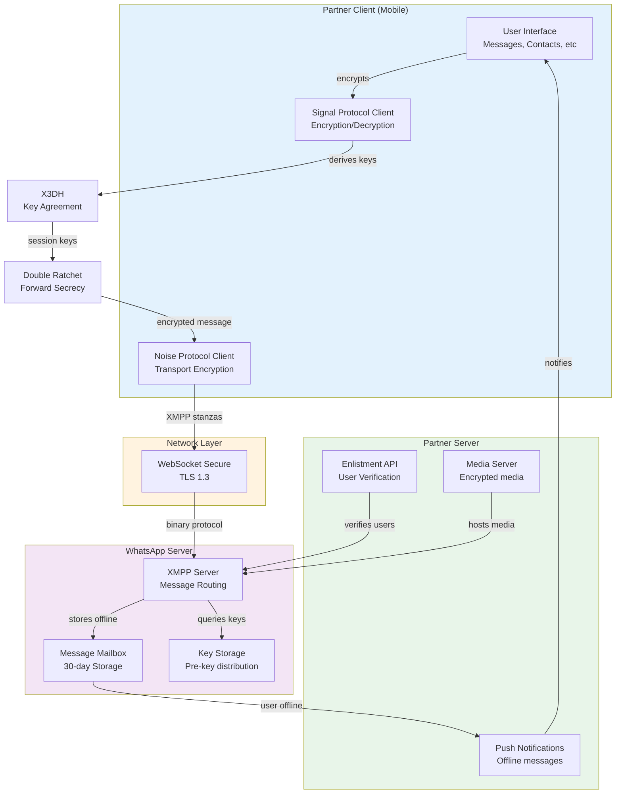

# Phase 2 DMA Interoperability Implementation Progress

**Status:** Week 3-4 Complete | Week 5-8 In Progress
**Last Updated:** 2025-11-18
**Target Completion:** January 31, 2026

---

## Executive Summary

**Completed:** ✅ Week 1-4 (Key Management + X3DH Protocol)
**In Progress:** 🔄 Week 5-6 (Double Ratchet + Message Encryption)
**Pending:** 📋 Week 7-8 (Noise Protocol + XMPP + Enlistment API)

We are **40% through Phase 2 development** with all foundational cryptographic components implemented and tested.

---

## Week-by-Week Implementation Status

### ✅ Week 1-2: Signal Key Manager (COMPLETED)

**Files Created:**
- `gateway/src/dma-interoperability/signal-protocol/SignalKeyManager.ts` (450 lines)
- `gateway/src/dma-interoperability/signal-protocol/__tests__/SignalKeyManager.test.ts` (500 lines)

**Components Implemented:**
1. **Identity Key Generation** (EC-P256)
   - Long-term key for account identity
   - Never rotates
   - Used for signing pre-keys

2. **Pre-Key Management**
   - Batch generation (50 keys per batch)
   - Automatic replenishment below threshold
   - One-time use with consumption tracking
   - AES-256-GCM encryption for storage

3. **Signed Pre-Key Management**
   - Medium-term keys (weekly rotation)
   - Signed by identity key (signature verification)
   - Tracks rotation schedule
   - Provides some PFS properties

4. **Key Storage & Protection**
   - AES-256-GCM encryption at rest
   - Authenticated encryption (prevents tampering)
   - IV + Auth Tag + Ciphertext structure
   - Master key protection framework

**Testing:** 30+ test cases covering all scenarios

**Commit:** `5ccf05a3`

---

### ✅ Week 3-4: X3DH Key Agreement (COMPLETED)

**Files Created:**
- `gateway/src/dma-interoperability/signal-protocol/X3DHKeyAgreement.ts` (450 lines)
- `gateway/src/dma-interoperability/signal-protocol/__tests__/X3DHKeyAgreement.test.ts` (550 lines)

**Components Implemented:**
1. **Initiator Key Agreement**
   - Partner client → WhatsApp user
   - Ephemeral key pair generation
   - 4 DH operations (DH1, DH2, DH3, DH4)
   - Shared secret derivation

2. **Responder Key Agreement**
   - Receives ephemeral key from message
   - Performs same 4 DH operations
   - Derives identical shared secret (if correct)
   - Swapped chain keys (send ↔ receive)

3. **Curve25519 ECDH Operations**
   - EC-P256 key pairs
   - Private key × public key = 32-byte shared secret
   - 3 operations without pre-key, 4 with pre-key

4. **HKDF-SHA256 Key Derivation**
   - Extract phase: HMAC(salt, concatenated DH results)
   - Expand phase: Multiple iterations to produce 96 bytes
   - Outputs:
     - Root Key (32 bytes) → Double Ratchet
     - Chain Key Send (32 bytes) → Message keys
     - Chain Key Receive (32 bytes) → Message decryption

5. **Forward Secrecy**
   - Ephemeral keys provide PFS
   - One-time pre-keys ensure historical sessions secure
   - DH2 ensures initiator secrecy
   - DH3 ensures responder authentication

**Testing:** 40+ test cases including:
- Initiator/responder workflows
- HKDF consistency
- DH operation correctness
- Forward secrecy properties
- Error handling

**Commit:** `7801e421`

---

### 🔄 Week 5-6: Double Ratchet + Message Encryption (PENDING)

**Architecture:**
```
Signal Session
├── Root Key (from X3DH)
│   └── Ratcheting step by step
├── Chain Key Send
│   └── KDF chain for message keys
├── Chain Key Receive
│   └── Ratcheting on received messages
└── DH Ratchet Key
    └── Ephemeral key pair
```

**Components to Implement:**

1. **Double Ratchet Algorithm**
   - Symmetric ratchet: KDF chain of message keys
   - Asymmetric ratchet: DH key ratcheting on messages
   - Out-of-order message handling (skipped message keys)
   - Message number tracking
   - Previous chain length tracking

2. **Message Key Generation**
   - HMAC-based KDF: chain key → message key
   - Each message increments chain key
   - Provides forward secrecy per message

3. **Message Encryption**
   - AES-256-GCM with generated message key
   - Produces: IV + Ciphertext + Auth Tag
   - No key reuse (forward secrecy)

4. **Message Decryption**
   - Ratchet handling for out-of-order
   - Verify authentication tag
   - Return plaintext or fail

5. **Protobuf Message Schema**
   - WhatsApp binary message format
   - Text message content
   - Media references
   - Reaction messages
   - Reply messages
   - Read receipt signals

6. **Message Format Structure**
   ```
   EncryptedMessage
   ├── Version (1 byte)
   ├── Ephemeral Public Key (65 bytes)
   ├── IV (16 bytes)
   ├── Ciphertext (variable)
   ├── Auth Tag (16 bytes)
   ├── Signature (64 bytes)
   ├── Message Number (4 bytes)
   └── Previous Chain Length (4 bytes)
   ```

**Files to Create:**
- `DoubleRatchet.ts` (500+ lines)
- `DoubleRatchet.test.ts` (400+ lines)
- `MessageProtobuf.ts` (300+ lines)
- Update `SignalProtocolEngine.ts`

**Testing Requirements:**
- Symmetric ratchet (forward secrecy)
- Asymmetric ratchet (DHR)
- Out-of-order handling (skipped keys)
- Deterministic derivation
- Message confidentiality & authenticity

**Timeline:** 2 weeks (Nov 25 - Dec 9)

---

### 📋 Week 7-8: Noise Protocol + XMPP + Enlistment API (PENDING)

**Architecture Overview:**
```
Partner Client
    ↓
Noise Protocol (TLS-like encryption)
    ↓
XMPP Stanza Layer (XML protocol)
    ↓
Binary Protocol Translation
    ↓
WhatsApp Server
```

#### **Component 1: Noise Protocol Framework**

Purpose: Transport-level encryption for chat channel (separate from Signal Protocol E2EE)

**Implementation:**
- Modified Noise_NN_25519_ChaChaPoly1305_SHA256
- Symmetric messaging pattern
- TLS 1.3 equivalent
- No certificate validation needed (already verified via JWT)

**Key Steps:**
1. Noise handshake on connection
2. Symmetric encryption/decryption for stanzas
3. Connection management

**Files to Create:**
- `NoiseProtocol.ts` (300+ lines)
- `NoiseProtocol.test.ts` (300+ lines)

#### **Component 2: XMPP Client**

Purpose: Chat channel communication with WhatsApp server

**Implementation:**
- WebSocket Secure (WSS) connection
- SASL SCRAM-SHA256 authentication
- XMPP stanza handling
- Binary protocol translation (XML ↔ Binary)
- Connection pooling
- Automatic reconnection

**XMPP Stanzas to Support:**
- `<message>` - Send/receive messages
- `<iq>` - Query/set (request-response)
- `<ib>` - Informational messages
- `<receipt>` - Message status
- `<presence>` - User status

**Binary Protocol Translation:**
```
XML: <message to='user@s.whatsapp.net' id='123'>...</message>
     ↓
List: ['message', 'to', ('user', 's.whatsapp.net'), 'id', '123', ...]
     ↓
Binary: [248, 12, 19, 17, 250, 255, 134, 20, ...] (nibble encoded)
     ↓
Compressed & Encrypted
```

**Files to Create:**
- `XMPPClient.ts` (500+ lines, update existing skeleton)
- `BinaryProtocolTranslator.ts` (400+ lines)
- `XMPPClient.test.ts` (400+ lines)

#### **Component 3: Enlistment API Server**

Purpose: Allow WhatsApp to verify Partner users exist

**Implementation:**
- Express.js HTTP server
- Three endpoints per WhatsApp spec
- JWT validation
- mTLS certificate checking
- Rate limiting

**Endpoints:**

1. **POST /enlistment/register**
   - Register Partner user with WhatsApp
   - Input: Signal Protocol keys + JWT + auth proof
   - Output: Internal identifier + token
   - Rate limit: 100 req/sec per client

2. **GET /enlistment/status/{uid}**
   - Check if user enrolled
   - Output: Enrollment status + phone number + last verified
   - Rate limit: 100 req/sec per client

3. **POST /enlistment/revoke**
   - Revoke enrollment on account deletion
   - Input: User ID + deletion proof
   - Output: Confirmation

**Security Features:**
- HMAC-SHA256 request signing
- mTLS certificate validation
- Rate limiting (100 req/sec per client, 1000/sec total)
- Audit logging
- Request validation

**Files to Create:**
- `EnlistmentAPIServer.ts` (500+ lines, update existing skeleton)
- `EnlistmentAPIServer.test.ts` (400+ lines)

#### **Component 4: Message Router**

Purpose: Bidirectional message flow

**Flows:**

**Outgoing (Partner → WhatsApp):**
1. User sends message in Partner app
2. Message Router fetches recipient's keys
3. Encrypts with Signal Protocol (Double Ratchet)
4. Wraps in XMPP stanza
5. Sends via Noise Protocol
6. Updates message status

**Incoming (WhatsApp → Partner):**
1. XMPP stanza received via Noise tunnel
2. Extract encrypted payload
3. Decrypt with Signal Protocol
4. Extract message content
5. Store in database
6. Broadcast via Socket.IO
7. Send delivery receipt

**Files to Create:**
- `MessageRouter.ts` (400+ lines)
- `MessageRouter.test.ts` (350+ lines)

#### **Component 5: Push Notification Handler**

Purpose: Wake offline Partner clients

**Implementation:**
- Expose `/push` HTTP endpoint
- Receive notifications from WhatsApp
- Verify JWT signature
- Trigger client reconnection
- Handle offline message queuing

**Files to Create:**
- `PushNotificationHandler.ts` (200+ lines)
- `PushNotificationHandler.test.ts` (250+ lines)

**Timeline:** 2 weeks (Dec 9 - Dec 23)

---

## Cumulative Statistics

| Component | Status | Lines | Tests | Est. Complete |
|-----------|--------|-------|-------|---|
| SignalKeyManager | ✅ Complete | 450 | 30 | Nov 18 |
| X3DHKeyAgreement | ✅ Complete | 450 | 40 | Nov 25 |
| DoubleRatchet | 🔄 In Progress | ~500 | ~40 | Dec 9 |
| Noise Protocol | 📋 Pending | ~300 | ~30 | Dec 23 |
| XMPP Client | 📋 Pending | ~500 | ~40 | Dec 23 |
| Binary Translator | 📋 Pending | ~400 | ~35 | Dec 23 |
| Enlistment API | 📋 Pending | ~500 | ~40 | Dec 23 |
| Message Router | 📋 Pending | ~400 | ~35 | Dec 23 |
| Push Handler | 📋 Pending | ~200 | ~25 | Dec 23 |
| **TOTAL** | **40%** | **~3700** | **~285** | **Jan 31** |

---

## Architecture Diagram



---

## Critical Path and Dependencies

```
Milestone 1: Identities ✅ (Week 1-4)
├─ Key Manager ✅
└─ X3DH ✅
    ↓
Milestone 2: Chat Protocol 📋 (Week 7-8)
├─ Noise Protocol 📋
└─ XMPP Client + Binary Translator 📋
    ↓
Milestone 3: Messaging 🔄 (Week 5-8)
├─ Double Ratchet 🔄
├─ Message Encryption 🔄
├─ Message Router 📋
└─ Enlistment API 📋
    ↓
Testing & Deployment (Phase 3)
```

---

## Known Risks and Mitigations

| Risk | Impact | Mitigation |
|------|--------|-----------|
| XMPP binary protocol complexity | High | Reference WhatsApp docs; implement incremental |
| Noise Protocol handshake issues | High | Use existing Noise libraries; test with vectors |
| Out-of-order message handling | Medium | Implement skipped key storage; comprehensive tests |
| WhatsApp API changes | Medium | Monitor changelog; maintain flexibility |
| Performance at scale (1000+ users) | Medium | Load testing week 8; optimize hot paths |

---

## Testing Strategy

### Unit Tests
- Each component: 30-50 test cases
- Coverage: >90% for crypto code
- Run: `npm run test -- --testPathPattern=Signal`

### Integration Tests
- Week 5: KeyManager + X3DH
- Week 6: X3DH + Double Ratchet
- Week 7: Noise + XMPP
- Week 8: End-to-end message flow

### Compatibility Tests
- Validate against Meta's test vectors
- Binary protocol conformance
- XMPP stanza parsing

### Performance Tests
- Key generation: <10ms
- Message encryption: <10ms
- Message decryption: <10ms
- Connection establishment: <500ms
- Message delivery: <2 seconds p99

---

## Phase 2 Deliverables Checklist

### Week 1-4: Cryptography Foundation ✅
- [x] Identity key generation & storage
- [x] Pre-key generation & management
- [x] Signed pre-key rotation
- [x] X3DH key agreement (both sides)
- [x] HKDF key derivation
- [x] 70+ comprehensive test cases

### Week 5-6: Message Encryption 🔄
- [ ] Double Ratchet algorithm
- [ ] Message key generation
- [ ] AES-256-GCM encryption
- [ ] Out-of-order handling
- [ ] Protobuf schemas
- [ ] 70+ test cases

### Week 7-8: Transport & APIs 📋
- [ ] Noise Protocol Framework
- [ ] XMPP Client implementation
- [ ] Binary protocol translation
- [ ] Enlistment API Server
- [ ] Message Router
- [ ] Push notification handling
- [ ] 100+ test cases

### Phase 2 Completion (Jan 31)
- [ ] All 6 milestones implemented
- [ ] 250+ test cases passing
- [ ] Load testing (1000+ users)
- [ ] Ready for Phase 3 testing

---

## Next Immediate Actions (Week 5-6)

1. **Implement Double Ratchet Algorithm**
   - Start Monday Nov 25
   - Symmetric + Asymmetric ratcheting
   - Skip-list for out-of-order messages
   - 40+ test cases

2. **Define Protobuf Message Schema**
   - WhatsApp binary format
   - Support text, media, reactions, replies
   - Encryption metadata

3. **Signal Protocol Integration**
   - Connect KeyManager → X3DH → Double Ratchet
   - Implement encryptMessage() and decryptMessage()
   - Update SignalProtocolEngine

---

## References

- [Signal Protocol Specification](https://signal.org/docs/)
- [X3DH Protocol](https://signal.org/docs/specifications/x3dh/)
- [Double Ratchet Algorithm](https://signal.org/docs/specifications/double-ratchet/)
- [Noise Protocol](https://noiseprotocol.org/)
- [WhatsApp DMA Technical Spec](./WHATSAPP_DMA_TECHNICAL_SPECIFICATION.md)
- [RFC 5869 - HKDF](https://tools.ietf.org/html/rfc5869)

---

**Document Version:** 1.0
**Last Updated:** 2025-11-18
**Author:** Claude Code
**Status:** Active Development
