# Video Call Feature - Architecture Documentation

## Table of Contents
1. [Executive Summary](#executive-summary)
2. [System Context](#system-context)
3. [Container Architecture](#container-architecture)
4. [Component Architecture](#component-architecture)
5. [Technology Stack](#technology-stack)
6. [P2P ↔ SFU Transition Logic](#p2p--sfu-transition-logic)
7. [Data Flow](#data-flow)
8. [Deployment Architecture](#deployment-architecture)
9. [Infrastructure Requirements](#infrastructure-requirements)

---

## Executive Summary

This document defines the architecture for Meeshy's **Video Call Feature with Real-time Translation**, supporting:

- **Dynamic P2P/SFU switching**: P2P for 2 participants, SFU for 3-50 participants
- **Conversation type support**: DIRECT (always 2 max) and GROUP (2+ users)
- **Anonymous participants**: Full video call support in GROUP conversations
- **Real-time transcription**: Client-side (P2P) and server-side (SFU) with translation
- **Seamless integration**: Leverages existing Socket.IO, Gateway, Translator services

### Key Design Principles
1. **Progressive Enhancement**: Start with P2P, scale to SFU only when needed
2. **Existing Infrastructure Reuse**: Socket.IO for signaling, Prisma/MongoDB for persistence
3. **Privacy-First**: End-to-end encryption for P2P, secure SFU routing
4. **Developer Experience**: Clear APIs, comprehensive error handling, debugging tools

---

## System Context

### C4 Level 1: System Context Diagram

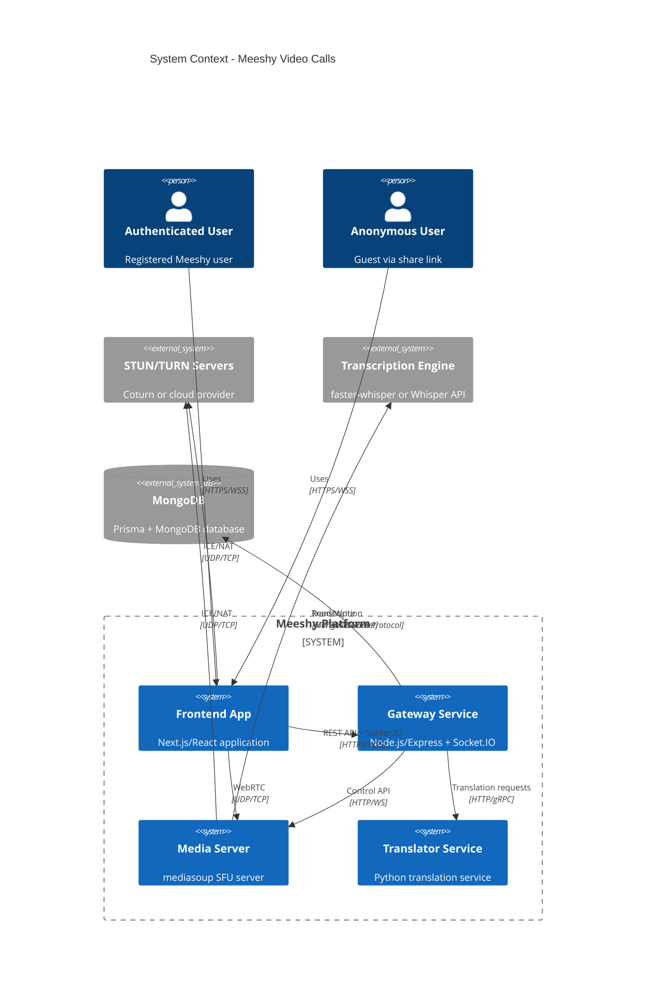

### External Systems
- **STUN/TURN Servers**: NAT traversal and relay (Coturn, Twilio, AWS, etc.)
- **Transcription Engine**: faster-whisper (self-hosted) or OpenAI Whisper API
- **MongoDB**: Existing database via Prisma ORM

---

## Container Architecture

### C4 Level 2: Container Diagram

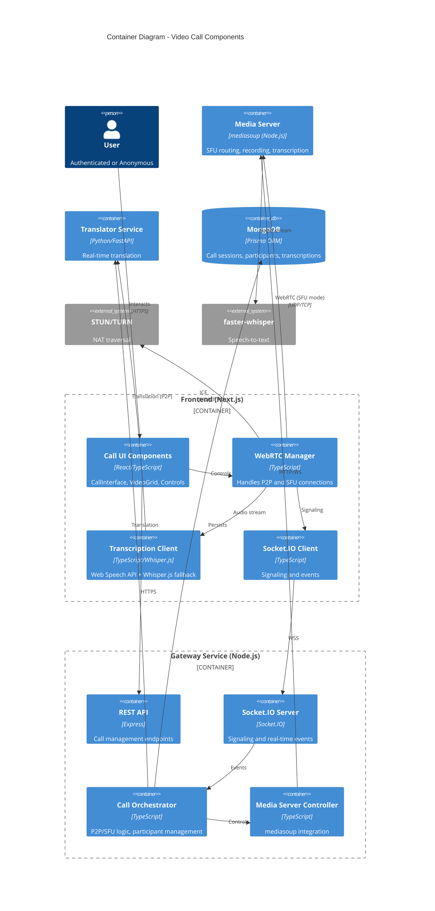

### Container Responsibilities

#### **Frontend Containers**
1. **Call UI Components**: Video grid, participant tiles, controls (mute, camera, screen share)
2. **WebRTC Manager**: Peer connection management, media stream handling, mode switching
3. **Transcription Client**: Web Speech API (primary), Whisper.js (fallback) for P2P mode
4. **Socket.IO Client**: Signaling, presence, events (call:initiated, participant:joined, etc.)

#### **Gateway Containers**
1. **REST API**: CRUD operations for calls (initiate, join, leave, history)
2. **Socket.IO Server**: Real-time signaling, SDP exchange, ICE candidate relay
3. **Call Orchestrator**: Core business logic - P2P/SFU decision, participant lifecycle
4. **Media Server Controller**: mediasoup API wrapper, router management, worker scaling

#### **Media Server**
- **mediasoup**: SFU routing, recording, server-side transcription pipeline integration

---

## Component Architecture

### Frontend Call Components

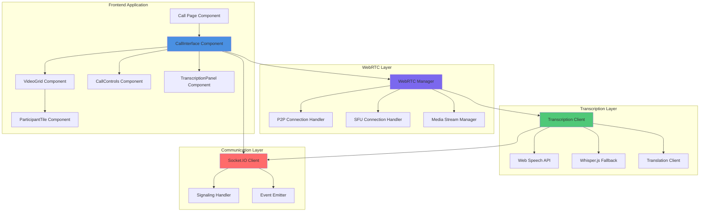

### Gateway Call Service Components

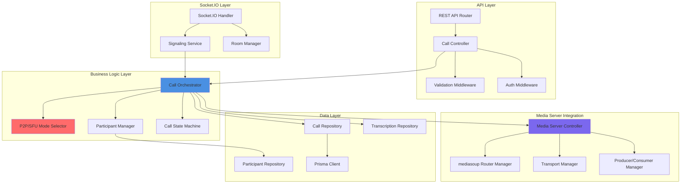

---

## Technology Stack

### Technology Selection with Rationale

#### **Frontend Technologies**

| Technology | Purpose | Rationale |
|------------|---------|-----------|
| **Next.js 14** | React framework | Already used, SSR/SSG support, API routes |
| **TypeScript** | Type safety | Existing standard, WebRTC type definitions |
| **mediasoup-client 3.x** | WebRTC SFU client | Production-grade, matches server, excellent docs |
| **simple-peer** | WebRTC P2P | Lightweight, easy P2P implementation, fallback |
| **Web Speech API** | Transcription (P2P) | Native browser support, zero latency, no cost |
| **Whisper.js (tfjs)** | Transcription fallback | Browser-based, works offline, privacy-preserving |
| **Socket.IO Client 4.x** | Real-time signaling | Already integrated, reliable, auto-reconnect |
| **Zustand** | State management | Lightweight, better than Redux for WebRTC state |
| **Tailwind CSS** | Styling | Existing design system |

#### **Backend Technologies**

| Technology | Purpose | Rationale |
|------------|---------|-----------|
| **Node.js 20.x** | Runtime | Existing Gateway runtime, async I/O for WebRTC |
| **Express 4.x** | REST API | Already used, middleware ecosystem |
| **Socket.IO 4.x** | Signaling server | Already integrated, rooms support, scaling |
| **mediasoup 3.x** | SFU media server | Best-in-class SFU, MIT license, active development |
| **TypeScript** | Type safety | Gateway standard, shared types with frontend |
| **Prisma 5.x** | ORM | Already used, MongoDB support, type safety |
| **MongoDB 7.x** | Database | Existing database, flexible schema for calls |

#### **Media & Transcription**

| Technology | Purpose | Rationale |
|------------|---------|-----------|
| **faster-whisper** | Server transcription | 4x faster than OpenAI, GPU support, self-hosted |
| **mediasoup-recorder** | Call recording | Native integration with mediasoup |
| **FFmpeg** | Media processing | Video format conversion, thumbnails |
| **Existing Translator** | Translation | Reuse Python service, proven translation pipeline |

#### **Infrastructure**

| Technology | Purpose | Rationale |
|------------|---------|-----------|
| **Coturn** | STUN/TURN server | Open-source, self-hosted, cost-effective |
| **Docker** | Containerization | Already used, consistent environments |
| **Kubernetes** | Orchestration (optional) | Future scaling, auto-healing, load balancing |
| **Redis** | Session/state cache | Socket.IO adapter, call state caching |
| **Nginx** | Reverse proxy | Load balancing, SSL termination |

---

## P2P ↔ SFU Transition Logic

### Mode Selection Algorithm

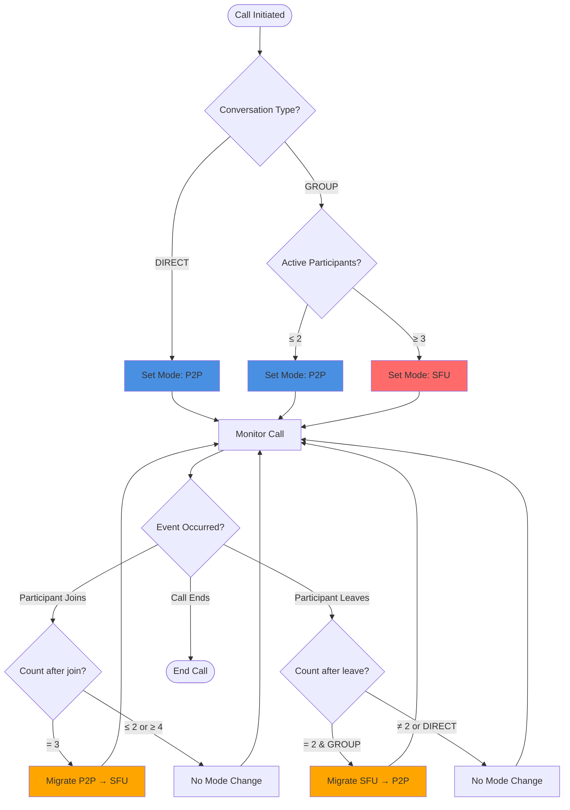

### Transition Triggers

| Scenario | Trigger | Action | Duration |
|----------|---------|--------|----------|
| **3rd participant joins GROUP** | `participant:joined` event | Migrate P2P → SFU | < 2s |
| **3rd participant leaves GROUP** | `participant:left` event | Migrate SFU → P2P | < 2s |
| **DIRECT call (always 2 max)** | N/A | Always P2P | N/A |
| **GROUP initialized with 3+** | `call:initiated` | Start with SFU | N/A |

### Migration Protocol

#### **P2P → SFU Migration**

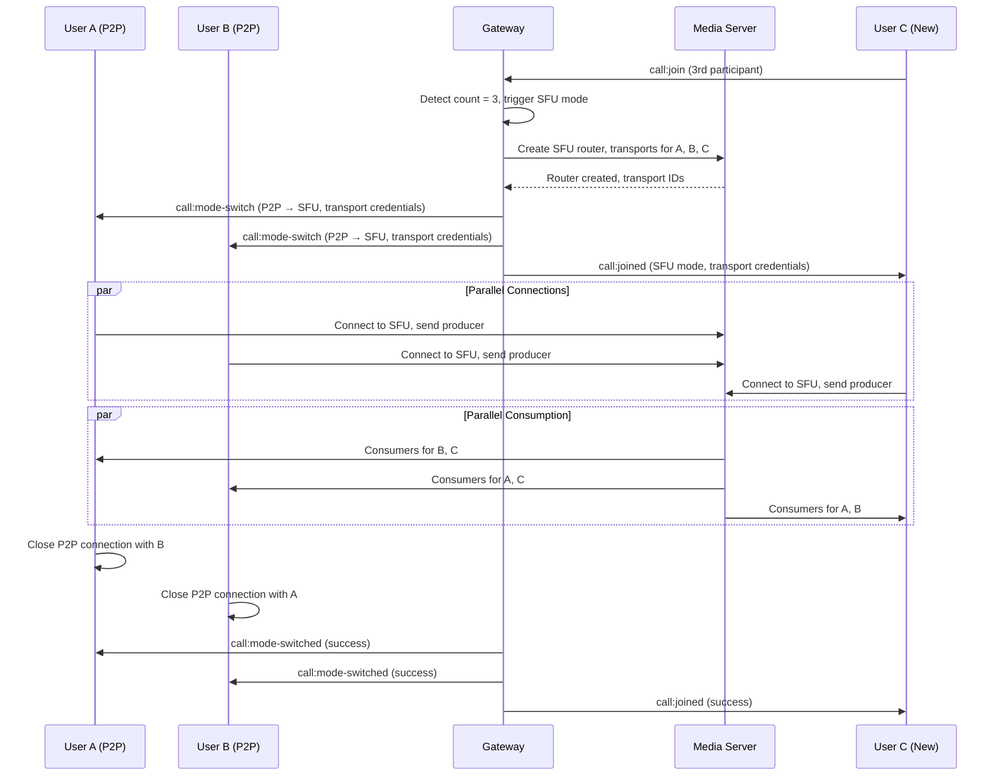

#### **SFU → P2P Migration**

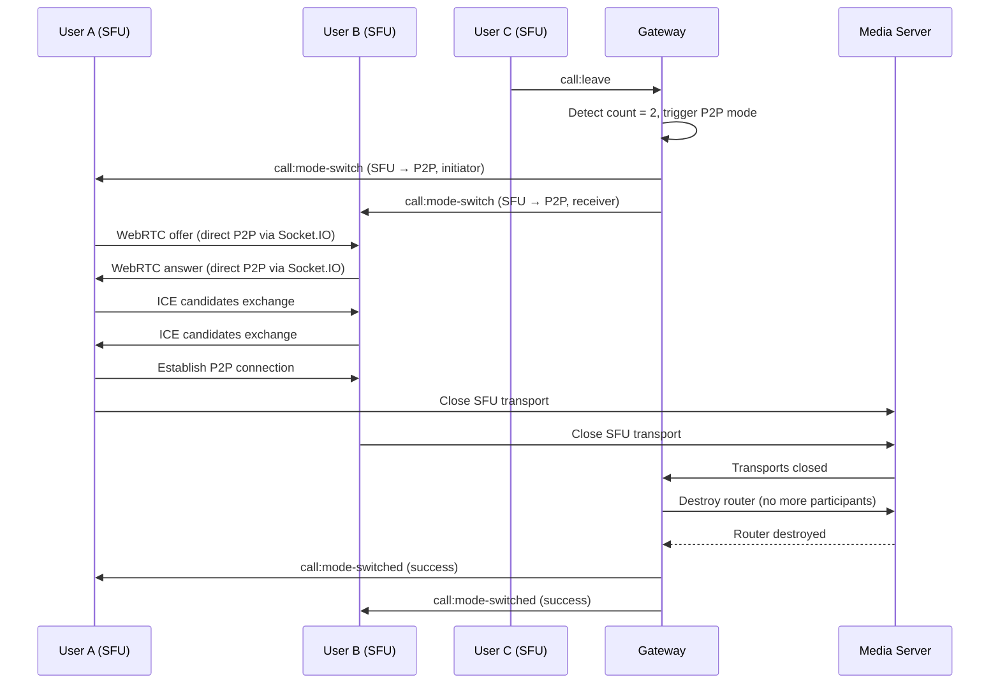

---

## Data Flow

### Call Initiation (P2P - DIRECT Conversation)

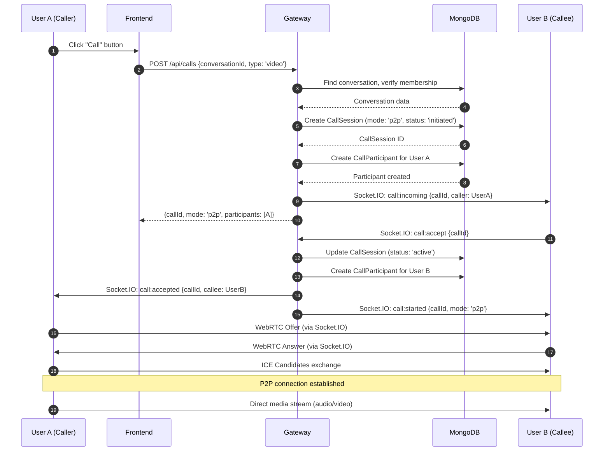

### Transcription & Translation Flow (P2P Mode)

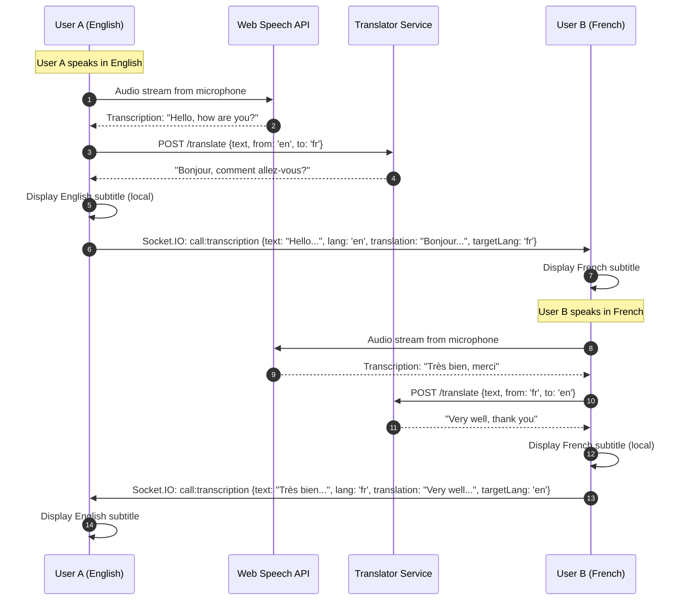

### Transcription & Translation Flow (SFU Mode)

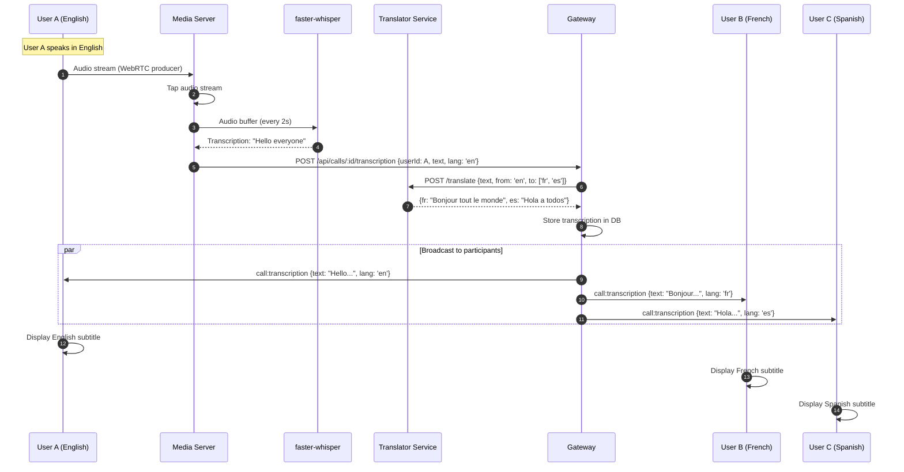

### 3rd Participant Joins (P2P → SFU)

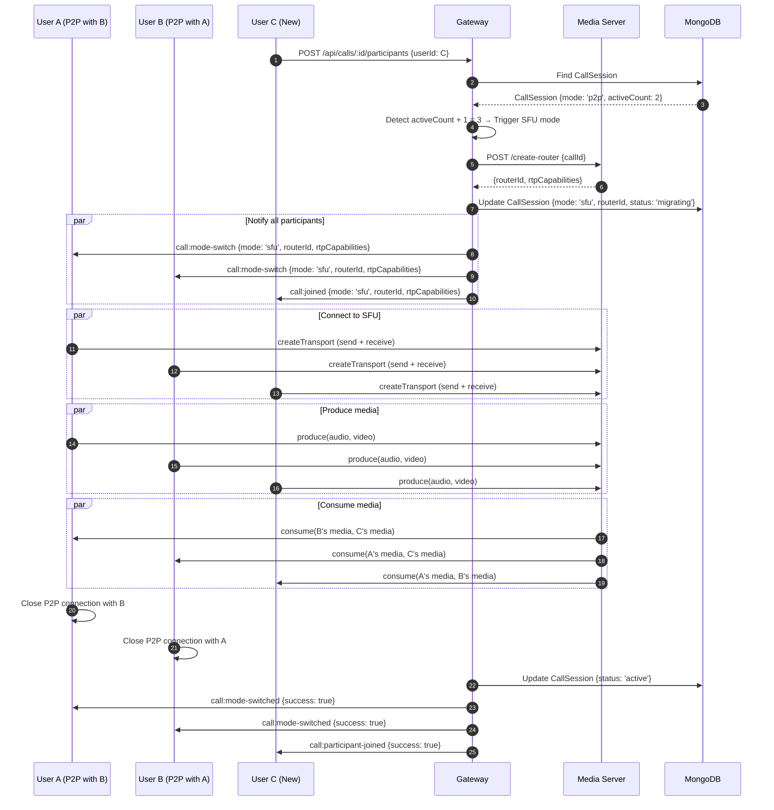

---

## Deployment Architecture

### Docker Compose Deployment (Development/Small Scale)

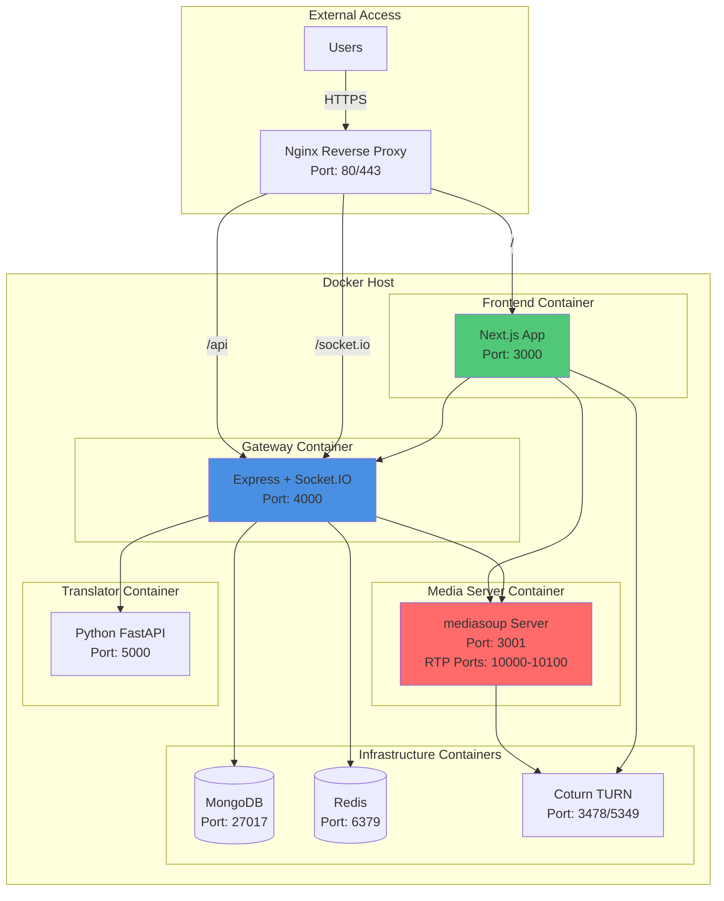

### Kubernetes Deployment (Production/High Scale)

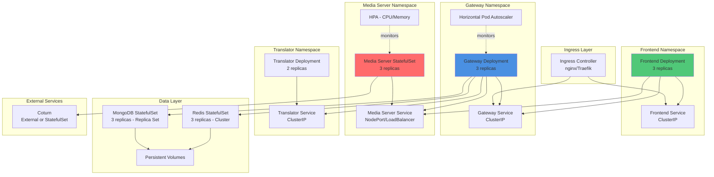

### Network Topology

```mermaid
graph TB
    subgraph "Internet"
        User[End Users]
    end

    subgraph "Edge Layer (CDN/Load Balancer)"
        LB[Load Balancer<br/>Cloudflare/AWS ALB]
    end

    subgraph "DMZ (Public Subnet)"
        TURN[TURN Servers<br/>Public IPs for relay]
        Ingress[Ingress/Reverse Proxy<br/>SSL Termination]
    end

    subgraph "Application Layer (Private Subnet)"
        FE[Frontend Servers]
        GW[Gateway Servers]
        MS[Media Servers<br/>Direct UDP if possible]
    end

    subgraph "Service Layer (Private Subnet)"
        TR[Translator Service]
        Cache[Redis Cache]
    end

    subgraph "Data Layer (Private Subnet)"
        DB[(MongoDB<br/>Replica Set)]
        Storage[(Object Storage<br/>Recordings)]
    end

    User -->|HTTPS/WSS| LB
    User -->|WebRTC/UDP| TURN
    User -.->|Direct WebRTC<br/>(if NAT allows)| MS

    LB --> Ingress
    Ingress --> FE
    Ingress --> GW

    FE --> GW
    GW --> MS
    GW --> TR
    GW --> Cache
    GW --> DB
    MS --> TR
    MS --> Storage
    MS --> TURN

    style MS fill:#FF6B6B
    style GW fill:#4A90E2
    style FE fill:#50C878
    style TURN fill:#FFA500
```

---

## Infrastructure Requirements

### Hardware Specifications

#### **Media Server (SFU)**
- **CPU**: 4-8 cores (2.5+ GHz) - high single-thread performance
- **RAM**: 8-16 GB (allocate ~100 MB per active participant)
- **Network**: 1 Gbps NIC, low-latency (<50ms to users)
- **Scaling**: 1 server supports ~50 concurrent participants (HD video)
- **OS**: Ubuntu 22.04 LTS or similar (kernel 5.10+)

#### **Gateway Service**
- **CPU**: 2-4 cores
- **RAM**: 4-8 GB
- **Network**: 1 Gbps NIC
- **Scaling**: Horizontal with Socket.IO Redis adapter
- **OS**: Ubuntu 22.04 LTS or Docker

#### **Translator Service**
- **CPU**: 4-8 cores (existing Python service)
- **RAM**: 4-8 GB
- **GPU**: Optional - for faster-whisper acceleration
- **Scaling**: Horizontal with load balancer

#### **STUN/TURN Server (Coturn)**
- **CPU**: 2-4 cores
- **RAM**: 4 GB
- **Network**: 1 Gbps NIC, **public IP required**
- **Bandwidth**: High (relay traffic for failed P2P)
- **Scaling**: Multiple TURN servers for geo-distribution

### Network Requirements

#### **Ports**
| Service | Protocol | Ports | Purpose |
|---------|----------|-------|---------|
| Frontend | HTTPS/WSS | 443 | HTTPS + WebSocket |
| Gateway | HTTPS/WSS | 443 (via proxy) | REST API + Socket.IO |
| Media Server | HTTP/WS | 3001 | Control API |
| Media Server | UDP/TCP | 10000-10100 | RTP/RTCP (WebRTC) |
| TURN | UDP/TCP | 3478, 5349 | STUN/TURN (TLS optional) |
| MongoDB | TCP | 27017 | Database |
| Redis | TCP | 6379 | Cache/Session |

#### **Bandwidth Estimates**
- **HD Video (720p)**: ~1.5 Mbps per stream
- **Audio**: ~50-100 Kbps per stream
- **Per participant (SFU)**:
  - Upload: 1 stream = ~1.6 Mbps
  - Download: (N-1) streams = ~1.6 Mbps × (participants - 1)
- **Example (10 participants in SFU)**:
  - Each participant: 1.6 Mbps up + 14.4 Mbps down = **16 Mbps**
  - Media server aggregate: 16 Mbps × 10 = **160 Mbps**

### Storage Requirements

#### **Database (MongoDB)**
- **Call Sessions**: ~5 KB per session
- **Participants**: ~2 KB per participant
- **Transcriptions**: ~1 KB per 10-second chunk
- **Estimate for 10,000 calls/month**: ~100 MB/month (metadata only)

#### **Object Storage (Recordings - Optional)**
- **HD Video Recording**: ~100 MB per 10 minutes per participant
- **Estimate for 1,000 hours/month**: ~600 GB/month
- **Recommendation**: Amazon S3, DigitalOcean Spaces, or self-hosted MinIO

---

## Architecture Validation Checklist

- [x] Service boundaries follow single responsibility principle
- [x] APIs are RESTful and WebSocket conventions
- [x] Security controls address OWASP Top 10 (see SECURITY.md)
- [x] Scalability patterns support 10x growth (horizontal scaling)
- [x] Failure modes identified with mitigation (reconnection, fallback)
- [x] Data consistency model is explicit (eventual consistency for transcriptions)
- [x] Observability is built-in (logs, metrics, traces - see below)
- [x] Cost implications are reasonable (open-source stack)
- [x] Migration path from current state is clear (incremental rollout)
- [x] Technology choices align with existing stack (Node.js, TypeScript, Socket.IO)

---

## Observability & Monitoring

### Key Metrics to Track

#### **Call Quality Metrics**
- WebRTC stats: packet loss, jitter, RTT, bitrate
- Audio/video quality scores (MOS - Mean Opinion Score)
- Connection establishment time (P2P and SFU)
- Mode switch duration (P2P ↔ SFU)

#### **Performance Metrics**
- Media server CPU/memory usage
- Active calls and participants count
- Transcription latency (client and server)
- Translation latency
- API response times

#### **Business Metrics**
- Total calls initiated/completed
- Average call duration
- Anonymous vs authenticated participants
- Transcription usage rate
- Failed call attempts (with reasons)

### Recommended Tools
- **Prometheus + Grafana**: Time-series metrics and dashboards
- **Jaeger/Zipkin**: Distributed tracing (trace call flow)
- **ELK Stack**: Centralized logging (Elasticsearch, Logstash, Kibana)
- **mediasoup-client**: Built-in WebRTC stats
- **Socket.IO Admin UI**: Real-time connection monitoring

---

## Next Steps

1. **Review ADR documents** for detailed technology justifications
2. **Review API_CONTRACTS.md** for complete API specifications
3. **Review DATA_MODELS.md** for database schema design
4. **Review SEQUENCE_DIAGRAMS.md** for detailed interaction flows
5. **Review SECURITY.md** for security architecture
6. **Review SCALING_STRATEGY.md** for performance and scaling

---

**Document Version**: 1.0
**Last Updated**: 2025-10-28
**Author**: Microservices Architect (Claude)
**Status**: Draft for Review
