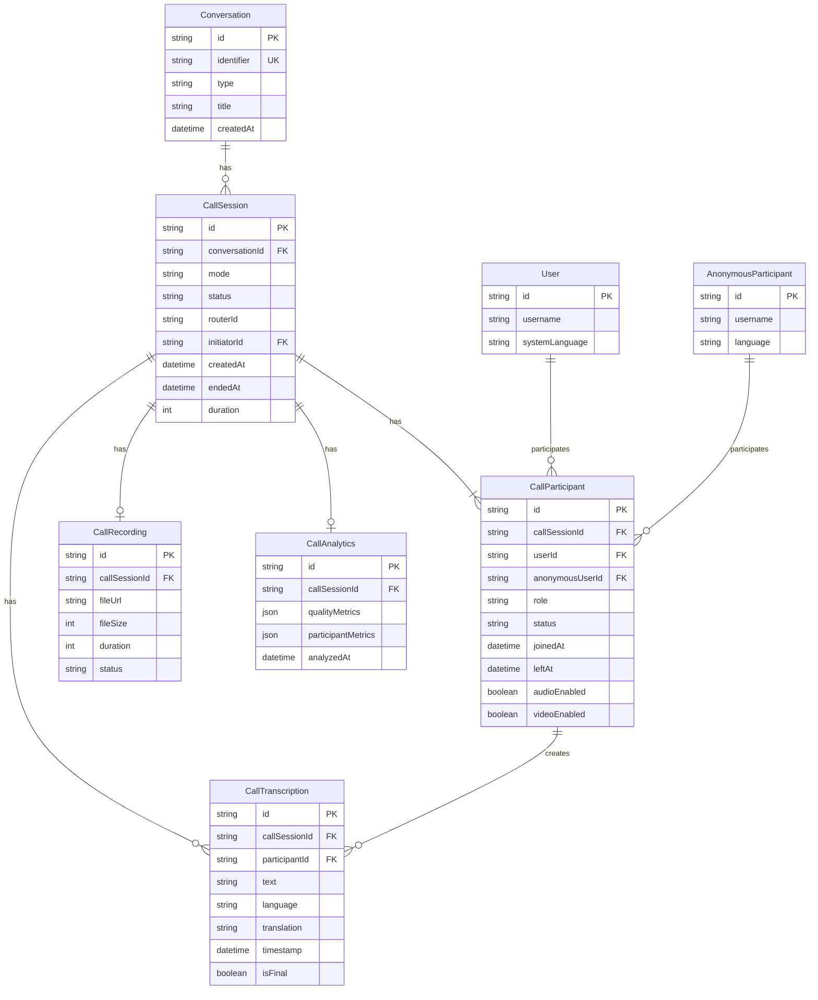

# Video Call Feature - Data Models

## Table of Contents
1. [Overview](#overview)
2. [Database Schema](#database-schema)
3. [Prisma Models](#prisma-models)
4. [Indexes & Performance](#indexes--performance)
5. [Data Relationships](#data-relationships)
6. [Data Retention & GDPR](#data-retention--gdpr)
7. [Migration Strategy](#migration-strategy)

---

## Overview

This document defines the database schema for the Video Call Feature using **Prisma ORM** and **MongoDB**.

### Design Principles
1. **Extend existing schema**: Add new models without modifying existing `Conversation`, `User`, `AnonymousParticipant` models
2. **Flexible schema**: MongoDB's document model for dynamic call metadata
3. **Performance-first**: Indexes for frequent queries (active calls, history, transcriptions)
4. **GDPR compliance**: Support for data deletion and anonymization
5. **Audit trail**: Track call lifecycle events for debugging and analytics

### Collections Overview

| Collection | Purpose | Estimated Size | Retention |
|------------|---------|----------------|-----------|
| `CallSession` | Call metadata, lifecycle | ~5 KB/call | 90 days (ended calls) |
| `CallParticipant` | Participant details per call | ~2 KB/participant | Same as CallSession |
| `CallTranscription` | Speech-to-text chunks | ~1 KB/10s chunk | 30 days or user deletion |
| `CallRecording` | Recording metadata (optional) | ~100 bytes + file | 30 days or user deletion |
| `CallAnalytics` | Call quality metrics | ~5 KB/call | 90 days |

---

## Database Schema

### Entity Relationship Diagram



---

## Prisma Models

### 1. CallSession

**Purpose**: Core call metadata and lifecycle tracking.

```prisma
/// Video/Audio call session in a conversation
model CallSession {
  id                String              @id @default(auto()) @map("_id") @db.ObjectId
  conversationId    String              @db.ObjectId

  /// Call mode: 'p2p' (2 participants) or 'sfu' (3-50 participants)
  mode              String              // 'p2p' | 'sfu'

  /// Call status: initiated, ringing, active, ended, failed
  status            String              @default("initiated")

  /// Call type: video or audio-only
  type              String              // 'video' | 'audio'

  /// User who initiated the call
  initiatorId       String              @db.ObjectId

  /// mediasoup router ID (for SFU mode)
  routerId          String?

  /// RTP capabilities for SFU mode (JSON encoded)
  rtpCapabilities   Json?

  /// Call settings
  settings          Json?               // { recordingEnabled: boolean, transcriptionEnabled: boolean }

  /// Call lifecycle timestamps
  createdAt         DateTime            @default(now())
  startedAt         DateTime?           // When first participant joined
  endedAt           DateTime?           // When call ended

  /// Call duration in seconds (calculated on end)
  duration          Int?

  /// Reason for call ending: normal, timeout, error, forced
  endReason         String?

  /// Who ended the call (userId)
  endedBy           String?             @db.ObjectId

  updatedAt         DateTime            @updatedAt

  // Relations
  conversation      Conversation        @relation(fields: [conversationId], references: [id], onDelete: Cascade)
  initiator         User                @relation("CallInitiator", fields: [initiatorId], references: [id])
  participants      CallParticipant[]
  transcriptions    CallTranscription[]
  recording         CallRecording?
  analytics         CallAnalytics?

  @@index([conversationId])
  @@index([status])
  @@index([createdAt])
  @@index([mode])
  @@index([initiatorId])
}
```

**Field Descriptions**:
- `mode`: `'p2p'` for 2 participants (direct WebRTC), `'sfu'` for 3-50 participants (via mediasoup)
- `status`: Lifecycle states - `initiated` (created), `ringing` (calling participants), `active` (in progress), `ended` (completed), `failed` (error)
- `routerId`: mediasoup router ID (only in SFU mode)
- `rtpCapabilities`: RTP capabilities from mediasoup (JSON) for client negotiation
- `settings`: Flexible JSON for call settings (recording, transcription toggles)
- `duration`: Calculated as `endedAt - startedAt` in seconds

---

### 2. CallParticipant

**Purpose**: Track each participant's state in a call.

```prisma
/// Participant in a video/audio call
model CallParticipant {
  id                String              @id @default(auto()) @map("_id") @db.ObjectId
  callSessionId     String              @db.ObjectId

  /// Reference to authenticated user (null for anonymous)
  userId            String?             @db.ObjectId

  /// Reference to anonymous participant (null for authenticated)
  anonymousUserId   String?             @db.ObjectId

  /// Participant role: initiator, participant
  role              String              @default("participant")

  /// Connection status: connecting, connected, disconnected, failed
  status            String              @default("connecting")

  /// Participant join/leave timestamps
  joinedAt          DateTime            @default(now())
  leftAt            DateTime?

  /// Media state
  audioEnabled      Boolean             @default(true)
  videoEnabled      Boolean             @default(true)
  screenShareEnabled Boolean            @default(false)

  /// SFU-specific identifiers (only in SFU mode)
  sendTransportId   String?             // mediasoup send transport ID
  recvTransportId   String?             // mediasoup receive transport ID
  audioProducerId   String?             // mediasoup audio producer ID
  videoProducerId   String?             // mediasoup video producer ID

  /// Connection quality metrics (JSON)
  qualityMetrics    Json?               // { packetLoss, jitter, rtt, bitrate }

  /// Participant device info (optional)
  deviceInfo        Json?               // { browser, os, deviceType }

  updatedAt         DateTime            @updatedAt

  // Relations
  callSession       CallSession         @relation(fields: [callSessionId], references: [id], onDelete: Cascade)
  user              User?               @relation("CallParticipantUser", fields: [userId], references: [id])
  anonymousUser     AnonymousParticipant? @relation("CallParticipantAnonymous", fields: [anonymousUserId], references: [id])
  transcriptions    CallTranscription[]

  // Ensure either userId or anonymousUserId is set (not both)
  @@index([callSessionId])
  @@index([userId])
  @@index([anonymousUserId])
  @@index([status])
  @@index([joinedAt])

  // Prevent duplicate participants in same call
  @@unique([callSessionId, userId])
  @@unique([callSessionId, anonymousUserId])
}
```

**Field Descriptions**:
- `userId` / `anonymousUserId`: Exactly one must be set (XOR constraint)
- `status`: Connection states - `connecting` (joining), `connected` (media flowing), `disconnected` (left), `failed` (error)
- `role`: `initiator` (started call) or `participant` (joined call)
- `sendTransportId` / `recvTransportId`: mediasoup transport IDs for SFU routing
- `audioProducerId` / `videoProducerId`: mediasoup producer IDs for media streams
- `qualityMetrics`: Real-time connection quality (updated periodically)

---

### 3. CallTranscription

**Purpose**: Store speech-to-text transcriptions and translations.

```prisma
/// Transcription chunk from a call participant
model CallTranscription {
  id                String              @id @default(auto()) @map("_id") @db.ObjectId
  callSessionId     String              @db.ObjectId
  participantId     String              @db.ObjectId

  /// Original transcribed text
  text              String

  /// Original language (ISO 639-1 code)
  language          String

  /// Translated text (JSON object with language codes as keys)
  /// Example: { "fr": "Bonjour", "es": "Hola", "de": "Hallo" }
  translations      Json?

  /// Timestamp when spoken
  timestamp         DateTime            @default(now())

  /// Duration of this speech segment in milliseconds
  duration          Int?

  /// Is this a final transcription or interim result?
  isFinal           Boolean             @default(true)

  /// Transcription confidence score (0.0 - 1.0)
  confidenceScore   Float?

  /// Transcription source: 'client' (Web Speech API, Whisper.js) or 'server' (faster-whisper)
  source            String              @default("client")

  /// Processing time in milliseconds
  processingTime    Int?

  createdAt         DateTime            @default(now())

  // Relations
  callSession       CallSession         @relation(fields: [callSessionId], references: [id], onDelete: Cascade)
  participant       CallParticipant     @relation(fields: [participantId], references: [id], onDelete: Cascade)

  @@index([callSessionId])
  @@index([participantId])
  @@index([timestamp])
  @@index([language])
  @@index([isFinal])
}
```

**Field Descriptions**:
- `text`: Original transcribed speech in speaker's language
- `translations`: JSON object mapping language codes to translated text
  - Example: `{ "fr": "Bonjour tout le monde", "es": "Hola a todos" }`
- `isFinal`: `true` for final transcription, `false` for interim (real-time) results
- `source`: `'client'` (browser-based), `'server'` (media server + faster-whisper)
- `confidenceScore`: Transcription accuracy (0.0 = low, 1.0 = high)

---

### 4. CallRecording (Optional)

**Purpose**: Metadata for call recordings (video/audio files stored in object storage).

```prisma
/// Call recording metadata (actual file in object storage)
model CallRecording {
  id                String              @id @default(auto()) @map("_id") @db.ObjectId
  callSessionId     String              @unique @db.ObjectId

  /// Recording file URL (S3, MinIO, etc.)
  fileUrl           String

  /// File path in object storage
  filePath          String

  /// File size in bytes
  fileSize          Int

  /// Recording duration in seconds
  duration          Int

  /// Recording format: webm, mp4, etc.
  format            String              @default("webm")

  /// Recording status: processing, available, deleted
  status            String              @default("processing")

  /// Recording quality: sd, hd, fullhd
  quality           String              @default("hd")

  /// Started/stopped timestamps
  startedAt         DateTime            @default(now())
  stoppedAt         DateTime?

  /// Who requested the recording
  requestedBy       String              @db.ObjectId

  /// Deletion timestamp (for GDPR compliance)
  deletedAt         DateTime?

  createdAt         DateTime            @default(now())
  updatedAt         DateTime            @updatedAt

  // Relations
  callSession       CallSession         @relation(fields: [callSessionId], references: [id], onDelete: Cascade)
  requestedByUser   User                @relation("RecordingRequester", fields: [requestedBy], references: [id])

  @@index([callSessionId])
  @@index([status])
  @@index([createdAt])
}
```

**Field Descriptions**:
- `fileUrl`: Public or signed URL for downloading recording
- `status`: `processing` (encoding), `available` (ready), `deleted` (GDPR deletion)
- `quality`: `sd` (480p), `hd` (720p), `fullhd` (1080p)

---

### 5. CallAnalytics (Optional)

**Purpose**: Aggregate call quality metrics and analytics.

```prisma
/// Call quality analytics and metrics
model CallAnalytics {
  id                String              @id @default(auto()) @map("_id") @db.ObjectId
  callSessionId     String              @unique @db.ObjectId

  /// Overall call quality score (0-100)
  qualityScore      Float?

  /// Aggregate quality metrics (JSON)
  qualityMetrics    Json?               // { avgPacketLoss, avgJitter, avgRtt, avgBitrate }

  /// Per-participant metrics (JSON array)
  participantMetrics Json?              // [{ participantId, avgQuality, issues: [] }]

  /// Network issues detected
  networkIssues     Json?               // [{ timestamp, type, severity, participantId }]

  /// Call events timeline (JSON array)
  eventTimeline     Json?               // [{ timestamp, event, participantId }]

  /// Total data transferred (bytes)
  totalDataSent     BigInt?
  totalDataReceived BigInt?

  /// Peak concurrent participants
  peakParticipants  Int?

  /// Mode switches count
  modeSwitchCount   Int?                @default(0)

  /// Analysis timestamp
  analyzedAt        DateTime            @default(now())

  createdAt         DateTime            @default(now())
  updatedAt         DateTime            @updatedAt

  // Relations
  callSession       CallSession         @relation(fields: [callSessionId], references: [id], onDelete: Cascade)

  @@index([callSessionId])
  @@index([qualityScore])
  @@index([analyzedAt])
}
```

**Field Descriptions**:
- `qualityScore`: Overall call quality (0-100), calculated from metrics
- `qualityMetrics`: Aggregate WebRTC stats (packet loss, jitter, RTT, bitrate)
- `participantMetrics`: Per-participant quality breakdown
- `networkIssues`: Detected issues (high packet loss, reconnections, etc.)
- `eventTimeline`: Call events for debugging (joined, left, mode switch, etc.)

---

## Indexes & Performance

### Query Patterns & Indexes

#### **Frequent Queries**

1. **Active calls in conversation**:
   ```typescript
   prisma.callSession.findMany({
     where: {
       conversationId: '...',
       status: 'active'
     }
   });
   ```
   **Index**: `@@index([conversationId, status])`

2. **User's active call**:
   ```typescript
   prisma.callParticipant.findFirst({
     where: {
       userId: '...',
       status: 'connected',
       callSession: { status: 'active' }
     },
     include: { callSession: true }
   });
   ```
   **Index**: `@@index([userId, status])`

3. **Call history for conversation**:
   ```typescript
   prisma.callSession.findMany({
     where: { conversationId: '...' },
     orderBy: { createdAt: 'desc' },
     take: 20
   });
   ```
   **Index**: `@@index([conversationId, createdAt])`

4. **Transcriptions for call**:
   ```typescript
   prisma.callTranscription.findMany({
     where: {
       callSessionId: '...',
       isFinal: true
     },
     orderBy: { timestamp: 'asc' }
   });
   ```
   **Index**: `@@index([callSessionId, isFinal, timestamp])`

5. **Anonymous participant calls**:
   ```typescript
   prisma.callParticipant.findMany({
     where: { anonymousUserId: '...' },
     include: { callSession: true }
   });
   ```
   **Index**: `@@index([anonymousUserId])`

### Composite Indexes

**Recommended Prisma Indexes**:

```prisma
// CallSession
@@index([conversationId, status])
@@index([conversationId, createdAt])
@@index([initiatorId, status])
@@index([mode, status])

// CallParticipant
@@index([callSessionId, status])
@@index([userId, status])
@@index([anonymousUserId, status])
@@index([callSessionId, joinedAt])

// CallTranscription
@@index([callSessionId, timestamp])
@@index([callSessionId, isFinal])
@@index([participantId, language])

// CallRecording
@@index([callSessionId, status])
@@index([createdAt, status])

// CallAnalytics
@@index([callSessionId])
@@index([qualityScore])
```

### MongoDB Indexes

**Additional MongoDB-specific indexes** (applied via migration):

```javascript
// CallSession - Compound index for active calls
db.CallSession.createIndex(
  { conversationId: 1, status: 1, createdAt: -1 },
  { name: 'conversationId_status_createdAt' }
);

// CallSession - TTL index for auto-deletion of old ended calls (90 days)
db.CallSession.createIndex(
  { endedAt: 1 },
  { expireAfterSeconds: 7776000, partialFilterExpression: { status: 'ended' } }
);

// CallTranscription - TTL index for auto-deletion (30 days)
db.CallTranscription.createIndex(
  { createdAt: 1 },
  { expireAfterSeconds: 2592000 }
);

// CallParticipant - Compound index for active participants
db.CallParticipant.createIndex(
  { callSessionId: 1, status: 1 }
);
```

---

## Data Relationships

### Relationship Cardinalities

```
Conversation (1) ──── (0..*) CallSession
CallSession (1) ──── (1..*) CallParticipant
CallSession (1) ──── (0..*) CallTranscription
CallSession (1) ──── (0..1) CallRecording
CallSession (1) ──── (0..1) CallAnalytics

User (1) ──── (0..*) CallParticipant
AnonymousParticipant (1) ──── (0..*) CallParticipant

CallParticipant (1) ──── (0..*) CallTranscription
```

### Cascade Behavior

**On Delete Conversation**:
- CASCADE → Delete all `CallSession` records
- CASCADE → Delete all `CallParticipant` records (via CallSession)
- CASCADE → Delete all `CallTranscription` records (via CallSession)
- CASCADE → Delete `CallRecording` (file deletion must be handled separately)
- CASCADE → Delete `CallAnalytics`

**On Delete User**:
- SET NULL → `CallParticipant.userId` (preserve anonymized call history)
- Alternatively: CASCADE if GDPR requires full deletion

**On Delete AnonymousParticipant**:
- CASCADE → Delete `CallParticipant` (anonymous participants are ephemeral)

---

## Data Retention & GDPR

### Retention Policies

| Data Type | Retention Period | Rationale |
|-----------|-----------------|-----------|
| **Active CallSession** | Until ended | Required for call functionality |
| **Ended CallSession** | 90 days | Analytics, support, dispute resolution |
| **CallParticipant** | Same as CallSession | Call history |
| **CallTranscription** | 30 days | Privacy concern, minimal storage needed |
| **CallRecording** | 30 days (default) | User-controlled, GDPR right to deletion |
| **CallAnalytics** | 90 days | Business intelligence |

### GDPR Compliance

#### **Right to Erasure (Art. 17)**

**User requests data deletion**:
1. Delete or anonymize `CallParticipant` records:
   ```typescript
   // Option 1: Anonymize (preserve call history)
   await prisma.callParticipant.updateMany({
     where: { userId: userIdToDelete },
     data: {
       userId: null,
       // Store anonymized reference if needed
       deviceInfo: null,
       qualityMetrics: null
     }
   });

   // Option 2: Full deletion
   await prisma.callParticipant.deleteMany({
     where: { userId: userIdToDelete }
   });
   ```

2. Delete transcriptions:
   ```typescript
   const participantIds = await prisma.callParticipant.findMany({
     where: { userId: userIdToDelete },
     select: { id: true }
   });

   await prisma.callTranscription.deleteMany({
     where: { participantId: { in: participantIds.map(p => p.id) } }
   });
   ```

3. Delete recordings from object storage:
   ```typescript
   const recordings = await prisma.callRecording.findMany({
     where: { requestedBy: userIdToDelete }
   });

   for (const recording of recordings) {
     await objectStorage.delete(recording.filePath);
     await prisma.callRecording.update({
       where: { id: recording.id },
       data: { status: 'deleted', deletedAt: new Date() }
     });
   }
   ```

#### **Data Minimization (Art. 5)**

- Only store essential call metadata
- Transcriptions auto-delete after 30 days (TTL index)
- IP addresses in `CallParticipant.deviceInfo` should be hashed or omitted
- Quality metrics aggregated, not raw packet captures

#### **Data Portability (Art. 20)**

**Export user's call data**:
```typescript
const userCallData = await prisma.callParticipant.findMany({
  where: { userId: userIdToExport },
  include: {
    callSession: {
      include: {
        conversation: { select: { title: true, identifier: true } }
      }
    },
    transcriptions: true
  }
});

// Serialize to JSON/XML for export
```

---

## Migration Strategy

### Phase 1: Schema Creation (Week 1)

1. **Create Prisma migration**:
   ```bash
   npx prisma migrate dev --name add_video_call_models
   ```

2. **Prisma schema additions** (append to `shared/schema.prisma`):
   ```prisma
   // Add new models: CallSession, CallParticipant, CallTranscription, CallRecording, CallAnalytics
   // Add relations to existing User, Conversation, AnonymousParticipant models
   ```

3. **Generate Prisma client**:
   ```bash
   npx prisma generate
   ```

### Phase 2: Seed Data (Week 1)

**Seed test data for development**:
```typescript
// seed-video-calls.ts
import { PrismaClient } from '@prisma/client';

const prisma = new PrismaClient();

async function seedTestCalls() {
  // Create test conversation
  const conversation = await prisma.conversation.create({
    data: {
      identifier: 'test-call-conv',
      type: 'group',
      title: 'Test Call Room',
      isActive: true
    }
  });

  // Create test users
  const users = await Promise.all([
    prisma.user.findFirst({ where: { username: 'john_doe' } }),
    prisma.user.findFirst({ where: { username: 'jane_smith' } })
  ]);

  // Create test call session
  const callSession = await prisma.callSession.create({
    data: {
      conversationId: conversation.id,
      initiatorId: users[0].id,
      mode: 'p2p',
      type: 'video',
      status: 'active',
      createdAt: new Date(),
      startedAt: new Date()
    }
  });

  // Create test participants
  await Promise.all([
    prisma.callParticipant.create({
      data: {
        callSessionId: callSession.id,
        userId: users[0].id,
        role: 'initiator',
        status: 'connected',
        audioEnabled: true,
        videoEnabled: true
      }
    }),
    prisma.callParticipant.create({
      data: {
        callSessionId: callSession.id,
        userId: users[1].id,
        role: 'participant',
        status: 'connected',
        audioEnabled: true,
        videoEnabled: true
      }
    })
  ]);

  console.log('✅ Test call data seeded');
}

seedTestCalls();
```

### Phase 3: Backward Compatibility (Week 2)

**Ensure existing queries unaffected**:
- New models are independent (no modifications to existing models)
- Relations added via `@relation` with new field names
- No breaking changes to existing API contracts

### Phase 4: Production Rollout (Week 3-4)

1. **Deploy schema changes** (with zero downtime):
   ```bash
   # Production migration
   npx prisma migrate deploy
   ```

2. **Monitor migration**:
   - Check index creation time on large collections
   - Verify no query performance regression
   - Monitor database CPU/memory usage

3. **Rollback plan**:
   - Keep old schema version in git
   - Drop new collections if critical issue:
     ```javascript
     db.CallSession.drop();
     db.CallParticipant.drop();
     db.CallTranscription.drop();
     db.CallRecording.drop();
     db.CallAnalytics.drop();
     ```

---

## Sample Queries

### 1. Create New Call Session

```typescript
import { PrismaClient } from '@prisma/client';

const prisma = new PrismaClient();

async function createCall(conversationId: string, initiatorId: string) {
  const callSession = await prisma.callSession.create({
    data: {
      conversationId,
      initiatorId,
      mode: 'p2p',
      type: 'video',
      status: 'initiated',
      settings: {
        recordingEnabled: false,
        transcriptionEnabled: true
      }
    }
  });

  const participant = await prisma.callParticipant.create({
    data: {
      callSessionId: callSession.id,
      userId: initiatorId,
      role: 'initiator',
      status: 'connecting',
      audioEnabled: true,
      videoEnabled: true
    }
  });

  return { callSession, participant };
}
```

### 2. Join Existing Call

```typescript
async function joinCall(callId: string, userId: string) {
  // Get current participant count
  const participantCount = await prisma.callParticipant.count({
    where: {
      callSessionId: callId,
      status: { in: ['connecting', 'connected'] }
    }
  });

  // Determine if mode switch needed (2 → 3 participants)
  const currentMode = await prisma.callSession.findUnique({
    where: { id: callId },
    select: { mode: true }
  });

  const newMode = participantCount + 1 >= 3 ? 'sfu' : 'p2p';

  // Create participant
  const participant = await prisma.callParticipant.create({
    data: {
      callSessionId: callId,
      userId,
      role: 'participant',
      status: 'connecting',
      audioEnabled: true,
      videoEnabled: true
    }
  });

  // Switch mode if needed
  if (currentMode.mode !== newMode) {
    await prisma.callSession.update({
      where: { id: callId },
      data: { mode: newMode }
    });
  }

  return { participant, modeSwitch: currentMode.mode !== newMode, newMode };
}
```

### 3. Store Transcription

```typescript
async function storeTranscription(
  callId: string,
  participantId: string,
  text: string,
  language: string,
  translations: Record<string, string>
) {
  return await prisma.callTranscription.create({
    data: {
      callSessionId: callId,
      participantId,
      text,
      language,
      translations,
      isFinal: true,
      timestamp: new Date(),
      source: 'server',
      confidenceScore: 0.95
    }
  });
}
```

### 4. End Call

```typescript
async function endCall(callId: string, endedBy: string) {
  const callSession = await prisma.callSession.findUnique({
    where: { id: callId },
    select: { startedAt: true }
  });

  const endedAt = new Date();
  const duration = callSession.startedAt
    ? Math.floor((endedAt.getTime() - callSession.startedAt.getTime()) / 1000)
    : 0;

  // Update call session
  await prisma.callSession.update({
    where: { id: callId },
    data: {
      status: 'ended',
      endedAt,
      duration,
      endedBy,
      endReason: 'normal'
    }
  });

  // Update all connected participants
  await prisma.callParticipant.updateMany({
    where: {
      callSessionId: callId,
      status: 'connected'
    },
    data: {
      status: 'disconnected',
      leftAt: endedAt
    }
  });

  return { endedAt, duration };
}
```

### 5. Get Call History

```typescript
async function getCallHistory(conversationId: string, limit = 20, offset = 0) {
  return await prisma.callSession.findMany({
    where: { conversationId },
    include: {
      initiator: {
        select: { username: true, avatar: true }
      },
      participants: {
        select: {
          userId: true,
          anonymousUserId: true,
          joinedAt: true,
          leftAt: true
        }
      }
    },
    orderBy: { createdAt: 'desc' },
    take: limit,
    skip: offset
  });
}
```

### 6. Get Active Call for User

```typescript
async function getUserActiveCall(userId: string) {
  return await prisma.callParticipant.findFirst({
    where: {
      userId,
      status: { in: ['connecting', 'connected'] },
      callSession: {
        status: { in: ['initiated', 'ringing', 'active'] }
      }
    },
    include: {
      callSession: {
        include: {
          conversation: {
            select: { id: true, identifier: true, title: true }
          },
          participants: {
            where: { status: { in: ['connecting', 'connected'] } }
          }
        }
      }
    }
  });
}
```

---

## TypeScript Types

**Generate types from Prisma schema**:
```typescript
// Auto-generated by Prisma
import type {
  CallSession,
  CallParticipant,
  CallTranscription,
  CallRecording,
  CallAnalytics
} from '@prisma/client';

// Type with relations
import type { Prisma } from '@prisma/client';

export type CallSessionWithParticipants = Prisma.CallSessionGetPayload<{
  include: { participants: true };
}>;

export type CallParticipantWithUser = Prisma.CallParticipantGetPayload<{
  include: { user: true; anonymousUser: true };
}>;

export type CallTranscriptionWithParticipant = Prisma.CallTranscriptionGetPayload<{
  include: { participant: { include: { user: true } } };
}>;
```

---

## Validation Rules

### CallSession Validation

```typescript
import { z } from 'zod';

export const CallSessionSchema = z.object({
  conversationId: z.string().regex(/^[a-f\d]{24}$/i, 'Invalid ObjectId'),
  mode: z.enum(['p2p', 'sfu']),
  type: z.enum(['video', 'audio']),
  status: z.enum(['initiated', 'ringing', 'active', 'ended', 'failed']),
  initiatorId: z.string().regex(/^[a-f\d]{24}$/i),
  routerId: z.string().optional(),
  settings: z.object({
    recordingEnabled: z.boolean().optional(),
    transcriptionEnabled: z.boolean().optional()
  }).optional()
});
```

### CallParticipant Validation

```typescript
export const CallParticipantSchema = z.object({
  callSessionId: z.string().regex(/^[a-f\d]{24}$/i),
  userId: z.string().regex(/^[a-f\d]{24}$/i).optional(),
  anonymousUserId: z.string().regex(/^[a-f\d]{24}$/i).optional(),
  role: z.enum(['initiator', 'participant']),
  status: z.enum(['connecting', 'connected', 'disconnected', 'failed']),
  audioEnabled: z.boolean(),
  videoEnabled: z.boolean(),
  screenShareEnabled: z.boolean().optional()
}).refine(
  data => (data.userId && !data.anonymousUserId) || (!data.userId && data.anonymousUserId),
  { message: 'Either userId or anonymousUserId must be set (not both)' }
);
```

---

**Document Version**: 1.0
**Last Updated**: 2025-10-28
**Author**: Microservices Architect (Claude)
**Status**: Draft for Review
