# Video Call Feature - Sequence Diagrams

## Table of Contents
1. [Overview](#overview)
2. [Call Initiation (P2P - DIRECT)](#1-call-initiation-p2p---direct-conversation)
3. [3rd Participant Joins (P2P → SFU)](#2-3rd-participant-joins-p2p--sfu-migration)
4. [Participant Leaves (SFU → P2P)](#3-participant-leaves-sfu--p2p-migration)
5. [Client-side Transcription (P2P)](#4-client-side-transcription-flow-p2p-mode)
6. [Server-side Transcription (SFU)](#5-server-side-transcription-flow-sfu-mode)
7. [Error Handling & Reconnection](#6-error-handling--reconnection)
8. [Anonymous Participant Joins](#7-anonymous-participant-joins-group-call)

---

## Overview

This document provides detailed sequence diagrams for all critical flows in the Video Call Feature using Mermaid syntax.

### Notation
- **Solid arrows** (→): Synchronous requests/responses
- **Dashed arrows** (--→): Asynchronous events/notifications
- **Boxes**: System components
- **Notes**: Important clarifications

---

## 1. Call Initiation (P2P - DIRECT Conversation)

### Scenario
User A initiates a video call with User B in a DIRECT conversation (always 2 participants max).

```mermaid
sequenceDiagram
    autonumber
    actor UserA as User A (Caller)
    participant FE_A as Frontend A
    participant GW as Gateway
    participant DB as MongoDB
    participant Socket as Socket.IO
    participant FE_B as Frontend B
    actor UserB as User B (Callee)

    %% Call initiation
    UserA->>FE_A: Click "Video Call" button
    FE_A->>FE_A: Check WebRTC support, permissions

    FE_A->>GW: POST /api/calls<br/>{conversationId, type: 'video'}
    GW->>DB: Find conversation, verify membership
    DB-->>GW: Conversation {type: 'direct', members: [A, B]}

    GW->>GW: Validate: DIRECT supports video calls
    GW->>DB: Create CallSession {mode: 'p2p', status: 'initiated'}
    DB-->>GW: CallSession {id, mode: 'p2p'}

    GW->>DB: Create CallParticipant {userId: A, role: 'initiator'}
    DB-->>GW: CallParticipant created

    GW-->>FE_A: 201 Created<br/>{callId, mode: 'p2p', status: 'initiated'}

    %% Notify callee
    GW->>Socket: Emit to User B room
    Socket-->>FE_B: call:incoming<br/>{callId, caller: UserA, type: 'video'}
    FE_B->>UserB: Show incoming call notification 🔔

    %% User B accepts
    UserB->>FE_B: Accept call
    FE_B->>GW: Socket.IO: call:accept<br/>{callId, audioEnabled: true, videoEnabled: true}

    GW->>DB: Create CallParticipant {userId: B, role: 'participant'}
    GW->>DB: Update CallSession {status: 'active', startedAt: now()}

    par Notify both participants
        Socket-->>FE_A: call:started<br/>{callId, mode: 'p2p', participants: [A, B]}
        Socket-->>FE_B: call:started<br/>{callId, mode: 'p2p', participants: [A, B]}
    end

    %% P2P WebRTC negotiation
    Note over FE_A,FE_B: P2P WebRTC Signaling (via Socket.IO)

    FE_A->>FE_A: Create RTCPeerConnection, add media streams
    FE_A->>FE_A: Generate WebRTC Offer
    FE_A->>Socket: call:signal<br/>{targetParticipantId: B, signal: {type: 'offer', sdp}}

    Socket-->>FE_B: call:signal<br/>{fromParticipantId: A, signal: {type: 'offer', sdp}}
    FE_B->>FE_B: Set remote description, create answer
    FE_B->>Socket: call:signal<br/>{targetParticipantId: A, signal: {type: 'answer', sdp}}

    Socket-->>FE_A: call:signal<br/>{fromParticipantId: B, signal: {type: 'answer', sdp}}

    par ICE candidate exchange
        FE_A->>Socket: call:signal {type: 'ice-candidate', candidate}
        Socket-->>FE_B: call:signal {type: 'ice-candidate', candidate}
        FE_B->>Socket: call:signal {type: 'ice-candidate', candidate}
        Socket-->>FE_A: call:signal {type: 'ice-candidate', candidate}
    end

    Note over FE_A,FE_B: P2P connection established ✅

    FE_A-->>UserA: Video/audio stream from User B
    FE_B-->>UserB: Video/audio stream from User A
```

**Key Points**:
- **Mode**: Always `p2p` for DIRECT conversations (max 2 participants)
- **Signaling**: Relayed via Socket.IO (Gateway)
- **Media**: Direct P2P connection (no media server)
- **Duration**: ~2-3 seconds from initiation to media flow

---

## 2. 3rd Participant Joins (P2P → SFU Migration)

### Scenario
User C joins a GROUP conversation where Users A and B are already in a P2P call. System automatically migrates to SFU mode.

**Key Points**:
- **Trigger**: 3rd participant joins (activeCount = 3)
- **Duration**: ~1-2 seconds for mode switch
- **Seamless**: Brief audio/video interruption (<500ms)
- **Parallel**: Participants connect to SFU simultaneously

---

## 3. Participant Leaves (SFU → P2P Migration)

### Scenario
User C leaves a 3-participant GROUP call. System automatically migrates back to P2P mode for remaining Users A and B.

**Key Points**:
- **Trigger**: Participant leaves, activeCount drops to 2 (GROUP only)
- **DIRECT conversations**: Never migrate (always P2P, always 2 participants)
- **Duration**: ~1-2 seconds for P2P re-establishment
- **Resource cleanup**: SFU router destroyed, resources freed

---

## 4. Client-side Transcription Flow (P2P Mode)

### Scenario
User A speaks in English, transcribed locally via Web Speech API, translated via Translator Service, and sent to User B who sees French subtitles.

```mermaid
sequenceDiagram
    autonumber
    actor UserA as User A (English)
    participant FE_A as Frontend A<br/>(Transcription Client)
    participant WebSpeech as Web Speech API
    participant Trans as Translator Service
    participant GW as Gateway
    participant FE_B as Frontend B
    actor UserB as User B (French)

    %% User A speaks
    Note over UserA,FE_A: User A speaks: "Hello, how are you?"

    UserA->>FE_A: Audio from microphone
    FE_A->>WebSpeech: Start recognition<br/>recognition.start()

    WebSpeech->>WebSpeech: Process audio buffer
    WebSpeech-->>FE_A: onresult (interim)<br/>"Hello, how"

    FE_A->>FE_A: Display interim transcript (local)

    WebSpeech-->>FE_A: onresult (final)<br/>"Hello, how are you?"<br/>confidence: 0.95

    Note over FE_A: Final transcription received

    %% Display original locally
    FE_A->>UserA: Display subtitle: "Hello, how are you?" (en)

    %% Translate
    FE_A->>Trans: POST /translate<br/>{text: "Hello...", from: 'en', to: ['fr']}
    Trans->>Trans: Translate (existing translator service)
    Trans-->>FE_A: {fr: "Bonjour, comment allez-vous?"}

    %% Send to other participant
    FE_A->>GW: Socket.IO: call:transcription<br/>{callId, participantId: A, text: "Hello...",<br/>language: 'en', translation: "Bonjour...",<br/>targetLanguage: 'fr', isFinal: true, timestamp}

    GW->>GW: Optional: Store in DB (CallTranscription)

    GW-->>FE_B: call:transcription<br/>{participantId: A, username: "UserA",<br/>text: "Hello...", language: 'en',<br/>translation: "Bonjour...", targetLanguage: 'fr'}

    %% Display translated on remote
    FE_B->>UserB: Display subtitle: "Bonjour, comment allez-vous?" (fr)

    Note over UserA,UserB: Total latency: ~300-500ms

    %% User B speaks (reverse flow)
    Note over UserB,FE_B: User B speaks: "Très bien, merci"

    UserB->>FE_B: Audio from microphone
    FE_B->>WebSpeech: recognition.start()
    WebSpeech-->>FE_B: onresult (final)<br/>"Très bien, merci"

    FE_B->>UserB: Display subtitle: "Très bien, merci" (fr)

    FE_B->>Trans: POST /translate<br/>{text: "Très bien...", from: 'fr', to: ['en']}
    Trans-->>FE_B: {en: "Very well, thank you"}

    FE_B->>GW: Socket.IO: call:transcription<br/>{text: "Très bien...", language: 'fr',<br/>translation: "Very well...", targetLanguage: 'en'}

    GW-->>FE_A: call:transcription<br/>{translation: "Very well, thank you"}

    FE_A->>UserA: Display subtitle: "Very well, thank you" (en)
```

**Key Points**:
- **Transcription**: Client-side Web Speech API (zero server cost)
- **Translation**: Existing Translator Service (HTTP API)
- **Latency**: ~300-500ms (speech → transcription → translation → display)
- **Fallback**: Whisper.js if Web Speech API unavailable
- **Privacy**: Audio never leaves user's device (only text sent)

---

## 5. Server-side Transcription Flow (SFU Mode)

### Scenario
User A speaks in English in SFU mode. Media server taps audio, sends to faster-whisper, translates to all participant languages, broadcasts subtitles.

```mermaid
sequenceDiagram
    autonumber
    actor UserA as User A (English)
    participant FE_A as Frontend A
    participant MS as Media Server
    participant Whisper as faster-whisper
    participant GW as Gateway
    participant Trans as Translator Service
    participant DB as MongoDB
    participant FE_B as Frontend B (French)
    participant FE_C as Frontend C (Spanish)

    %% User A speaks
    Note over UserA: User A speaks: "Hello everyone"

    UserA->>FE_A: Audio from microphone
    FE_A->>MS: WebRTC producer (audio stream)

    MS->>MS: Tap audio stream<br/>(copy buffer every 2 seconds)

    MS->>Whisper: POST /transcribe<br/>{audio: buffer, language: 'en'}
    Whisper->>Whisper: Transcribe audio<br/>(faster-whisper model)
    Whisper-->>MS: {text: "Hello everyone", confidence: 0.96, duration: 1.8s}

    MS->>GW: POST /api/calls/:callId/transcriptions<br/>{participantId: A, text: "Hello everyone",<br/>language: 'en', timestamp, confidenceScore: 0.96}

    %% Get participant languages
    GW->>DB: Get all call participants with languages
    DB-->>GW: Participants: [A(en), B(fr), C(es)]

    GW->>Trans: POST /translate<br/>{text: "Hello everyone", from: 'en',<br/>to: ['fr', 'es']}

    Trans->>Trans: Batch translate to all languages
    Trans-->>GW: {fr: "Bonjour à tous",<br/>es: "Hola a todos"}

    %% Store transcription
    GW->>DB: Create CallTranscription<br/>{callSessionId, participantId: A, text: "Hello...",<br/>language: 'en', translations: {fr: "...", es: "..."},<br/>source: 'server', confidenceScore: 0.96}

    %% Broadcast to all participants
    par Broadcast transcriptions
        GW->>FE_A: call:transcription<br/>{participantId: A, text: "Hello everyone", language: 'en'}
        GW->>FE_B: call:transcription<br/>{participantId: A, translation: "Bonjour à tous",<br/>targetLanguage: 'fr'}
        GW->>FE_C: call:transcription<br/>{participantId: A, translation: "Hola a todos",<br/>targetLanguage: 'es'}
    end

    %% Display subtitles
    FE_A->>UserA: Display subtitle: "Hello everyone" (en)
    FE_B->>UserB: Display subtitle: "Bonjour à tous" (fr)
    FE_C->>UserC: Display subtitle: "Hola a todos" (es)

    Note over UserA,UserC: Total latency: ~800ms-1.2s<br/>(server processing overhead)
```

**Key Points**:
- **Transcription**: Server-side faster-whisper (GPU-accelerated if available)
- **Batch translation**: Single request translates to all participant languages
- **Persistence**: Stored in database (CallTranscription)
- **Latency**: ~800ms-1.2s (higher than client-side, but more accurate)
- **Scalability**: Transcription load on media server, not clients

---

## 6. Error Handling & Reconnection

### Scenario
User A loses network connection during a call, attempts to reconnect, and rejoins the call.

```mermaid
sequenceDiagram
    autonumber
    actor UserA as User A
    participant FE_A as Frontend A
    participant GW as Gateway
    participant DB as MongoDB
    participant MS as Media Server
    participant FE_B as Frontend B

    %% Normal call in progress
    Note over FE_A,FE_B: Call in progress (SFU mode)

    %% Network disconnection
    UserA->>UserA: Network disconnected ❌
    FE_A->>FE_A: Detect: Socket.IO disconnect event

    FE_A->>UserA: Show "Reconnecting..." notification

    par Notify other participants
        GW-->>FE_B: call:participant-media-state<br/>{participantId: A, status: 'disconnected'}
    end

    FE_B->>UserB: Show "User A disconnected" indicator

    %% Automatic reconnection attempts
    loop Retry connection (max 5 attempts, exponential backoff)
        FE_A->>GW: Socket.IO: connect()
        Note over FE_A,GW: Attempt 1: delay 1s<br/>Attempt 2: delay 2s<br/>Attempt 3: delay 4s...

        alt Connection successful
            GW-->>FE_A: Socket.IO: connected
            FE_A->>GW: Socket.IO: authenticate<br/>{userId: A, language: 'en'}
            GW-->>FE_A: authenticated {success: true}

            %% Rejoin call
            FE_A->>GW: Socket.IO: call:rejoin<br/>{callId, participantId: A}

            GW->>DB: Get CallSession, verify still active
            DB-->>GW: CallSession {status: 'active', mode: 'sfu'}

            GW->>DB: Update CallParticipant<br/>{status: 'connected', reconnectedAt: now()}

            GW-->>FE_A: call:rejoined<br/>{mode: 'sfu', routerId, rtpCapabilities,<br/>participants: [...]}

            %% Reconnect to media server
            FE_A->>MS: Recreate transports, producers, consumers
            MS-->>FE_A: Connections re-established

            par Notify other participants
                GW-->>FE_B: call:participant-media-state<br/>{participantId: A, status: 'connected'}
            end

            FE_A->>UserA: "Reconnected" notification ✅
            FE_B->>UserB: Remove "disconnected" indicator

            Note over FE_A,FE_B: Call resumed successfully
        else Connection failed
            FE_A->>FE_A: Wait exponential backoff, retry
        end
    end

    alt Reconnection failed after max attempts
        FE_A->>UserA: Show "Connection lost. Call ended." error
        FE_A->>FE_A: Clean up call, navigate to conversation

        GW->>DB: Update CallParticipant<br/>{status: 'failed', leftAt: now()}

        par Notify other participants
            GW-->>FE_B: call:participant-left<br/>{participantId: A, reason: 'network-failure'}
        end

        FE_B->>UserB: "User A left due to network issue"
    end
```

**Key Points**:
- **Auto-reconnect**: Exponential backoff (1s, 2s, 4s, 8s, 16s)
- **Max retries**: 5 attempts (~31s total)
- **Graceful degradation**: Other participants notified, call continues
- **State preservation**: Call state maintained during reconnection window
- **Timeout**: If disconnected >60s, automatically leave call

---

## 7. Anonymous Participant Joins Group Call

### Scenario
Anonymous user (via share link) joins an active GROUP video call.

```mermaid
sequenceDiagram
    autonumber
    actor AnonUser as Anonymous User
    participant FE_A as Frontend (Anonymous)
    participant GW as Gateway
    participant DB as MongoDB
    participant MS as Media Server
    participant FE_B as Frontend (User B)
    actor UserB as User B (Authenticated)

    %% Anonymous user accesses share link
    AnonUser->>FE_A: Access share link<br/>https://meeshy.com/links/tracked/:token

    FE_A->>GW: GET /api/links/tracked/:token
    GW->>DB: Find ConversationShareLink, verify active
    DB-->>GW: ShareLink {conversationId, allowAnonymousMessages: true}

    GW-->>FE_A: 200 OK {conversationId, linkId, permissions}

    FE_A->>AnonUser: Show "Join Conversation" form<br/>(name, language)

    AnonUser->>FE_A: Submit form<br/>{firstName: "Guest", language: "es"}

    FE_A->>GW: POST /api/conversations/:id/join-anonymous<br/>{firstName, lastName, language, shareLinkId}

    GW->>DB: Create AnonymousParticipant<br/>{conversationId, shareLinkId, firstName, language,<br/>sessionToken, canSendMessages: true}

    DB-->>GW: AnonymousParticipant {id, sessionToken}

    GW-->>FE_A: 201 Created<br/>{anonymousUserId, sessionToken, username: "Guest_Alice"}

    FE_A->>GW: Socket.IO: authenticate<br/>{sessionToken, language: 'es'}
    GW-->>FE_A: authenticated {success: true, user: {...}}

    %% Check for active call
    FE_A->>GW: GET /api/conversations/:id/active-call
    GW->>DB: Find active CallSession
    DB-->>GW: CallSession {id, mode: 'sfu', status: 'active'}

    GW-->>FE_A: 200 OK {callId, mode: 'sfu', participants: [...]}

    FE_A->>AnonUser: Show "Video call in progress. Join?" 🎥

    AnonUser->>FE_A: Click "Join Call"

    %% Join call (same flow as authenticated user)
    FE_A->>GW: Socket.IO: call:join<br/>{callId, audioEnabled: true, videoEnabled: true}

    GW->>DB: Create CallParticipant<br/>{callSessionId, anonymousUserId, role: 'participant'}

    GW-->>FE_A: call:started<br/>{mode: 'sfu', routerId, rtpCapabilities}

    par Notify all participants
        GW-->>FE_B: call:participant-joined<br/>{participantId, username: "Guest_Alice",<br/>isAnonymous: true, language: 'es'}
    end

    FE_B->>UserB: Show "Guest_Alice joined" notification 🎉

    %% Connect to SFU
    FE_A->>MS: Create transport, produce audio/video
    MS-->>FE_A: Producers created

    MS-->>FE_A: new-producer {other participants}
    FE_A->>MS: Create consumers for all participants

    Note over FE_A,FE_B: Anonymous user in call ✅<br/>Transcriptions in Spanish

    FE_A->>AnonUser: Display video grid with all participants
```

**Key Points**:
- **Authentication**: Session token (not JWT)
- **Permissions**: Based on `ConversationShareLink` settings
- **Transcription**: Anonymous users get translated subtitles in their language
- **Limitations**: May not have screen share or recording permissions
- **Identification**: Username shown as "Guest_FirstName" (e.g., "Guest_Alice")

---

## Summary

These sequence diagrams cover all critical flows:

1. ✅ **Call Initiation (P2P)**: DIRECT conversation, 2 participants
2. ✅ **P2P → SFU Migration**: 3rd participant joins GROUP call
3. ✅ **SFU → P2P Migration**: Participant leaves, drops to 2
4. ✅ **Client-side Transcription**: Web Speech API + Translator (P2P)
5. ✅ **Server-side Transcription**: faster-whisper + batch translation (SFU)
6. ✅ **Error Handling**: Network disconnection and reconnection
7. ✅ **Anonymous Participant**: Share link user joins video call

**Additional Flows** (not diagrammed, but described):

8. **Call Recording**: Start/stop recording, store in object storage
9. **Screen Sharing**: Create screen share producer, broadcast to consumers
10. **Media Controls**: Mute/unmute, camera on/off, speaker selection
11. **Call Analytics**: Collect WebRTC stats, store in CallAnalytics
12. **GDPR Deletion**: Delete transcriptions, recordings, participant data

---

**Document Version**: 1.0
**Last Updated**: 2025-10-28
**Author**: Microservices Architect (Claude)
**Status**: Draft for Review
