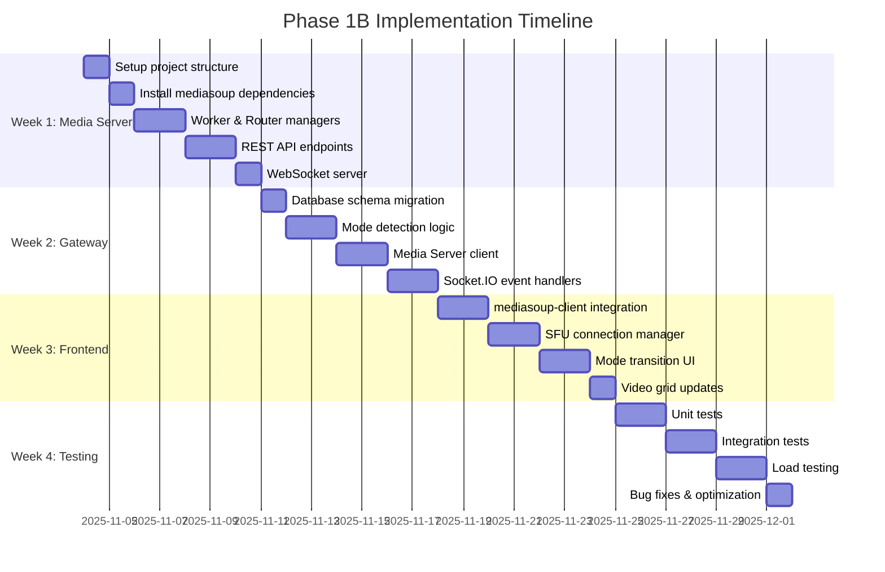

# Phase 1B: Implementation Plan

## Table of Contents
1. [Overview](#overview)
2. [Timeline Summary](#timeline-summary)
3. [Week 1: Media Server Foundation](#week-1-media-server-foundation)
4. [Week 2: Gateway Integration](#week-2-gateway-integration)
5. [Week 3: Frontend SFU Client](#week-3-frontend-sfu-client)
6. [Week 4: Testing & Optimization](#week-4-testing--optimization)
7. [Dependencies & Blockers](#dependencies--blockers)
8. [Resource Allocation](#resource-allocation)
9. [Success Criteria](#success-criteria)

---

## Overview

Phase 1B implementation is structured as a **4-week sprint** with clear deliverables and acceptance criteria for each week. The plan follows an **incremental integration** approach to minimize risk and enable early testing.

### Approach
- **Week 1**: Build standalone Media Server (testable independently)
- **Week 2**: Integrate Media Server with Gateway (mode switching logic)
- **Week 3**: Implement frontend SFU client (mediasoup-client integration)
- **Week 4**: End-to-end testing, performance optimization, bug fixes

---

## Timeline Summary



**Total Duration**: 4 weeks (28 days)
**Team Size**: 3-4 developers + 1 QA engineer
**Start Date**: 2025-11-04 (example)
**Target Completion**: 2025-12-01

---

## Week 1: Media Server Foundation

**Goal**: Build standalone Media Server with mediasoup integration and HTTP/WebSocket APIs.

**Assigned Agent**: `backend-microservices-architect`

### Day 1: Project Setup

**Tasks**:
- [ ] Create `media-server/` directory
- [ ] Initialize Node.js project (`npm init`)
- [ ] Configure TypeScript (`tsconfig.json`)
- [ ] Setup folder structure (see architecture doc)
- [ ] Configure ESLint and Prettier
- [ ] Setup logger (Winston)
- [ ] Configure environment variables (`.env`)

**Deliverables**:
```
media-server/
├── src/
│   ├── server.ts
│   ├── config/
│   │   └── environment.ts
│   └── utils/
│       └── logger.ts
├── package.json
├── tsconfig.json
├── .env.example
└── README.md
```

**Acceptance Criteria**:
- ✅ `npm run dev` starts server successfully
- ✅ TypeScript compiles without errors
- ✅ Logger outputs to console and file

---

### Day 2: mediasoup Installation & Configuration

**Tasks**:
- [ ] Install mediasoup (`npm install mediasoup`)
- [ ] Install dependencies: `express`, `socket.io`, `dotenv`
- [ ] Create `mediasoup-config.ts` with Worker/Router settings
- [ ] Generate DTLS certificates (for WebRTC)
- [ ] Test mediasoup Worker creation

**Code**:
```typescript
// src/config/mediasoup-config.ts
export const mediasoupConfig = {
  worker: {
    logLevel: 'warn',
    rtcMinPort: 10000,
    rtcMaxPort: 10100,
  },
  router: {
    mediaCodecs: [
      {
        kind: 'audio',
        mimeType: 'audio/opus',
        clockRate: 48000,
        channels: 2,
      },
      {
        kind: 'video',
        mimeType: 'video/VP8',
        clockRate: 90000,
      },
    ],
  },
};
```

**Acceptance Criteria**:
- ✅ mediasoup Worker starts without errors
- ✅ Worker emits `@success` event
- ✅ DTLS certificates generated in `certs/` directory

---

### Days 3-4: Worker & Router Managers

**Tasks**:
- [ ] Implement `WorkerManager` class
  - Worker pool initialization (1 per CPU core)
  - Round-robin worker selection
  - Worker failure handling & restart
- [ ] Implement `RouterManager` class
  - Router creation per call
  - Router cleanup on call end
  - RTP capabilities export
- [ ] Implement `RoomManager` class
  - Room abstraction (wraps Router + participants)
  - Participant add/remove
  - Producer/consumer tracking

**Code Skeleton**:
```typescript
// src/mediasoup/worker-manager.ts
export class WorkerManager {
  async initialize(): Promise<void>;
  getNextWorker(): Worker;
  async shutdown(): Promise<void>;
}

// src/mediasoup/router-manager.ts
export class RouterManager {
  async createRouter(callId: string, worker: Worker): Promise<Router>;
  getRouter(callId: string): Router | undefined;
  async destroyRouter(callId: string): Promise<void>;
}

// src/room/room-manager.ts
export class RoomManager {
  createRoom(callId: string, router: Router): Room;
  getRoom(callId: string): Room | undefined;
  destroyRoom(callId: string): void;
}
```

**Acceptance Criteria**:
- ✅ Worker pool initializes with correct number of workers
- ✅ Router created successfully for test call
- ✅ Room manages participants correctly (add/remove)

---

### Days 5-6: REST API Endpoints

**Tasks**:
- [ ] Setup Express server with routes
- [ ] Implement `CallController` class
  - `POST /api/rooms/:callId/create` (create router)
  - `POST /api/rooms/:callId/transports` (create transport)
  - `POST /api/rooms/:callId/transports/:id/connect` (connect transport)
  - `POST /api/rooms/:callId/transports/:id/produce` (produce media)
  - `POST /api/rooms/:callId/consume` (consume media)
  - `POST /api/rooms/:callId/consumers/:id/resume` (resume consumer)
  - `DELETE /api/rooms/:callId/producers/:id` (close producer)
  - `POST /api/rooms/:callId/participants/:id/leave` (leave room)
  - `DELETE /api/rooms/:callId` (destroy room)
- [ ] Implement auth middleware (JWT validation)
- [ ] Implement error handling middleware
- [ ] Add request validation (Zod schemas)

**Acceptance Criteria**:
- ✅ All endpoints respond with correct status codes
- ✅ Postman collection tests pass
- ✅ Invalid requests return proper error messages
- ✅ JWT authentication works

---

### Day 7: WebSocket Server

**Tasks**:
- [ ] Setup Socket.IO server
- [ ] Implement `WebSocketController` class
  - `join-room` event handler
  - `leave-room` event handler
  - Emit `new-producer` event on producer creation
  - Emit `producer-closed` event on producer close
- [ ] Integrate WebSocket with Room events
- [ ] Add WebSocket authentication

**Acceptance Criteria**:
- ✅ WebSocket connects successfully
- ✅ `new-producer` event emitted correctly
- ✅ Multiple clients can connect to same room

**Week 1 Deliverable**: Standalone Media Server with full API (testable via Postman + Socket.IO client)

---

## Week 2: Gateway Integration

**Goal**: Integrate Media Server with Gateway, implement mode switching logic.

**Assigned Agent**: `backend-microservices-architect`

### Day 8: Database Schema Migration

**Tasks**:
- [ ] Update Prisma schema (see DATABASE_CHANGES.md)
  - Add SFU fields to `CallSession`
  - Add SFU fields to `CallParticipant`
  - Add `CallMetrics` model (optional)
- [ ] Generate Prisma migration
- [ ] Apply migration to development database
- [ ] Test migration rollback
- [ ] Regenerate Prisma client

**Commands**:
```bash
npx prisma migrate dev --name add_sfu_support
npx prisma generate
```

**Acceptance Criteria**:
- ✅ Migration applies without errors
- ✅ New fields visible in database
- ✅ Existing Phase 1A calls unaffected

---

### Days 9-10: Mode Detection Logic

**Tasks**:
- [ ] Implement `ModeSelector` service
  - `determineMode(participantCount)` function
  - Mode transition detection on join/leave
- [ ] Update `CallService` class
  - Add mode switching methods
  - Trigger mode switch on participant count change
- [ ] Implement transition state machine
  - States: `p2p`, `switching_to_sfu`, `sfu`, `switching_to_p2p`
  - Prevent concurrent transitions

**Code**:
```typescript
// gateway/src/services/mode-selector.ts
export class ModeSelector {
  determineMode(participantCount: number): CallMode {
    return participantCount <= 2 ? 'p2p' : 'sfu';
  }

  shouldSwitchMode(currentMode: CallMode, participantCount: number): boolean {
    const targetMode = this.determineMode(participantCount);
    return currentMode !== targetMode;
  }
}
```

**Acceptance Criteria**:
- ✅ Mode switches from P2P to SFU when 3rd participant joins
- ✅ Mode switches from SFU to P2P when only 2 remain
- ✅ Concurrent transitions prevented (state machine)

---

### Days 11-12: Media Server Client

**Tasks**:
- [ ] Create `MediaServerClient` class (HTTP client)
  - `createRoom(callId)` method
  - `destroyRoom(callId)` method
  - Error handling and retries
- [ ] Implement in `CallService`
  - Call Media Server API on SFU mode activation
  - Store `sfuRoomId` and `rtpCapabilities` in database
- [ ] Add WebSocket relay
  - Forward `new-producer` events from Media Server to clients
  - Forward `producer-closed` events

**Code**:
```typescript
// gateway/src/clients/media-server-client.ts
export class MediaServerClient {
  async createRoom(callId: string): Promise<{ roomId: string; rtpCapabilities: any }> {
    const response = await fetch(`${MEDIA_SERVER_URL}/api/rooms/${callId}/create`, {
      method: 'POST',
      headers: { 'Authorization': `Bearer ${serviceToken}` }
    });
    return response.json();
  }

  async destroyRoom(callId: string): Promise<void> {
    await fetch(`${MEDIA_SERVER_URL}/api/rooms/${callId}`, {
      method: 'DELETE',
      headers: { 'Authorization': `Bearer ${serviceToken}` }
    });
  }
}
```

**Acceptance Criteria**:
- ✅ Gateway successfully creates room on Media Server
- ✅ RTP capabilities stored in database
- ✅ Room destroyed when call ends

---

### Days 13-14: Socket.IO Event Handlers

**Tasks**:
- [ ] Add new Socket.IO events:
  - `call:mode-switch` (server → client)
  - `call:mode-switched` (client → server, confirmation)
  - `new-producer` (relay from Media Server)
  - `producer-closed` (relay from Media Server)
- [ ] Update `CallParticipant` with SFU transport/producer IDs
- [ ] Test P2P → SFU transition end-to-end (without frontend)

**Acceptance Criteria**:
- ✅ `call:mode-switch` event emitted to all participants
- ✅ Database updated with SFU fields
- ✅ Events relayed correctly from Media Server

**Week 2 Deliverable**: Gateway fully integrated with Media Server, mode switching working (testable via Socket.IO test client)

---

## Week 3: Frontend SFU Client

**Goal**: Implement mediasoup-client in frontend, handle mode transitions.

**Assigned Agent**: `senior-frontend-architect`

### Days 15-16: mediasoup-client Integration

**Tasks**:
- [ ] Install `mediasoup-client` package
- [ ] Create `SFUConnectionManager` class
  - Device initialization
  - Transport creation (send + receive)
  - Producer creation
  - Consumer management
- [ ] Wrap mediasoup-client in React hooks
  - `useSFUConnection()`
  - `useSFUProducers()`
  - `useSFUConsumers()`

**Code**:
```typescript
// frontend/hooks/useSFUConnection.ts
export function useSFUConnection(callId: string, rtpCapabilities: any) {
  const [device, setDevice] = useState<Device | null>(null);
  const [sendTransport, setSendTransport] = useState<Transport | null>(null);
  const [recvTransport, setRecvTransport] = useState<Transport | null>(null);

  useEffect(() => {
    async function init() {
      const device = new mediasoupClient.Device();
      await device.load({ routerRtpCapabilities: rtpCapabilities });
      setDevice(device);

      // Create send transport
      const sendTransport = await createSendTransport(device, callId);
      setSendTransport(sendTransport);

      // Create receive transport
      const recvTransport = await createRecvTransport(device, callId);
      setRecvTransport(recvTransport);
    }

    init();
  }, [callId, rtpCapabilities]);

  return { device, sendTransport, recvTransport };
}
```

**Acceptance Criteria**:
- ✅ Device loads RTP capabilities successfully
- ✅ Send/receive transports created
- ✅ Transports connect without errors

---

### Days 17-18: Mode Transition UI

**Tasks**:
- [ ] Update `CallInterface` component
  - Listen for `call:mode-switch` event
  - Close P2P connections
  - Initialize SFU connection
  - Produce local media via SFU
- [ ] Handle SFU → P2P reverse transition
  - Close SFU transports
  - Re-establish P2P connection
- [ ] Add transition loading state
  - Show "Switching to group call mode..." message
  - Prevent user actions during transition

**Code**:
```typescript
// frontend/components/CallInterface.tsx
socket.on('call:mode-switch', async ({ mode, rtpCapabilities }) => {
  setIsTransitioning(true);

  if (mode === 'sfu') {
    // Close P2P
    peerConnections.forEach(pc => pc.close());

    // Initialize SFU
    const { device, sendTransport, recvTransport } = await initSFU(rtpCapabilities);

    // Produce media
    await produceMedia(sendTransport, localStream);
  } else {
    // SFU → P2P
    sendTransport?.close();
    recvTransport?.close();

    // Re-establish P2P
    await initP2P();
  }

  setIsTransitioning(false);
  socket.emit('call:mode-switched', { success: true });
});
```

**Acceptance Criteria**:
- ✅ Transition completes in <2 seconds
- ✅ No call drop during transition
- ✅ User sees loading indicator

---

### Days 19-20: Producer/Consumer Lifecycle

**Tasks**:
- [ ] Implement producer management
  - Produce audio/video tracks on SFU connect
  - Handle producer errors
  - Close producer when media disabled
- [ ] Implement consumer management
  - Listen for `new-producer` events
  - Create consumer for each remote producer
  - Resume consumer after creation
  - Close consumer on `producer-closed`
- [ ] Update video grid to handle dynamic participants

**Acceptance Criteria**:
- ✅ Local media streams to SFU
- ✅ Remote media consumed correctly
- ✅ Video tiles appear for all participants
- ✅ Tiles removed when participant leaves

---

### Day 21: Video Grid Updates

**Tasks**:
- [ ] Update `VideoGrid` component
  - Support 3-50 participants (grid layout)
  - Pagination for >16 participants
  - Highlight active speaker
  - Responsive grid (1x1, 2x2, 3x3, 4x4, etc.)
- [ ] Add participant labels
  - Show username below each video
  - Indicate audio/video muted state

**Acceptance Criteria**:
- ✅ Grid layout adjusts for participant count
- ✅ All participants visible (with pagination if needed)
- ✅ Active speaker highlighted

**Week 3 Deliverable**: Frontend fully functional in SFU mode, P2P ↔ SFU transitions working end-to-end

---

## Week 4: Testing & Optimization

**Goal**: Comprehensive testing, performance optimization, bug fixes.

**Assigned Agent**: `elite-testing-architect` + `backend-microservices-architect`

### Days 22-23: Unit Tests

**Tasks**:
- [ ] Media Server unit tests
  - WorkerManager tests
  - RouterManager tests
  - RoomManager tests
  - API endpoint tests (Jest + Supertest)
- [ ] Gateway unit tests
  - ModeSelector tests
  - CallService SFU methods tests
  - MediaServerClient tests
- [ ] Frontend unit tests
  - SFUConnectionManager tests
  - Mode transition logic tests

**Coverage Target**: >80% code coverage

**Acceptance Criteria**:
- ✅ All unit tests pass
- ✅ Coverage report generated
- ✅ No critical uncovered code paths

---

### Days 24-25: Integration Tests

**Tasks**:
- [ ] End-to-end call flow tests
  - P2P call initiation
  - 3rd participant joins (P2P → SFU)
  - Participant leaves (SFU → P2P)
  - Call ends gracefully
- [ ] Edge case tests
  - Rapid participant join/leave
  - Network disconnection during transition
  - Concurrent mode switches (should queue)
- [ ] Database integration tests
  - Verify SFU fields populated correctly
  - Verify mode transition metrics

**Tools**: Playwright (E2E), Prisma Test Containers (DB)

**Acceptance Criteria**:
- ✅ All integration tests pass
- ✅ No race conditions detected
- ✅ Database state consistent after tests

---

### Days 26-27: Load Testing

**Tasks**:
- [ ] Setup load testing environment
  - Deploy Media Server to test server
  - Configure monitoring (Prometheus + Grafana)
- [ ] Load test scenarios
  - **Test 1**: 50 participants in single call
  - **Test 2**: 10 concurrent calls (5 participants each)
  - **Test 3**: 500 concurrent participants (multiple calls)
- [ ] Measure metrics
  - CPU/RAM usage
  - Latency (p50, p95, p99)
  - Packet loss
  - Mode transition duration
- [ ] Performance optimization
  - Identify bottlenecks
  - Optimize hot code paths
  - Tune mediasoup Worker settings

**Tools**: Artillery (load testing), Prometheus (metrics)

**Acceptance Criteria**:
- ✅ Media Server handles 50 participants in single call
- ✅ Latency <100ms (p95)
- ✅ Mode transition <2 seconds (p95)
- ✅ CPU usage <80% at peak load

---

### Day 28: Bug Fixes & Documentation

**Tasks**:
- [ ] Fix all P0/P1 bugs from testing
- [ ] Code review and refactoring
- [ ] Update API documentation (Swagger/OpenAPI)
- [ ] Write developer guide
  - How to run Media Server locally
  - How to test mode transitions
  - Troubleshooting common issues
- [ ] Create demo video (optional)

**Acceptance Criteria**:
- ✅ Zero P0 bugs
- ✅ <3 P1 bugs (documented for future sprints)
- ✅ Documentation complete and reviewed

**Week 4 Deliverable**: Production-ready Phase 1B code, fully tested and documented

---

## Dependencies & Blockers

### External Dependencies

| Dependency | Required For | Mitigation |
|------------|--------------|------------|
| mediasoup v3.x | Media Server core | Stable release, well-documented |
| mediasoup-client v3.x | Frontend SFU | Paired with server version |
| TURN server (Coturn) | NAT traversal | Use existing or Twilio TURN |
| MongoDB 7.x | Database | Already in use (Phase 1A) |

### Internal Blockers

| Blocker | Impact | Mitigation |
|---------|--------|------------|
| Phase 1A not fully tested | Delays Week 1 | Complete Phase 1A testing first |
| Shared types out of sync | Integration issues | Strict version control in `@meeshy/shared` |
| Media Server deployment infrastructure | Delays production | Setup Docker/K8s early (Week 1-2) |

### Critical Path

```
Week 1 (Media Server) → Week 2 (Gateway) → Week 3 (Frontend) → Week 4 (Testing)
```

**If delayed**:
- Week 1 delay → All subsequent weeks delayed
- Week 2 delay → Frontend can start UI work (mock SFU)
- Week 3 delay → Testing can start on backend only

---

## Resource Allocation

### Team Composition

| Role | Allocation | Responsibilities |
|------|------------|------------------|
| Backend Architect | 100% (Weeks 1-2) | Media Server + Gateway integration |
| Frontend Architect | 100% (Weeks 3-4) | mediasoup-client + UI |
| QA Engineer | 50% (Weeks 2-4) | Test planning, execution, automation |
| DevOps Engineer | 25% (Weeks 1-4) | Docker, deployment, monitoring |

**Total Effort**: ~10 person-weeks

---

## Success Criteria

### Functional Requirements

- [x] SFU mode supports 3-50 participants per call
- [x] Automatic P2P → SFU transition when 3rd participant joins
- [x] Automatic SFU → P2P transition when only 2 remain
- [x] Seamless mode switching (<2s downtime)
- [x] No call drops during transitions
- [x] All Phase 1A features work in both P2P and SFU modes

### Non-Functional Requirements

- [x] Mode transition completes in <2 seconds (p95)
- [x] Media latency <100ms (p95) in SFU mode
- [x] Media Server handles 50 participants per call
- [x] Media Server handles 10 concurrent calls
- [x] Unit test coverage >80%
- [x] Zero P0 bugs at release

### Business Goals

- [x] Enable group video calls for enterprise customers
- [x] Differentiate from competitors (Zoom, Google Meet)
- [x] Foundation for Phase 2 (transcription at scale)

---

## Milestones & Checkpoints

| Milestone | Date | Deliverable | Review |
|-----------|------|-------------|--------|
| **M1**: Media Server MVP | End of Week 1 | Standalone Media Server working | Technical review |
| **M2**: Gateway Integration | End of Week 2 | Mode switching functional | Integration demo |
| **M3**: Frontend SFU Client | End of Week 3 | E2E call flow working | User acceptance test |
| **M4**: Production Ready | End of Week 4 | Tested, optimized, documented | Go/No-Go decision |

**Final Review**: 2025-12-01 (example)
**Production Deployment**: 2025-12-08 (1 week buffer)

---

**Document Version**: 1.0
**Last Updated**: 2025-10-28
**Author**: Microservices Architect (Claude)
**Status**: Final for Review
