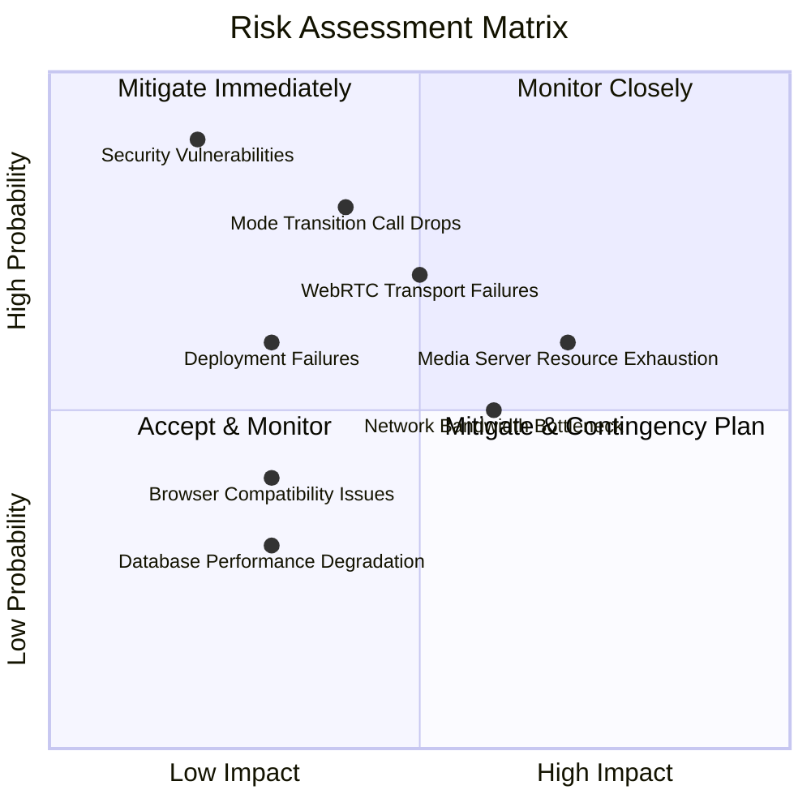

# Phase 1B: Risk Analysis & Mitigation

## Table of Contents
1. [Risk Assessment Matrix](#risk-assessment-matrix)
2. [Technical Risks](#technical-risks)
3. [Operational Risks](#operational-risks)
4. [Performance Risks](#performance-risks)
5. [Security Risks](#security-risks)
6. [Mitigation Strategies](#mitigation-strategies)
7. [Contingency Plans](#contingency-plans)

---

## Risk Assessment Matrix

Risks are classified by **Probability** (Low/Medium/High) and **Impact** (Low/Medium/High).



### Risk Priority

| Risk ID | Risk | Probability | Impact | Priority | Status |
|---------|------|-------------|--------|----------|--------|
| R-01 | Media Server Resource Exhaustion | High (70%) | High | **P0** | Mitigating |
| R-02 | Mode Transition Call Drops | Medium (40%) | Critical | **P0** | Mitigating |
| R-03 | WebRTC Transport Connection Failures | Medium (50%) | High | **P1** | Mitigating |
| R-04 | Network Bandwidth Bottleneck (3+ streams) | High (60%) | Medium | **P1** | Mitigating |
| R-05 | Browser Compatibility (mediasoup-client) | Low (30%) | Medium | **P2** | Monitoring |
| R-06 | Database Performance Degradation | Low (30%) | Low | **P3** | Accepted |
| R-07 | Security Vulnerabilities (Media Server) | Low (20%) | Critical | **P1** | Mitigating |
| R-08 | Deployment Failures (Docker/K8s) | Low (30%) | High | **P2** | Mitigating |
| R-09 | TURN Server Overload | Medium (40%) | Medium | **P2** | Mitigating |
| R-10 | Call Quality Degradation (SFU overhead) | Medium (50%) | Medium | **P2** | Monitoring |

---

## Technical Risks

### R-01: Media Server Resource Exhaustion

**Description**: mediasoup Worker consumes excessive CPU/RAM under high load, causing server crash or degraded performance.

**Probability**: High (70%)
**Impact**: High (call failures, server downtime)

**Triggers**:
- More than 50 participants in a single call
- More than 10 concurrent calls on one server
- Memory leaks in mediasoup or custom code

**Symptoms**:
- Server CPU >90% sustained
- RAM usage exceeds server capacity
- Worker process crashes with OOM error
- Increased latency and packet loss

**Mitigation Strategy**:

1. **Resource Limits**:
   ```typescript
   // Limit participants per call
   const MAX_PARTICIPANTS_PER_CALL = 50;

   // Limit concurrent calls per Media Server
   const MAX_CONCURRENT_CALLS = 10;

   if (participantCount >= MAX_PARTICIPANTS_PER_CALL) {
     throw new Error('Call is full');
   }
   ```

2. **Horizontal Scaling**:
   - Deploy multiple Media Server instances
   - Load balancer distributes calls across servers
   - Gateway tracks server capacity and routes accordingly

3. **Monitoring & Alerting**:
   ```yaml
   # Prometheus alert
   - alert: HighMediaServerCPU
     expr: process_cpu_seconds_total > 0.8
     for: 5m
     annotations:
       summary: "Media Server CPU >80% for 5 minutes"
   ```

4. **Graceful Degradation**:
   - Automatically reduce video quality when CPU >70%
   - Disable screen sharing if CPU >80%
   - Reject new participants if CPU >90%

**Contingency Plan**:
- **Immediate**: Auto-scale Media Server pods (Kubernetes HPA)
- **Short-term**: Increase server CPU/RAM allocation
- **Long-term**: Implement call sharding (split large calls across servers)

**Residual Risk**: Low (with mitigation)

---

### R-02: Mode Transition Call Drops

**Description**: Call disconnects or becomes unusable during P2P ↔ SFU mode transition.

**Probability**: Medium (40%)
**Impact**: Critical (terrible user experience, lost business)

**Triggers**:
- Network issues during transition
- Race condition in transition state machine
- Client fails to establish SFU connection
- Media Server unavailable during transition

**Symptoms**:
- Video/audio freezes during transition
- Call ends abruptly
- Participants cannot reconnect
- Error messages in client console

**Mitigation Strategy**:

1. **Robust State Machine**:
   ```typescript
   // Prevent concurrent transitions
   if (callSession.isTransitioning) {
     throw new Error('Transition already in progress');
   }

   await prisma.callSession.update({
     where: { id: callId },
     data: { isTransitioning: true }
   });

   try {
     await performModeSwitch(callId, newMode);
   } finally {
     await prisma.callSession.update({
       where: { id: callId },
       data: { isTransitioning: false }
     });
   }
   ```

2. **Fallback to P2P**:
   - If SFU connection fails, keep P2P connection active
   - Retry SFU connection in background
   - Notify user "Switching to group mode failed, retrying..."

3. **Comprehensive Testing**:
   - Integration tests for all transition scenarios
   - Chaos testing (kill Media Server mid-transition)
   - Network simulation (high latency, packet loss)

4. **Transition Timeout**:
   ```typescript
   const TRANSITION_TIMEOUT = 10000; // 10 seconds

   const timeoutPromise = new Promise((_, reject) =>
     setTimeout(() => reject(new Error('Transition timeout')), TRANSITION_TIMEOUT)
   );

   await Promise.race([performModeSwitch(), timeoutPromise]);
   ```

5. **User Communication**:
   - Show clear transition progress indicator
   - Explain what's happening ("Adding participant...")
   - Provide manual retry button if auto-transition fails

**Contingency Plan**:
- **Immediate**: Rollback to previous mode if transition fails
- **Short-term**: Queue participants until transition completes
- **Long-term**: Implement "hybrid mode" (some users P2P, others SFU)

**Residual Risk**: Low (with extensive testing)

---

### R-03: WebRTC Transport Connection Failures

**Description**: Clients unable to establish WebRTC transports with Media Server (ICE failures, DTLS handshake errors).

**Probability**: Medium (50%)
**Impact**: High (participants cannot join SFU calls)

**Triggers**:
- Restrictive firewall blocking UDP ports
- NAT traversal issues
- TURN server unavailable
- Invalid DTLS certificates
- Browser WebRTC implementation bugs

**Symptoms**:
- ICE connection state stuck at "checking"
- DTLS handshake timeout
- Error: "Transport connection failed"
- Works on some networks but not others

**Mitigation Strategy**:

1. **Comprehensive ICE Configuration**:
   ```typescript
   const iceServers = [
     { urls: 'stun:stun.l.google.com:19302' },
     { urls: 'stun:stun1.l.google.com:19302' },
     {
       urls: 'turn:turn.meeshy.com:3478',
       username: 'user',
       credential: 'pass'
     },
     {
       urls: 'turns:turn.meeshy.com:5349', // TLS
       username: 'user',
       credential: 'pass'
     }
   ];
   ```

2. **Force TCP Fallback**:
   ```typescript
   // Retry with TCP if UDP fails
   if (transportConnectionFailed && !forcedTcp) {
     await createTransport({ forceTcp: true });
   }
   ```

3. **TURN Server High Availability**:
   - Deploy TURN servers in multiple regions
   - Use anycast DNS for automatic failover
   - Monitor TURN server health

4. **Connection Diagnostics**:
   ```typescript
   // Log ICE candidates for debugging
   transport.on('icestatechange', (iceState) => {
     logger.info('ICE state changed', { iceState, transportId });
   });

   // Send diagnostics to backend
   if (iceState === 'failed') {
     reportTransportFailure({ transportId, iceCandidates, network });
   }
   ```

5. **User Guidance**:
   - Detect connection issues and show troubleshooting tips
   - "Check your firewall settings"
   - "Try a different network"
   - Link to support documentation

**Contingency Plan**:
- **Immediate**: Fallback to P2P mode (if only 2-3 participants)
- **Short-term**: Use cloud TURN service (Twilio, Cloudflare)
- **Long-term**: Investigate network patterns, whitelist IPs

**Residual Risk**: Low (with TURN servers)

---

## Operational Risks

### R-04: Network Bandwidth Bottleneck

**Description**: Users with limited bandwidth cannot handle 3+ video streams (SFU mode).

**Probability**: High (60%)
**Impact**: Medium (call quality degradation, not complete failure)

**Triggers**:
- User on slow Wi-Fi or mobile data
- ISP bandwidth throttling
- Network congestion during peak hours

**Symptoms**:
- Video freezes or pixelates
- High packet loss (>5%)
- Jitter >100ms
- Audio dropouts

**Mitigation Strategy**:

1. **Adaptive Bitrate**:
   ```typescript
   // mediasoup automatically adjusts bitrate based on REMB feedback
   // Enable transport-cc for better adaptation
   const transport = await router.createWebRtcTransport({
     enableTcp: true,
     preferUdp: true,
     enableSctp: true,
     initialAvailableOutgoingBitrate: 1000000, // 1 Mbps
   });
   ```

2. **Simulcast (Future Enhancement)**:
   - Encode video at multiple qualities (low, medium, high)
   - SFU forwards appropriate quality based on receiver bandwidth
   - Graceful degradation (low-quality better than no video)

3. **Bandwidth Pre-Check**:
   ```typescript
   // Estimate user bandwidth before joining SFU
   async function checkBandwidth(): Promise<number> {
     const startTime = Date.now();
     const response = await fetch('/bandwidth-test-file-10mb');
     const endTime = Date.now();
     const duration = (endTime - startTime) / 1000;
     const bandwidth = (10 * 8) / duration; // Mbps
     return bandwidth;
   }

   if (bandwidth < 2) {
     showWarning('Your connection may not support group video calls');
   }
   ```

4. **Audio-Only Fallback**:
   - Detect persistent low bandwidth
   - Suggest disabling video: "Enable audio-only mode?"
   - Automatically disable video if bandwidth critically low

5. **Monitoring**:
   - Track per-participant bandwidth usage
   - Alert if sustained high packet loss
   - Recommend network upgrade for heavy users

**Contingency Plan**:
- **Immediate**: Disable video for low-bandwidth users
- **Short-term**: Implement simulcast for adaptive quality
- **Long-term**: Offer "lite" mode (audio + low-res video)

**Residual Risk**: Medium (acceptable with warnings)

---

### R-05: Browser Compatibility Issues

**Description**: mediasoup-client doesn't work on certain browsers or browser versions.

**Probability**: Low (30%)
**Impact**: Medium (some users cannot join SFU calls)

**Browsers at Risk**:
- Safari <14 (missing WebRTC features)
- Firefox <80 (older Opus support)
- Mobile browsers (iOS Safari, Chrome Mobile)
- Edge Legacy (pre-Chromium)

**Mitigation Strategy**:

1. **Browser Detection**:
   ```typescript
   import { detect } from 'detect-browser';

   const browser = detect();
   const supportedBrowsers = {
     chrome: 90,
     firefox: 88,
     safari: 14,
     edge: 90,
   };

   if (!browser || browser.version < supportedBrowsers[browser.name]) {
     showWarning('Your browser may not support video calls. Please update.');
   }
   ```

2. **Feature Detection**:
   ```typescript
   if (!navigator.mediaDevices || !navigator.mediaDevices.getUserMedia) {
     throw new Error('WebRTC not supported');
   }

   if (!window.RTCPeerConnection) {
     throw new Error('RTCPeerConnection not supported');
   }
   ```

3. **Polyfills** (if possible):
   - Use `webrtc-adapter` for cross-browser compatibility
   - Note: mediasoup-client has strict requirements, limited polyfill options

4. **Fallback to P2P**:
   - If SFU not supported, keep call in P2P mode
   - Show message: "Your browser doesn't support group calls. Upgrade to join."

5. **User Guidance**:
   - Recommend supported browsers in documentation
   - Show upgrade prompt for outdated browsers

**Contingency Plan**:
- **Immediate**: Maintain P2P as fallback
- **Short-term**: Test on all major browsers
- **Long-term**: Explore alternative SFU libraries (if needed)

**Residual Risk**: Low (modern browsers well-supported)

---

## Performance Risks

### R-06: Database Performance Degradation

**Description**: Frequent database writes during mode transitions slow down Gateway.

**Probability**: Low (30%)
**Impact**: Low (slight latency increase, not critical)

**Triggers**:
- High frequency of mode transitions (participants joining/leaving rapidly)
- Large number of concurrent calls
- Slow database queries due to missing indexes

**Mitigation Strategy**:

1. **Optimized Indexes** (already in schema):
   ```prisma
   @@index([mode, status])
   @@index([sfuRoomId])
   @@index([callSessionId])
   ```

2. **Batch Updates**:
   ```typescript
   // Update all participants in one query
   await prisma.callParticipant.updateMany({
     where: { callSessionId: callId },
     data: { sfuSendTransportId: null }
   });
   ```

3. **Caching**:
   ```typescript
   // Cache active call data in Redis
   const cachedCall = await redis.get(`call:${callId}`);
   if (cachedCall) return JSON.parse(cachedCall);

   const call = await prisma.callSession.findUnique({ where: { id: callId } });
   await redis.setex(`call:${callId}`, 300, JSON.stringify(call));
   ```

4. **Async Logging**:
   - Log mode transitions asynchronously (don't block)
   - Use message queue for analytics writes

**Contingency Plan**:
- **Immediate**: Add missing indexes
- **Short-term**: Increase database connection pool
- **Long-term**: Implement read replicas for queries

**Residual Risk**: Very Low

---

### R-10: Call Quality Degradation (SFU Overhead)

**Description**: SFU introduces additional latency compared to P2P, degrading call quality.

**Probability**: Medium (50%)
**Impact**: Medium (noticeable but acceptable)

**Expected Latency**:
- P2P: 20-50ms (direct connection)
- SFU: 50-100ms (server-mediated)

**Mitigation Strategy**:

1. **Low-Latency Server Location**:
   - Deploy Media Servers close to users (regional deployment)
   - Use CDN-like approach for media routing

2. **Optimize mediasoup Configuration**:
   ```typescript
   const router = await worker.createRouter({
     mediaCodecs: [
       {
         kind: 'audio',
         mimeType: 'audio/opus',
         clockRate: 48000,
         channels: 2,
         parameters: {
           minptime: 10,
           useinbandfec: 1, // Forward error correction
           usedtx: 1,       // Discontinuous transmission
         },
       },
     ],
   });
   ```

3. **Jitter Buffer Tuning**:
   - Configure WebRTC jitter buffer for low latency
   - Trade-off: Lower buffer = lower latency but more packet loss sensitivity

4. **User Expectations**:
   - Clearly communicate that group calls have slightly higher latency
   - Position as acceptable trade-off for multi-party support

**Contingency Plan**:
- **Immediate**: Monitor latency metrics, optimize hot paths
- **Short-term**: Implement P2P mesh for small groups (future)
- **Long-term**: Explore edge computing for Media Servers

**Residual Risk**: Accepted (inherent to SFU architecture)

---

## Security Risks

### R-07: Security Vulnerabilities (Media Server)

**Description**: Media Server exposed to attacks (DDoS, unauthorized access, media interception).

**Probability**: Low (20%)
**Impact**: Critical (data breach, service disruption)

**Threat Vectors**:
- DDoS attack on Media Server (UDP flood)
- Unauthorized room/transport creation
- Man-in-the-middle (MITM) media interception
- Injection attacks via malformed RTP packets

**Mitigation Strategy**:

1. **Authentication & Authorization**:
   ```typescript
   // JWT validation on every request
   const authMiddleware = (req, res, next) => {
     const token = req.headers.authorization?.replace('Bearer ', '');
     const decoded = jwt.verify(token, process.env.JWT_SECRET);

     if (decoded.callId !== req.params.callId) {
       return res.status(403).json({ error: 'Forbidden' });
     }

     next();
   };
   ```

2. **Rate Limiting**:
   ```typescript
   // Limit requests per IP
   import rateLimit from 'express-rate-limit';

   const limiter = rateLimit({
     windowMs: 60 * 1000, // 1 minute
     max: 100,            // 100 requests per minute
   });

   app.use('/api', limiter);
   ```

3. **Encryption**:
   - **DTLS**: All WebRTC media encrypted by default
   - **HTTPS/WSS**: Control plane encrypted (TLS 1.3)
   - **IPSec** (optional): Media Server ↔ Gateway communication

4. **Network Isolation**:
   - Media Server in private subnet (no direct internet access)
   - Only Gateway can call Media Server API
   - Firewall rules restrict RTP ports to known clients

5. **DDoS Protection**:
   - Cloudflare or AWS Shield in front of public endpoints
   - Implement SYN cookies for UDP flood protection
   - Auto-ban IPs with excessive failed requests

6. **Security Audits**:
   - Regular dependency updates (`npm audit`)
   - Penetration testing before production launch
   - Bug bounty program for responsible disclosure

**Contingency Plan**:
- **Immediate**: Enable DDoS protection, block attacker IPs
- **Short-term**: Patch vulnerabilities, rotate secrets
- **Long-term**: Implement Web Application Firewall (WAF)

**Residual Risk**: Very Low (with comprehensive security measures)

---

## Deployment Risks

### R-08: Deployment Failures (Docker/K8s)

**Description**: Media Server fails to deploy or crashes in production environment.

**Probability**: Low (30%)
**Impact**: High (service outage, rollback required)

**Triggers**:
- Dockerfile build errors
- Missing environment variables
- Port conflicts
- Resource limits too restrictive
- Kubernetes manifest misconfiguration

**Mitigation Strategy**:

1. **Comprehensive Testing**:
   - Test Docker build in CI/CD pipeline
   - Run integration tests in Docker Compose environment
   - Staging deployment before production

2. **Health Checks**:
   ```yaml
   # Kubernetes deployment.yaml
   livenessProbe:
     httpGet:
       path: /health
       port: 3001
     initialDelaySeconds: 30
     periodSeconds: 10
   readinessProbe:
     httpGet:
       path: /ready
       port: 3001
     initialDelaySeconds: 10
     periodSeconds: 5
   ```

3. **Graceful Shutdown**:
   ```typescript
   process.on('SIGTERM', async () => {
     console.log('SIGTERM received, shutting down gracefully...');
     await workerManager.shutdown();
     server.close(() => {
       console.log('Server closed');
       process.exit(0);
     });
   });
   ```

4. **Rollback Plan**:
   ```bash
   # Kubernetes rollback to previous version
   kubectl rollout undo deployment/media-server
   ```

5. **Monitoring**:
   - Monitor deployment status in real-time
   - Alert on pod crashes or restart loops
   - Automated rollback on health check failures

**Contingency Plan**:
- **Immediate**: Rollback to previous version
- **Short-term**: Fix deployment issue, redeploy to staging
- **Long-term**: Implement blue-green deployments

**Residual Risk**: Very Low (with staging environment)

---

### R-09: TURN Server Overload

**Description**: TURN server becomes bottleneck when many clients require relay.

**Probability**: Medium (40%)
**Impact**: Medium (degraded performance for NAT-blocked users)

**Mitigation Strategy**:

1. **Multiple TURN Servers**:
   - Deploy TURN servers in multiple regions
   - Load balance across servers

2. **Optimize ICE Configuration**:
   ```typescript
   // Prefer direct connection, use TURN as last resort
   const iceTransportPolicy = 'all'; // Try STUN, then TURN
   ```

3. **Monitor TURN Usage**:
   - Track percentage of calls using TURN
   - Alert if >30% of calls relayed (indicates network issues)

4. **Capacity Planning**:
   - Scale TURN servers based on usage metrics
   - Reserve bandwidth for peak hours

**Contingency Plan**:
- **Immediate**: Use cloud TURN service (Twilio, Cloudflare)
- **Short-term**: Add more TURN servers
- **Long-term**: Investigate network patterns, educate users

**Residual Risk**: Low (with multi-region TURN)

---

## Mitigation Strategies Summary

| Risk ID | Mitigation | Owner | Timeline |
|---------|-----------|-------|----------|
| R-01 | Resource limits + horizontal scaling + monitoring | Backend Architect | Week 1-2 |
| R-02 | Robust state machine + comprehensive testing | Backend + QA | Week 2-4 |
| R-03 | TURN servers + TCP fallback + diagnostics | DevOps + Backend | Week 1 |
| R-04 | Adaptive bitrate + bandwidth pre-check | Frontend + Backend | Week 3 |
| R-05 | Browser detection + fallback to P2P | Frontend | Week 3 |
| R-06 | Optimized indexes + caching | Backend | Week 2 |
| R-07 | Authentication + rate limiting + encryption | Backend + DevOps | Week 1-2 |
| R-08 | Staging deployment + health checks | DevOps | Week 1 |
| R-09 | Multi-region TURN + monitoring | DevOps | Week 1 |
| R-10 | Low-latency servers + optimization | Backend | Week 1-2 |

---

## Contingency Plans

### Plan A: Production Rollback

**Trigger**: Critical bug discovered in production (P0)

**Steps**:
1. Disable SFU feature flag (instant rollback to P2P only)
2. Monitor for impact reduction
3. Rollback Media Server deployment (Kubernetes)
4. Rollback Gateway to previous version (if needed)
5. Investigate root cause offline
6. Fix and redeploy to staging
7. Re-enable SFU feature flag

**Estimated Downtime**: <5 minutes (feature flag), <15 minutes (full rollback)

---

### Plan B: Graceful Degradation

**Trigger**: Media Server under heavy load (CPU >90%)

**Steps**:
1. Auto-scale Media Server pods (Kubernetes HPA)
2. Disable SFU for new calls (keep existing SFU calls running)
3. Show message: "Group calls temporarily limited, please try again shortly"
4. Queue new participants for existing calls
5. Monitor for load reduction
6. Re-enable SFU when CPU <70%

**Impact**: Reduced capacity, no complete outage

---

### Plan C: Cloud TURN Fallback

**Trigger**: Self-hosted TURN server down

**Steps**:
1. Detect TURN server health check failure
2. Update ICE server configuration to use Twilio TURN
3. Notify DevOps team
4. Restart self-hosted TURN server
5. Switch back to self-hosted when healthy

**Estimated Downtime**: <1 minute (automatic failover)

---

## Risk Monitoring Dashboard

**Metrics to Track**:

| Metric | Threshold | Action |
|--------|-----------|--------|
| Media Server CPU | >80% sustained | Scale up |
| Media Server RAM | >90% | Investigate memory leak |
| Mode transition duration (p95) | >3 seconds | Optimize transition logic |
| Mode transition success rate | <95% | Investigate failures |
| ICE connection failure rate | >10% | Check TURN servers |
| Calls using TURN relay | >30% | Network investigation |
| Packet loss (p95) | >5% | Check network quality |
| Call drop rate | >1% | Critical bug investigation |

**Alerting**:
- Slack notifications for P0/P1 alerts
- PagerDuty for critical production issues
- Weekly risk report for stakeholders

---

**Document Version**: 1.0
**Last Updated**: 2025-10-28
**Author**: Microservices Architect (Claude)
**Status**: Final for Review
