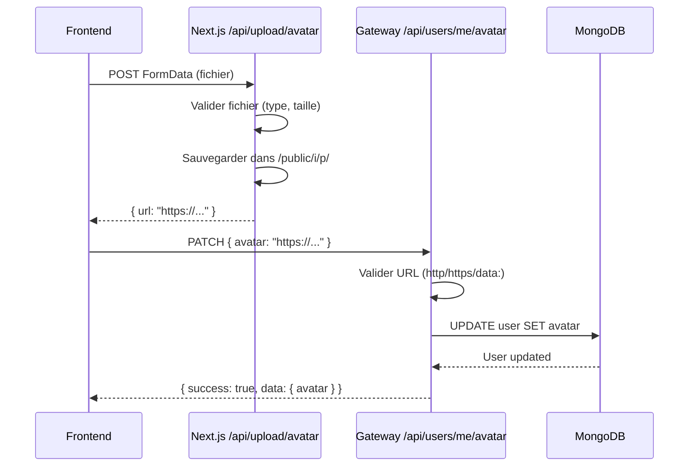

# Corrections de la mise à jour du profil et de l'avatar

## Problème initial

Erreur 400 "Données invalides" lors de la mise à jour du profil depuis `/settings`, notamment lors de l'upload d'une image de profil.

```
PATCH https://gate.meeshy.me/api/users/me 400 (Bad Request)
Erreur lors de la mise à jour: Error: Données invalides
```

## Causes identifiées

### 1. Validation incorrecte du champ `phoneNumber`
**Ligne 12 de `gateway/src/routes/users.ts`** :
```typescript
// ❌ AVANT - Syntaxe Zod incorrecte
phoneNumber: z.string().nullable().optional().or(z.literal(''))
```

Cette syntaxe causait des erreurs de validation car Zod ne pouvait pas traiter correctement cette combinaison.

### 2. Absence de normalisation des données
Les données utilisateur n'étaient pas normalisées lors de la mise à jour (contrairement à l'inscription).

### 3. Manque de logs de débogage
Aucun log permettait d'identifier rapidement le champ problématique.

## Solutions appliquées

### 1. Correction du schéma de validation `phoneNumber`

```typescript
// ✅ APRÈS - Syntaxe Zod correcte
phoneNumber: z.union([z.string(), z.null()]).optional()
```

Cette définition accepte correctement :
- `undefined` (champ non fourni)
- `null`
- Une chaîne vide `''`
- Une chaîne non vide

### 2. Ajout de `.strict()` aux schémas

```typescript
const updateUserSchema = z.object({
  // ... champs
}).strict(); // Rejeter explicitement les champs inconnus

const updateAvatarSchema = z.object({
  avatar: z.string().refine(/*...*/)
}).strict(); // Accepter uniquement le champ avatar
```

Cela permet de :
- Détecter les erreurs lorsque le frontend envoie des champs non attendus
- Séparer clairement les routes `/users/me` et `/users/me/avatar`

### 3. Normalisation des données

Ajout de normalisation cohérente avec la route d'inscription :

```typescript
// Normalisation des données
if (body.firstName !== undefined) updateData.firstName = capitalizeName(body.firstName);
if (body.lastName !== undefined) updateData.lastName = capitalizeName(body.lastName);
if (body.displayName !== undefined) updateData.displayName = normalizeDisplayName(body.displayName);
if (body.email !== undefined) updateData.email = normalizeEmail(body.email);
if (body.phoneNumber !== undefined) {
  updateData.phoneNumber = (body.phoneNumber === '' || body.phoneNumber === null) ? null : body.phoneNumber.trim();
}
```

### 4. Amélioration des logs de débogage

Ajout de logs détaillés pour tracer les erreurs :

```typescript
// Route /users/me
fastify.log.info(`[PROFILE_UPDATE] User ${userId} updating profile. Body keys: ${Object.keys(request.body || {}).join(', ')}`);

// Route /users/me/avatar
fastify.log.info(`[AVATAR_UPDATE] User ${userId} updating avatar. Body: ${JSON.stringify(request.body)}`);
fastify.log.info(`[AVATAR_UPDATE] Avatar URL validated: ${body.avatar}`);

// Erreurs de validation
fastify.log.error(`[PROFILE_UPDATE] Validation error for user ${userId}: ${JSON.stringify(error.errors)}`);
```

## Architecture des routes

### Route 1: Mise à jour du profil
```
PATCH /api/users/me
Body: {
  firstName?: string,
  lastName?: string,
  displayName?: string,
  email?: string,
  phoneNumber?: string | null,
  bio?: string,
  systemLanguage?: string,
  regionalLanguage?: string,
  customDestinationLanguage?: string,
  autoTranslateEnabled?: boolean,
  translateToSystemLanguage?: boolean,
  translateToRegionalLanguage?: boolean,
  useCustomDestination?: boolean
}
```

**N'inclut PAS le champ `avatar`**

### Route 2: Mise à jour de l'avatar
```
PATCH /api/users/me/avatar
Body: {
  avatar: string // URL http://, https:// ou data:image/
}
```

**Accepte UNIQUEMENT le champ `avatar`**

## Flux de l'upload d'avatar



## Tests

Un script de test a été créé pour valider les routes :

```bash
cd /Users/smpceo/Documents/Services/Meeshy/meeshy/gateway
node test-avatar-upload.js
```

Ce script teste :
- ✅ Upload avec URL HTTPS valide
- ✅ Upload avec URL HTTP valide
- ✅ Upload avec data URL (base64)
- ✅ Rejet d'URL invalide (ftp://)
- ✅ Rejet de champs supplémentaires

## Validation du phoneNumber

Le numéro de téléphone est **optionnel** tant qu'un email valide est fourni :

- ✅ Peut être `null`
- ✅ Peut être une chaîne vide `""`
- ✅ Peut être omis complètement
- ✅ Est vérifié pour l'unicité seulement s'il est fourni et non vide

## Pour appliquer les modifications

1. **Redémarrer le gateway** :
```bash
cd /Users/smpceo/Documents/Services/Meeshy/meeshy/gateway
pkill -f "node.*gateway"
./gateway.sh
```

2. **Tester depuis l'interface web** :
   - Aller sur `/settings`
   - Modifier la photo de profil
   - Vérifier qu'il n'y a plus d'erreur 400

3. **Vérifier les logs** :
```bash
tail -f /Users/smpceo/Documents/Services/Meeshy/meeshy/gateway/gateway.log
```

Les logs afficheront maintenant :
- Les champs envoyés lors de chaque requête
- Les erreurs de validation détaillées
- La progression de l'upload d'avatar

## Fichiers modifiés

- ✅ `gateway/src/routes/users.ts` - Corrections de validation et normalisation
- ✅ `gateway/src/utils/normalize.ts` - Déjà existant, importé dans users.ts
- ✅ `gateway/test-avatar-upload.js` - Nouveau script de test

## Points de vérification

- [x] Le schéma `updateUserSchema` valide correctement tous les champs
- [x] Le schéma `updateAvatarSchema` accepte uniquement le champ avatar
- [x] Les deux schémas utilisent `.strict()` pour éviter les champs inconnus
- [x] Les données sont normalisées (email, firstName, lastName, displayName)
- [x] Le `phoneNumber` peut être null ou omis
- [x] Les logs de débogage sont en place
- [x] Le build TypeScript réussit sans erreur
- [x] Les tests sont disponibles

## Notes importantes

⚠️ **Séparation des routes** : 
- Ne PAS envoyer l'avatar dans la route `/users/me`
- Ne PAS envoyer d'autres champs dans la route `/users/me/avatar`

✅ **Le frontend respecte déjà cette séparation** :
- `handleAvatarUpload()` → `/users/me/avatar` avec `{ avatar }`
- `handleSave()` → `/users/me` avec `{ firstName, lastName, ... }`

🔍 **Debugging** :
Les logs permettent maintenant de voir exactement quels champs sont envoyés et quelle validation échoue.

