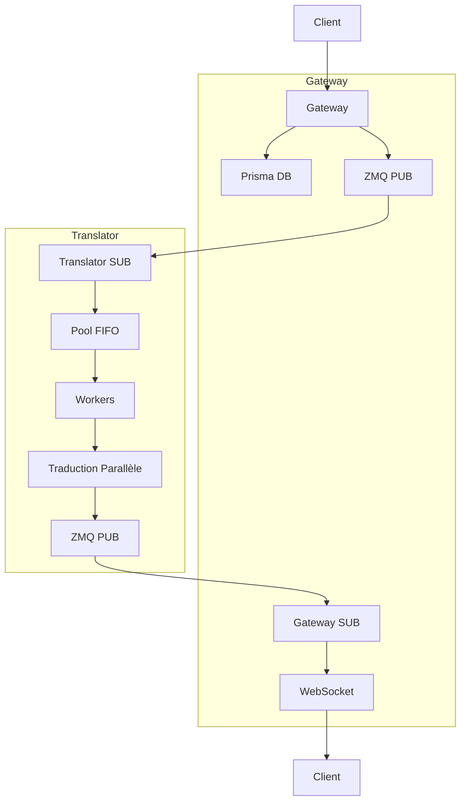

# 🏗️ Architecture PUB/SUB avec Pools FIFO Séparées

## 📋 Vue d'ensemble

Cette nouvelle architecture résout les problèmes de performance et de scalabilité en utilisant un modèle **PUB/SUB** avec des **pools FIFO séparées** pour les conversations normales et "any".

## 🎯 Objectifs de l'Architecture

### ✅ Problèmes Résolus
- **EFSM Errors** : Élimination des erreurs ZMQ "Operation cannot be accomplished in current state"
- **Performance** : Support de 10+ req/sec Gateway, 100-1000 req/sec Translator
- **Scalabilité** : Pools séparées pour différents types de conversations
- **Fiabilité** : Gestion des pools pleines avec rejets gracieux
- **Responsabilité** : Séparation claire Gateway ↔ Translator

### 🚀 Avantages
- **Asynchrone** : Gateway libère le client immédiatement
- **Parallèle** : Traductions multi-langues en parallèle
- **Configurable** : Taille des pools et nombre de workers ajustables
- **Monitoring** : Métriques granulaires par pool et worker

## 🔄 Flux de Données



## 🏢 Composants de l'Architecture

### 1. **Gateway (TypeScript)**

#### `TranslationService`
```typescript
class TranslationService {
  async handleNewMessage(messageData: MessageData) {
    // 1. SAUVEGARDER LE MESSAGE
    const savedMessage = await this._saveMessageToDatabase(messageData);
    
    // 2. LIBÉRER LE CLIENT IMMÉDIATEMENT
    const response = { messageId: savedMessage.id, status: 'message_saved' };
    
    // 3. TRAITEMENT ASYNCHRONE
    setImmediate(() => this._processTranslationsAsync(savedMessage));
    
    return response;
  }
}
```

#### `ZMQTranslationClient`
```typescript
class ZMQTranslationClient {
  // PUB pour envoyer les requêtes
  private pubSocket: zmq.Publisher;
  
  // SUB pour recevoir les résultats
  private subSocket: zmq.Subscriber;
  
  async sendTranslationRequest(request: TranslationRequest): Promise<string> {
    // Envoi via PUB
    await this.pubSocket.send(JSON.stringify(request));
    return taskId;
  }
}
```

#### `MeeshySocketIOManager`
```typescript
class MeeshySocketIOManager {
  async _handleNewMessage(socket, data) {
    // 1. Sauvegarder et libérer le client
    const result = await this.translationService.handleNewMessage(messageData);
    socket.emit('message_sent', result);
    
    // 2. Diffuser le message
    socket.to(`conversation_${data.conversationId}`).emit('new_message', messagePayload);
    
    // 3. Traductions en arrière-plan
    // (gérées par TranslationService)
  }
}
```

### 2. **Translator (Python)**

#### `ZMQTranslationServer`
```python
class ZMQTranslationServer:
    def __init__(self):
        # Socket SUB pour recevoir les requêtes
        self.sub_socket = self.context.socket(zmq.SUB)
        
        # Socket PUB pour publier les résultats
        self.pub_socket = self.context.socket(zmq.PUB)
        
        # Pool manager
        self.pool_manager = TranslationPoolManager()
    
    async def _handle_translation_request(self, message: bytes):
        # Créer la tâche
        task = TranslationTask(...)
        
        # Enfiler dans la pool appropriée
        success = await self.pool_manager.enqueue_task(task)
        
        if not success:
            # Pool pleine, publier erreur
            await self.pub_socket.send(error_message)
```

#### `TranslationPoolManager`
```python
class TranslationPoolManager:
    def __init__(self):
        # Pools FIFO séparées
        self.normal_pool = asyncio.Queue(maxsize=10000)
        self.any_pool = asyncio.Queue(maxsize=10000)
        
        # Workers séparés
        self.normal_workers = 3
        self.any_workers = 2
    
    async def enqueue_task(self, task: TranslationTask) -> bool:
        if task.conversation_id == "any":
            # Pool spéciale pour "any"
            if self.any_pool.full():
                return False  # Pool pleine
            await self.any_pool.put(task)
        else:
            # Pool normale
            if self.normal_pool.full():
                return False  # Pool pleine
            await self.normal_pool.put(task)
        
        return True
```

#### `Worker Loops`
```python
async def _normal_worker_loop(self, worker_name: str):
    while self.normal_workers_running:
        task = await self.normal_pool.get()
        
        # Traduction parallèle multi-langues
        for target_language in task.target_languages:
            result = await self._translate_single_language(task, target_language)
            await self._publish_translation_result(task.task_id, result, target_language)

async def _any_worker_loop(self, worker_name: str):
    while self.any_workers_running:
        task = await self.any_pool.get()
        
        # Même logique que les workers normaux
        # mais pour les conversations "any"
```

## 🔧 Configuration

### Variables d'Environnement

#### Translator
```bash
# Pools FIFO
NORMAL_POOL_SIZE=10000
ANY_POOL_SIZE=10000

# Workers
NORMAL_WORKERS=3
ANY_WORKERS=2

# Ports ZMQ
ZMQ_SUB_PORT=5555
ZMQ_PUB_PORT=5556
```

#### Gateway
```bash
# Client ZMQ
ZMQ_TRANSLATOR_HOST=localhost
ZMQ_PUB_PORT=5555
ZMQ_SUB_PORT=5556
```

### Configuration Avancée

#### Taille des Pools
```python
# Translator
pool_manager = TranslationPoolManager(
    normal_pool_size=10000,  # Conversations normales
    any_pool_size=10000,     # Conversations "any"
    normal_workers=3,        # Workers pour pool normale
    any_workers=2           # Workers pour pool "any"
)
```

#### Workers
```python
# Pool normale : 3 workers minimum
normal_worker_tasks = [
    asyncio.create_task(self._normal_worker_loop(f"normal_worker_{i}"))
    for i in range(self.normal_workers)
]

# Pool "any" : 2 workers minimum
any_worker_tasks = [
    asyncio.create_task(self._any_worker_loop(f"any_worker_{i}"))
    for i in range(self.any_workers)
]
```

## 📊 Monitoring et Métriques

### Statistiques Translator
```python
{
    'normal_pool_size': 0,        # Taille pool normale
    'any_pool_size': 0,           # Taille pool "any"
    'normal_workers_active': 0,   # Workers normaux actifs
    'any_workers_active': 0,      # Workers "any" actifs
    'tasks_processed': 0,         # Tâches traitées
    'tasks_failed': 0,           # Tâches échouées
    'translations_completed': 0,  # Traductions terminées
    'pool_full_rejections': 0,    # Rejets pool pleine
    'memory_usage_mb': 0,         # Utilisation mémoire
    'uptime_seconds': 0           # Temps de fonctionnement
}
```

### Statistiques Gateway
```typescript
{
    'messages_saved': 0,           // Messages sauvegardés
    'translation_requests_sent': 0, // Requêtes envoyées
    'translations_received': 0,     // Traductions reçues
    'errors': 0,                   // Erreurs
    'pool_full_rejections': 0,     // Rejets pool pleine
    'avg_processing_time': 0,      // Temps traitement moyen
    'uptime_seconds': 0,           // Temps de fonctionnement
    'memory_usage_mb': 0           // Utilisation mémoire
}
```

## 🧪 Tests et Validation

### Script de Test
```bash
# Test de la nouvelle architecture
./test_new_architecture.sh

# Configuration du test
DURATION=30                    # 30 secondes
REQUESTS_PER_MINUTE=120       # 2 req/sec
CONCURRENT_REQUESTS=10        # 10 requêtes concurrentes
```

### Métriques de Validation
- ✅ **Taux de succès** ≥ 95%
- ✅ **Performance Gateway** ≥ 10 req/sec
- ✅ **Performance Translator** ≥ 100 req/sec
- ✅ **Rejets pool pleine** < 1%
- ✅ **Latence moyenne** < 1 seconde

## 🔄 Flux Détaillé

### 1. Réception d'un Message
```
Client → Gateway → Prisma DB → Message sauvegardé → Client libéré
```

### 2. Extraction des Langues
```
Gateway → Analyse conversation → Extraction langues uniques → Préparation requête
```

### 3. Envoi de Traduction
```
Gateway PUB → Translator SUB → Pool FIFO appropriée → Worker disponible
```

### 4. Traitement Parallèle
```
Worker → Traduction parallèle multi-langues → Publication résultats individuels
```

### 5. Réception des Résultats
```
Translator PUB → Gateway SUB → Cache mémoire → Base de données → WebSocket → Client
```

## 🚨 Gestion d'Erreurs

### Pool Pleine
```python
if self.normal_pool.full():
    # Publier message d'erreur
    error_message = {
        'type': 'translation_error',
        'error': 'translation pool full',
        'conversationId': task.conversation_id
    }
    await self.pub_socket.send(json.dumps(error_message))
```

### Erreur de Traduction
```python
try:
    result = await self._translate_single_language(task, target_language)
except Exception as e:
    # Créer résultat d'erreur
    error_result = self._create_error_result(task, target_language, str(e))
    await self._publish_translation_result(task.task_id, error_result, target_language)
```

### Timeout et Retry
```typescript
// Gateway : Timeout sur les requêtes
const timeout = setTimeout(() => {
    // Gérer le timeout
}, 30000);

// Translator : Gestion des workers défaillants
if worker_failed:
    // Redémarrer le worker
    await self._restart_worker(worker_name)
```

## 🔧 Maintenance et Évolution

### Ajout de Workers
```python
# Augmenter le nombre de workers
self.normal_workers = 5  # Au lieu de 3
self.any_workers = 3     # Au lieu de 2

# Redémarrer les workers
await self.pool_manager.restart_workers()
```

### Monitoring en Temps Réel
```bash
# Script de monitoring
./monitor_performance.sh

# Métriques affichées
- Taille des pools
- Workers actifs
- Taux de succès
- Latences
- Utilisation mémoire
```

### Scaling Horizontal
```python
# Support multi-instances
class TranslationCluster:
    def __init__(self):
        self.instances = []
        self.load_balancer = RoundRobinBalancer()
    
    async def distribute_translation(self, request):
        instance = self.load_balancer.select_instance()
        return await instance.process_translation(request)
```

## 📈 Performance Attendue

### Objectifs
- **Gateway** : 10+ requêtes par seconde
- **Translator** : 100-1000 traductions par seconde
- **Latence** : < 1 seconde pour 95% des requêtes
- **Fiabilité** : > 99% de taux de succès

### Facteurs de Performance
- **Nombre de workers** : Plus de workers = plus de parallélisme
- **Taille des pools** : Plus grande = plus de buffer
- **Complexité des textes** : Textes courts = traduction plus rapide
- **Nombre de langues** : Plus de langues = plus de temps de traitement

## 🎯 Avantages de cette Architecture

### 1. **Séparation des Responsabilités**
- Gateway : Gestion des messages et WebSockets
- Translator : Traduction pure avec pools dédiées

### 2. **Performance Optimale**
- PUB/SUB : Communication asynchrone non-bloquante
- Pools FIFO : Gestion efficace de la charge
- Workers parallèles : Traitement multi-langues simultané

### 3. **Scalabilité**
- Pools séparées : Isolation des charges
- Workers configurables : Adaptation à la charge
- Cache multi-niveaux : Réduction des traductions redondantes

### 4. **Fiabilité**
- Gestion des pools pleines : Évite la surcharge
- Workers redondants : Tolérance aux pannes
- Monitoring complet : Détection précoce des problèmes

### 5. **Maintenabilité**
- Code modulaire : Facile à maintenir et étendre
- Configuration centralisée : Paramètres ajustables
- Logs détaillés : Debugging facilité

Cette architecture représente une solution robuste et performante pour les besoins de traduction en temps réel de Meeshy.
